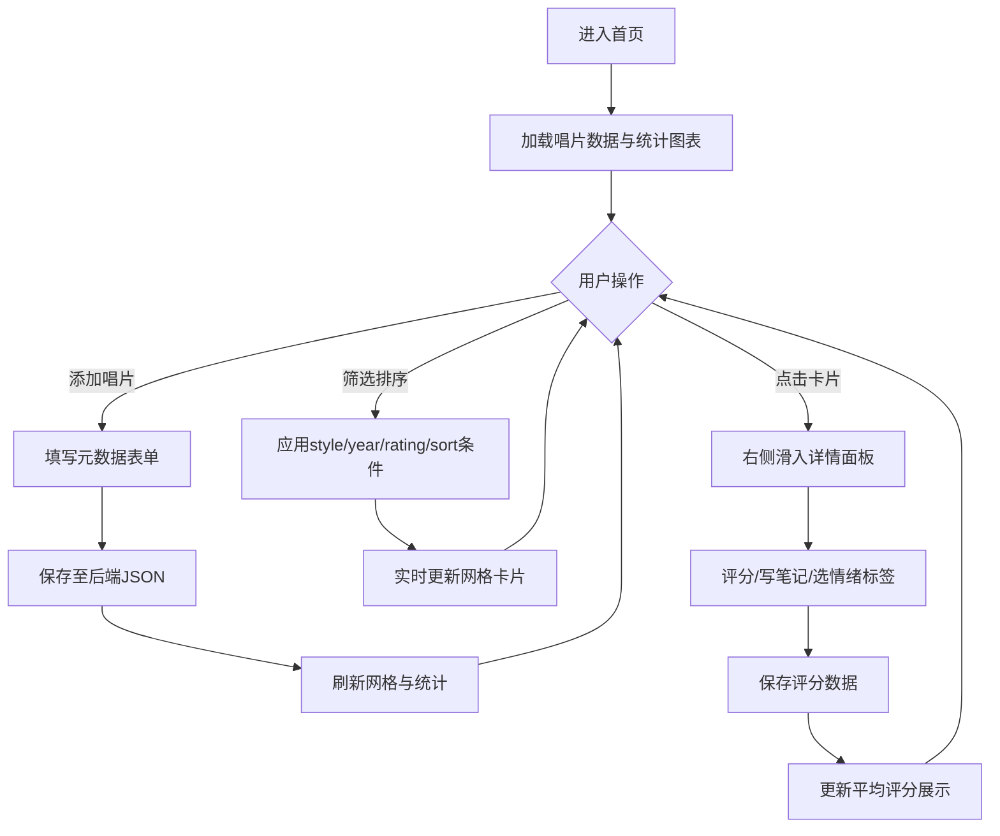

## 1. 产品概述

面向小型独立唱片店和音乐爱好者的在线黑胶唱片收藏管理系统，解决唱片实体信息零散、难以快速定位和听感笔记不好回溯的问题。用户可添加唱片元数据、记录个人评分与听感、按多维条件筛选浏览，并通过可视化图表洞察收藏分布。

---

## 2. 核心功能

### 2.1 功能模块

1. **唱片管理与元数据模块**：添加唱片（名称、艺术家、年份、风格多选、厂牌、价格、购买渠道）、卡片网格展示、唱片刻盘颜色色块
2. **个人评分与听感记录模块**：1-5星评分、200字听感笔记、情绪标签选择、评分统计展示
3. **筛选与排序模块**：风格多选筛选、年代滑杆、评分筛选、排序方式切换、空结果占位动画
4. **购买渠道统计模块**：购买渠道饼图、风格分布柱状图、近三月折线图

### 2.2 页面详情

| 页面名称 | 模块名称 | 功能描述 |
|-----------|-------------|---------------------|
| 主页面 | 顶部工具栏 | 风格多选下拉、年代范围滑杆、评分筛选、排序下拉、添加唱片按钮 |
| 主页面 | 唱片网格视图 | CSS Grid响应式卡片、悬停动效、刻盘颜色色块、点击进入详情 |
| 详情侧滑面板 | 唱片详情 | 完整元数据展示、星级评分、听感输入框、情绪标签、评分统计 |
| 右侧边栏 | 统计面板 | 饼状图（渠道占比）、柱状图（风格分布）、折线图（近三月添加） |

---

## 3. 核心流程

---

## 4. 用户界面设计

### 4.1 设计风格

- **主背景色**：暖白 `#FAF5EF`
- **正文文本色**：深灰 `#2D2A24`
- **点缀色（风格映射）**：
  - 爵士蓝 `#2563EB`、摇滚红 `#DC2626`、古典金 `#D97706`
  - 电子紫 `#9333EA`、放克橙 `#EA580C`、民谣绿 `#16A34A`、灵魂乐粉 `#DB2777`
- **按钮样式**：圆角12px，悬停时应用对应风格色
- **字体**：Playfair Display（标题复古衬线）+ DM Sans（正文无衬线）
- **布局**：左侧唱片网格 + 右侧统计面板（可折叠）的双栏布局，卡片圆角12px，间距16px
- **图标**：Lucide 线性图标

### 4.2 页面设计概览

| 页面区域 | 模块名称 | UI元素 |
|-----------|-------------|-------------|
| 主工具栏 | 筛选控制 | 风格多选下拉（带彩色标签）、双滑杆年代选择器、星评筛选按钮组、排序下拉、"+添加唱片"主按钮 |
| 网格区 | 唱片卡片 | 左上角模拟唱片刻盘圆形色块（风格色渐变）、封面占位、唱片名、艺术家、年份标签、悬停上移5px+加深阴影、300ms ease-in-out过渡 |
| 详情面板 | 评分笔记 | 右滑入动画（translateX+opacity）、覆盖层rgba(0,0,0,0.4)、黄色渐变五星评分、textarea限制200字、情绪标签芯片组、右上角总次数+平均星数 |
| 右侧边栏 | 统计卡片 | 三色数据卡片包裹三个Chart.js图表，悬停显示tooltip数值，响应式填充父容器 |

### 4.3 响应式适配

- **桌面端（>1024px）**：网格4列 + 右侧统计面板展开
- **平板端（768-1024px）**：网格3列 + 统计面板可折叠
- **手机端（<768px）**：网格2列 + 统计面板底部折叠
- 所有过渡动画统一 300ms ease-in-out 缓动
- 空结果状态：弹跳动画占位图（animate-bounce）
