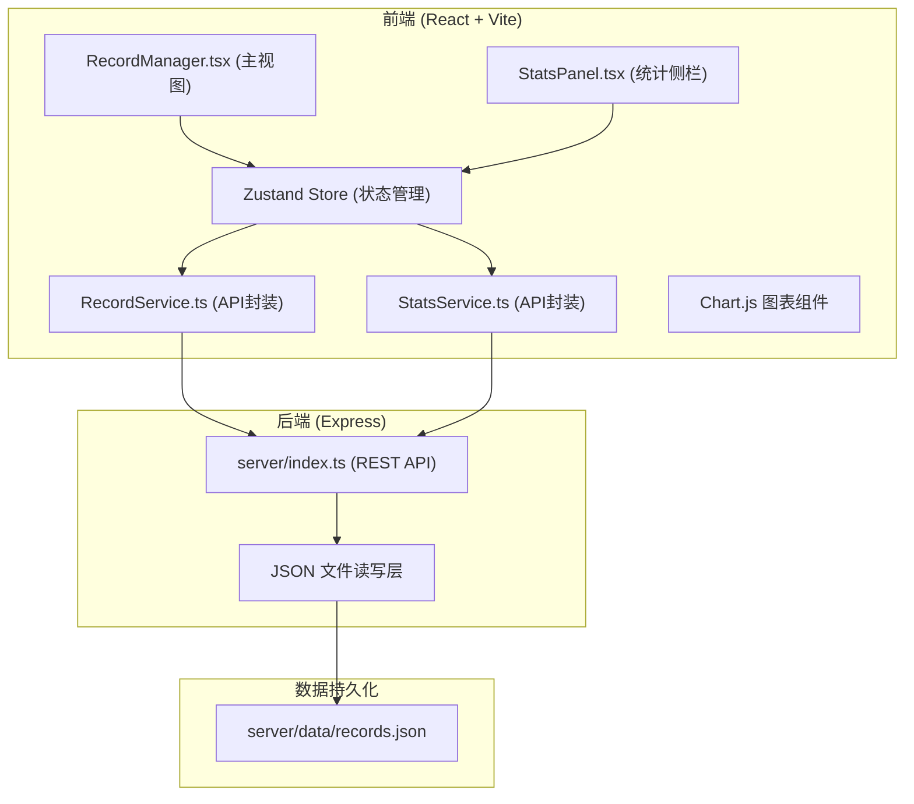
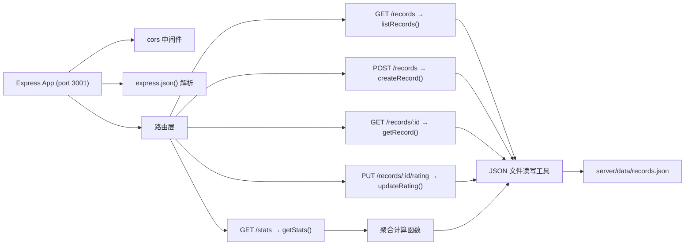
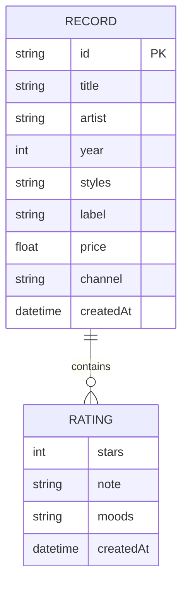

## 1. 架构设计



---

## 2. 技术选型

| 层级 | 技术 | 版本/说明 |
|-------|------|-----------|
| 前端框架 | React | 18.x + TypeScript（严格模式） |
| 构建工具 | Vite | 最新稳定版，proxy代理/api到3001端口 |
| 状态管理 | Zustand | 集中管理唱片数据、筛选条件、评分状态 |
| 路由 | react-router-dom | 单页（如需多页扩展） |
| 图表库 | Chart.js + react-chartjs-2 | 饼图/柱状图/折线图 |
| HTTP客户端 | axios | 前后端通信 |
| 后端框架 | Express | 4.x + TypeScript + cors |
| 数据存储 | JSON文件 | server/data/records.json |
| 唯一ID | uuid | 唱片ID生成 |
| 并启动 | concurrently | 同时启动Vite(5173)和Express(3001) |

---

## 3. 路由定义（前端）

| 路由 | 用途 |
|-------|---------|
| `/` | 主页面（唱片网格 + 筛选工具栏 + 统计侧栏） |

---

## 4. API 接口定义

### 4.1 类型定义

```typescript
type Style = '爵士' | '摇滚' | '古典' | '电子' | '放克' | '民谣' | '灵魂乐';
type PurchaseChannel = '实体店' | '在线' | '二手市场';
type MoodTag = '迷幻' | '复古' | '放松' | '亢奋' | '忧郁' | '怀旧';

interface Rating {
  stars: number;           // 1-5
  note?: string;           // 最多200字
  moods: MoodTag[];        // 最多3个
  createdAt: string;
}

interface Record {
  id: string;
  title: string;           // 唱片名称
  artist: string;          // 艺术家
  year: number;            // 发行年份
  styles: Style[];         // 风格（多选）
  label: string;           // 厂牌
  price: number;           // 个人购买价格
  channel: PurchaseChannel; // 购买渠道
  ratings: Rating[];       // 评分数组
  createdAt: string;       // 添加时间
}

interface Stats {
  channelCounts: Record<PurchaseChannel, number>;
  styleCounts: Record<Style, number>;
  recentMonthly: { month: string; count: number }[];
}
```

### 4.2 REST API

| 方法 | 路径 | 请求参数 | 响应 | 用途 |
|------|------|----------|------|------|
| GET | `/records` | query: `style`, `sort`, `yearGte`, `yearLte`, `rating` | `Record[]` | 列表查询（支持过滤排序） |
| POST | `/records` | body: Omit\<Record,'id' \| 'ratings' \| 'createdAt'\> | `Record` | 添加唱片 |
| GET | `/records/:id` | path: `id` | `Record` | 单张详情 |
| PUT | `/records/:id/rating` | body: `{ stars, note?, moods }` | `Record` | 保存评分与笔记 |
| GET | `/stats` | - | `Stats` | 聚合统计（渠道/风格/近三月） |

---

## 5. 服务器架构图



---

## 6. 数据模型

### 6.1 数据模型 ER 图



### 6.2 初始数据

`server/data/records.json` 初始内容：

```json
[
  {
    "id": "uuid-generated-001",
    "title": "Kind of Blue",
    "artist": "Miles Davis",
    "year": 1959,
    "styles": ["爵士"],
    "label": "Columbia",
    "price": 30.0,
    "channel": "实体店",
    "ratings": [],
    "createdAt": "2026-03-15T10:00:00.000Z"
  }
]
```

---

## 7. 文件组织结构

```
.
├── package.json
├── index.html
├── vite.config.js
├── tsconfig.json
├── src/
│   ├── main.tsx                          # React 入口
│   ├── App.tsx                           # 根组件
│   ├── store/
│   │   └── useRecordStore.ts             # Zustand store
│   ├── modules/
│   │   ├── records/
│   │   │   ├── RecordManager.tsx         # 唱片管理主组件
│   │   │   ├── RecordService.ts          # REST API 封装
│   │   │   ├── RecordCard.tsx            # 唱片卡片
│   │   │   ├── RecordDetail.tsx          # 详情面板
│   │   │   ├── AddRecordModal.tsx        # 添加唱片弹窗
│   │   │   └── FilterBar.tsx             # 筛选工具栏
│   │   └── stats/
│   │       ├── StatsPanel.tsx            # 统计侧栏
│   │       └── StatsService.ts           # 统计 API 封装
│   ├── shared/
│   │   └── types.ts                      # 共享类型定义
│   └── styles/
│       └── globals.css                   # 全局样式
└── server/
    ├── index.ts                          # Express 入口
    ├── data/
    │   └── records.json                  # 数据持久化
    └── utils/
        └── jsonStore.ts                  # JSON 文件读写工具
```
