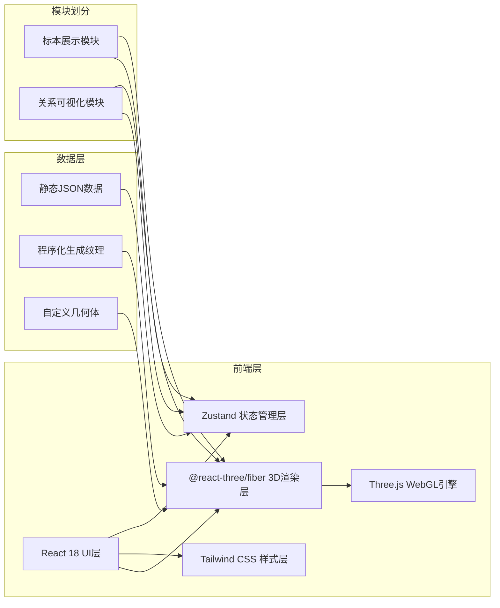
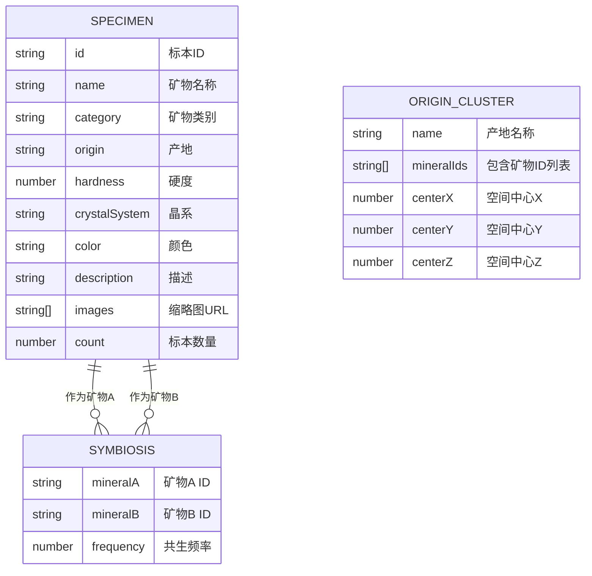

## 1. 架构设计



## 2. 技术描述

- **前端框架**：React 18 + TypeScript 5
- **构建工具**：Vite 5
- **3D引擎**：Three.js r160
- **React 3D绑定**：@react-three/fiber 8 + @react-three/drei 9
- **状态管理**：Zustand 4
- **样式框架**：Tailwind CSS 3 + PostCSS + Autoprefixer
- **力导向模拟**：d3-force-3d 3
- **动画库**：@react-three/postprocessing（后期处理效果）

**文件结构与调用关系：**

```
src/
├── main.tsx                    # 入口：挂载App，初始化store，加载数据
├── App.tsx                     # 根组件：布局容器，视图切换
├── stores/
│   └── useStore.ts             # Zustand store：管理全局状态
├── data/
│   └── specimens.json          # 标本数据：矿物信息、产地、共生关系
├── modules/
│   ├── specimen/
│   │   ├── SpecimenViewer.tsx  # 3D场景：Canvas + 标本模型 + 光照
│   │   ├── SpecimenControls.tsx # UI：筛选面板 + 信息面板 + 缩略图列表
│   │   └── SpecimenModel.tsx   # 3D组件：单标本几何体 + 材质 + 动画
│   └── relation/
│       ├── RelationGraph.tsx   # 3D力导向图：节点 + 连线 + 产地球体
│       ├── RelationControls.tsx # UI：视图切换 + 参数调节滑块
│       └── ForceSimulation.ts  # 力导向模拟：d3-force-3d封装
└── utils/
    ├── colors.ts               # 颜色映射：矿物类别颜色
    └── geometry.ts             # 几何体生成：自定义晶体形状
```

**数据流向：**
1. `main.tsx` → 加载 `specimens.json` → 初始化 `useStore`
2. `useStore` → 分发 `specimens` / `selectedSpecimen` / `filter` / `viewMode` 到各模块
3. `SpecimenControls` → 用户筛选 → 更新 `useStore.filter` → 触发列表重渲染
4. `SpecimenControls` → 点击缩略图 → 更新 `useStore.selectedSpecimen` → `SpecimenViewer` 重新加载模型
5. `RelationControls` → 切换视图 → 更新 `useStore.viewMode` → `App.tsx` 切换渲染组件
6. `RelationGraph` → 点击节点 → 更新 `useStore.selectedSpecimen` + `useStore.viewMode` → 跳转标本视图

## 3. 路由定义

| 路由 | 用途 |
|------|------|
| / | 主页面：包含所有功能模块的单页应用 |

## 4. 数据模型

### 4.1 数据模型定义



### 4.2 TypeScript 类型定义

```typescript
interface Specimen {
  id: string;
  name: string;
  category: 'sulfide' | 'oxide' | 'silicate' | 'carbonate' | 'halide' | 'native' | 'phosphate';
  origin: string;
  hardness: [number, number];
  crystalSystem: string;
  color: string;
  description: string;
  count: number;
}

interface Symbiosis {
  mineralA: string;
  mineralB: string;
  frequency: number;
}

interface FilterState {
  categories: string[];
  origins: string[];
  hardnessRange: [number, number];
}

interface ViewMode = 'specimen' | 'relation';
interface GraphMode = 'top' | 'fly';

interface StoreState {
  specimens: Specimen[];
  relations: Symbiosis[];
  selectedSpecimen: Specimen | null;
  filter: FilterState;
  viewMode: ViewMode;
  graphMode: GraphMode;
  forceParams: { repulsion: number; attraction: number };
  filteredSpecimens: Specimen[];
  setSelectedSpecimen: (s: Specimen | null) => void;
  setFilter: (f: Partial<FilterState>) => void;
  setViewMode: (v: ViewMode) => void;
  setGraphMode: (g: GraphMode) => void;
  setForceParams: (p: Partial<{repulsion: number; attraction: number}>) => void;
}
```

## 5. 性能优化策略

1. **3D渲染优化**：
   - 使用 `InstancedMesh` 批量渲染图谱节点
   - `LineSegments` 批量渲染连线
   - 力导向模拟使用 `useFrame` 节流至30fps
   - 标本几何体使用 `BufferGeometry` 并禁用 unnecessary attributes

2. **状态更新优化**：
   - Zustand selector 避免不必要重渲染
   - 筛选结果使用 `useMemo` 缓存
   - 缩略图懒加载 + WebP格式

3. **动画优化**：
   - 使用 `useSpring` 而非 CSS transition 处理复杂动画
   - 背景渐变使用 Canvas 而非 DOM 元素
   - 星空粒子使用 `Points` + `BufferGeometry`

## 6. 核心算法

1. **力导向模拟（3D）**：
   - 斥力：`repulsion * (1 / distance^2)`
   - 引力：`attraction * (distance - idealDistance)`
   - 产地聚类：增加中心引力，系数随距离衰减
   - 速度衰减：0.9每帧，防止震荡

2. **节点大小映射**：
   - `radius = 0.5 + (count / maxCount) * 1.5`
   - 范围：0.5 ~ 2.0 单位

3. **连线粗细映射**：
   - `width = frequency >= 3 ? 0.1 : 0.04`

4. **产地球体半径**：
   - `radius = 2 + mineralCount * 0.5`
   - 基础2单位，每多一种矿物+0.5
