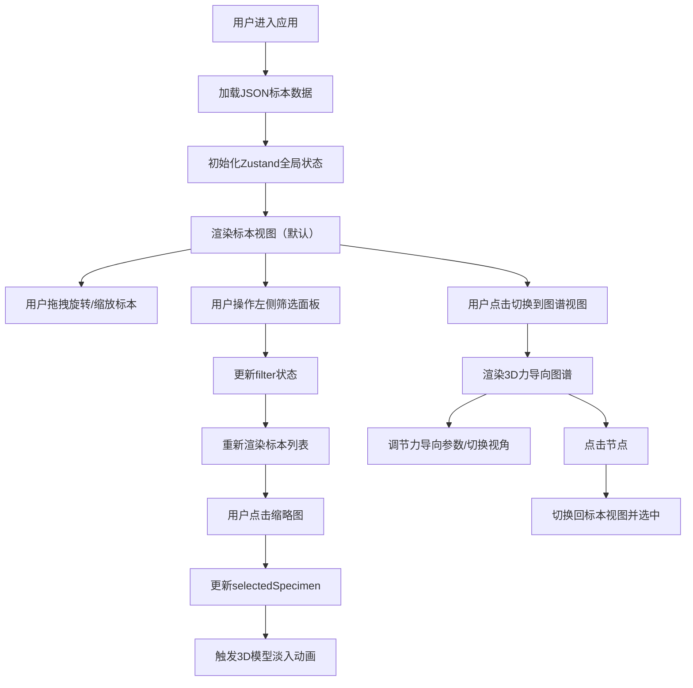

## 1. 产品概述

3D矿物标本馆与共生关系可视化应用，为地质科普爱好者提供沉浸式矿物标本浏览体验。通过3D旋转展示、分类筛选、力导向关系图谱和产地地理标记，帮助用户理解矿物间的共生关系与地理分布。

- 核心价值：将静态标本数据转化为可交互的3D虚拟博物馆，提升科普教育的趣味性和直观性
- 目标用户：地质科普爱好者、学生、教育工作者

## 2. 核心功能

### 2.1 用户角色

| 角色 | 注册方式 | 核心权限 |
|------|----------|----------|
| 浏览用户 | 无需注册 | 浏览标本、筛选搜索、查看关系图谱、切换视图 |

### 2.2 功能模块

1. **标本展示模块**：3D标本旋转查看、模型加载动画、缩放控制
2. **分类筛选模块**：矿物类别筛选、产地筛选、硬度范围筛选、缩略图列表
3. **关系可视化模块**：3D力导向图谱、节点大小映射、连线粗细映射
4. **产地定位模块**：产地聚类展示、发光球体包裹、悬停提示
5. **视图切换模块**：标本视图/图谱视图切换、背景动画过渡

### 2.3 页面详情

| 页面名称 | 模块名称 | 功能描述 |
|----------|----------|----------|
| 主页面 | 左侧筛选面板 | 矿物类别多选、产地多选、硬度范围滑块、实时筛选 |
| 主页面 | 右侧3D渲染区 | 标本360度旋转、滚轮缩放、模型淡入动画、信息展示 |
| 主页面 | 关系图谱视图 | 3D力导向布局、节点交互、框选高亮、产地聚类球体 |
| 主页面 | 视图切换控制 | 标本/图谱模式切换、力导向参数调节、俯视图/漫游模式 |

## 3. 核心流程

用户进入应用 → 加载标本数据初始化全局状态 → 默认展示标本视图 → 用户可：
- 拖拽旋转当前标本、滚轮缩放查看细节
- 通过左侧面板筛选矿物类别/产地/硬度 → 更新标本列表
- 点击缩略图切换选中标本 → 触发3D模型重新加载动画
- 切换到关系图谱视图 → 加载3D力导向图 → 调节物理参数或切换视角
- 点击图谱节点 → 跳转回标本视图并选中对应矿物

## 4. 用户界面设计

### 4.1 设计风格

- **主题色调**：暗色主题，主色深蓝#0f3460，点缀色朱红#e94560
- **背景渐变**：标本视图采用#1a1a2e到#16213e的深色渐变，图谱视图采用星空粒子效果
- **字体**：Inter无衬线字体
- **按钮样式**：朱红到深蓝渐变背景，悬停右移0.4rem并加深阴影，点击缩放至0.95倍
- **卡片样式**：#16213e背景，12px圆角，20px内边距，朱红色焦点指示线
- **动画效果**：0.8秒视图切换ease-in-out，1.2秒模型淡入，0.3秒悬停放大

### 4.2 页面设计概述

| 页面名称 | 模块名称 | UI元素 |
|----------|----------|--------|
| 主页面 | 左侧筛选面板 | 分类卡片、多选复选框、硬度范围滑块、标本缩略图列表（悬停放大1.2倍） |
| 主页面 | 右侧3D区域 | Canvas画布、标本信息浮窗、视图切换按钮、图谱参数滑块 |
| 主页面 | 关系图谱视图 | 3D节点（大小映射标本数量）、连线（粗细映射共生频率）、产地发光球体、星空背景粒子 |

### 4.3 响应式设计

- 桌面端优先设计，左右分栏布局（左侧320px，右侧自适应）
- 平板端：筛选面板可折叠，3D区域保持全屏
- 移动端：垂直布局，筛选面板在上，3D区域在下

### 4.4 3D场景指导

**标本视图：**
- 环境：深色渐变背景，环境光+方向光组合，营造博物馆展柜氛围
- 光照：AmbientLight(0xffffff, 0.4) + DirectionalLight(0xffffff, 0.8) + PointLight辅助照明
- 相机：PerspectiveCamera，初始距离5单位，fov 50
- 交互：OrbitControls，enablePan=false，minDistance=2.5，maxDistance=15
- 动画：加载时scale从0.5→1，opacity从0→1，持续1.2秒；持续缓慢自转

**关系图谱视图：**
- 环境：400个随机分布的星空粒子（半径80单位球体），深色背景
- 光照：AmbientLight(0xffffff, 0.5) + 多点光源照亮节点
- 相机：可切换正交相机（俯视图）和透视相机（漫游模式）
- 力导向模拟：d3-force-3d实现，斥力-引力模型，30fps更新频率
- 节点：IcosahedronGeometry，颜色按矿物类别区分，大小映射标本数量（最大半径2单位）
- 连线：LineGeometry，粗细映射共生频率（≥3次宽度0.1，1-2次宽度0.04）
- 产地球体：半透明发光SphereGeometry，半径随矿物多样性增加（每类+0.5单位）
