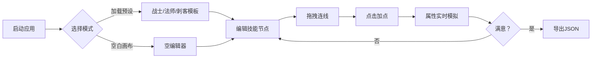

## 1. 产品概述

面向独立游戏开发者的技能树系统可视化设计与平衡调试工具，解决手动规划技能树时依赖关系不直观、属性变化难以模拟、数值平衡调试困难的问题。通过可视化编辑器、实时属性模拟器和预设模板三大功能模块，帮助开发者快速完成角色技能系统的设计、测试与迭代。

## 2. 核心特性

### 2.1 用户角色

| 角色 | 注册方式 | 核心权限 |
|------|---------|---------|
| 独立开发者 | 无需注册，本地运行 | 完整使用编辑器、模拟器、导入导出等所有功能 |

### 2.2 功能模块

1. **技能树可视化编辑器**：Pixi.js 画布上拖拽创建节点、连线建立依赖关系、滚轮缩放与中键平移
2. **属性模拟器**：虚拟加点后实时查看角色属性变化，动画化数值展示
3. **预设与导入导出**：内置战士/法师/刺客三套模板，支持 JSON 导入导出

### 2.3 页面详情

| 页面名称 | 模块名称 | 功能描述 |
|---------|---------|---------|
| 主界面 | 顶部工具栏 | 加载预设、导出、导入、撤销、重做、清空画布按钮 |
| 主界面 | 编辑器画布 | Pixi.js 渲染技能节点与贝塞尔曲线连线，支持缩放、平移、拖拽、连线交互 |
| 主界面 | 属性模拟面板 | 角色基础属性进度条（攻击/防御/生命/法力）、已学技能列表、点数消耗统计 |
| 主界面 | 节点详情编辑 | 双击节点弹出编辑窗，修改名称、描述、图标、消耗点数、技能类型 |

## 3. 核心流程

用户打开应用 → 选择加载预设技能树或从零创建 → 在画布上拖拽节点位置、添加新节点、拖拽连线建立依赖 → 点击节点进行加点操作 → 右侧面板实时显示属性变化 → 数值满意后导出 JSON 文件保存。

## 4. 用户界面设计

### 4.1 设计风格

- **主色调**：深色主题，背景 #1a1a2e，面板 #16213e，卡片 #0f3460
- **强调色**：#e94560（玫红），主文字 #e0e0e0
- **技能类型色**：攻击红 #e94560、防御蓝 #4a9eff、辅助绿 #3dd598、通用金 #ffd700
- **属性色**：攻击橙 #ff8c42、防御蓝 #4a9eff、生命绿 #3dd598、法力紫 #a855f7
- **按钮样式**：扁平圆角 4px，悬停半透明白色覆盖，点击轻微下压
- **字体**：中文微软雅黑/英文 Segoe UI，标题 14px 粗体，正文 12px 常规
- **布局**：顶部工具栏 40px，左侧编辑器 60%，右侧属性面板 35%，中间 5% 拖拽分隔条
- **图标**：像素风格 SVG 图标库（32个），包含火焰、冰霜、盾牌、剑、弓箭、魔法书等

### 4.2 页面设计概览

| 页面名称 | 模块名称 | UI 元素 |
|---------|---------|--------|
| 主界面 | 工具栏 | 深色背景 40px 高，6 个图标按钮，悬停高亮，点击下压 |
| 主界面 | 编辑器画布 | 浅网格背景（#ffffff10，10px间距），节点半透明灰蓝色底，选中亮白边框放大，贝塞尔曲线连线 |
| 主界面 | 属性面板 | 6 个属性条（图标+名称+数值+进度条），已学技能列表带淡入动画，点数统计超量红色抖动 |
| 主界面 | 技能节点 | 方形卡片，顶部 SVG 图标，中间名称（≤12字），底部点数，选中放大亮边，已学金色呼吸光晕 |

### 4.3 响应式

桌面端优先设计，最小窗口宽度 1200px，暂不做移动端适配。

### 4.4 性能指标

- 50 节点 + 80 连线时，拖拽与缩放保持 60FPS
- 属性数值变化响应时间 < 100ms
- 数值动画过渡 0.3 秒
