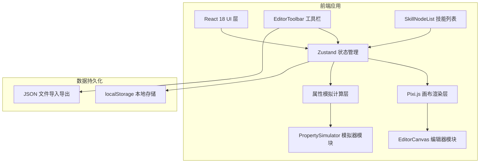
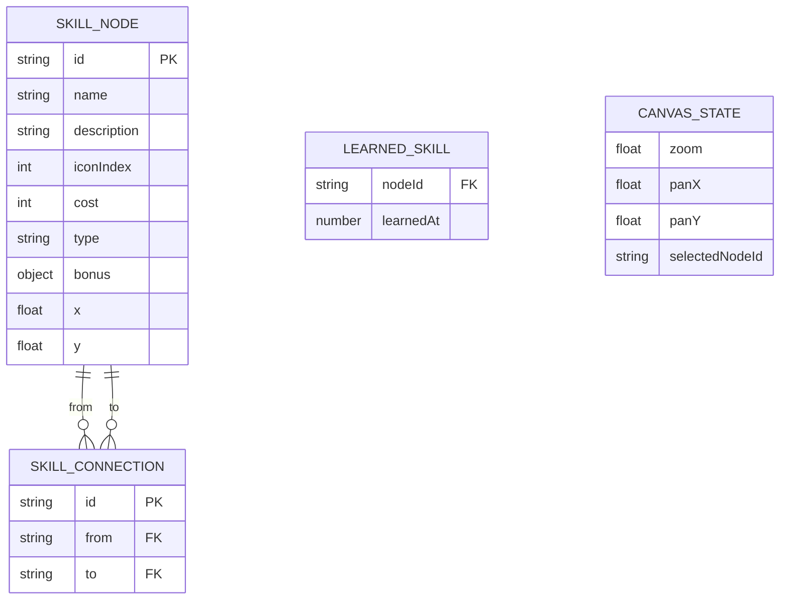

## 1. 架构设计



## 2. 技术说明

- **前端框架**：React 18 + TypeScript + Vite
- **画布渲染**：pixi.js 7.x（处理 2D 节点、连线渲染与交互）
- **状态管理**：Zustand（节点、连线、加点、画布状态、撤销栈）
- **UI 组件**：原生 HTML/CSS（不使用 UI 库，保持轻量）
- **图标**：内置 SVG 像素风格图标组件（32个）
- **数据持久化**：localStorage 自动保存 + JSON 文件导入导出
- **唯一 ID**：uuid

## 3. 路由定义

| 路由 | 用途 |
|------|-----|
| / | 主应用界面（编辑器 + 模拟器） |

单页应用，无多路由需求。

## 4. 数据模型

### 4.1 TypeScript 类型定义

```typescript
type SkillType = 'attack' | 'defense' | 'support' | 'universal';

interface SkillBonus {
  attack?: number;
  defense?: number;
  health?: number;
  mana?: number;
}

interface SkillNode {
  id: string;
  name: string;
  description: string;
  iconIndex: number;
  cost: number;
  type: SkillType;
  bonus: SkillBonus;
  x: number;
  y: number;
}

interface SkillConnection {
  id: string;
  from: string;
  to: string;
}

interface LearnedSkill {
  nodeId: string;
  learnedAt: number;
}

interface CharacterStats {
  baseAttack: number;
  baseDefense: number;
  health: number;
  mana: number;
}

interface CanvasState {
  zoom: number;
  panX: number;
  panY: number;
  selectedNodeId: string | null;
}

interface HistoryState {
  nodes: SkillNode[];
  connections: SkillConnection[];
}
```

### 4.2 核心数据结构



## 5. 文件组织

```
├── package.json
├── index.html
├── vite.config.js
├── tsconfig.json
└── src/
    ├── main.tsx
    ├── App.tsx
    ├── App.css
    ├── components/
    │   └── SkillNodeComponent.tsx
    ├── modules/
    │   ├── editor/
    │   │   ├── EditorCanvas.tsx
    │   │   └── EditorToolbar.tsx
    │   └── simulator/
    │       ├── PropertySimulator.tsx
    │       └── SkillNodeList.tsx
    ├── store/
    │   └── useSkillTreeStore.ts
    ├── utils/
    │   └── skillPresets.ts
    └── icons/
        └── skillIcons.tsx
```

## 6. 核心模块职责

| 模块 | 职责 |
|-----|-----|
| useSkillTreeStore | Zustand store，管理节点、连线、已学技能、画布状态、撤销/重做历史栈 |
| skillPresets | 战士(12节点)、法师(10节点)、刺客(11节点)三套预设数据 + loadPreset 函数 |
| SkillNodeComponent | SVG 渲染单个技能节点，根据状态切换视觉样式（选中/已学/未激活） |
| EditorCanvas | Pixi.js 画布初始化、节点与连线渲染、缩放/平移/拖拽/连线交互 |
| EditorToolbar | 工具栏按钮（预设/导出/导入/撤销/重做/清空），调用 store 方法 |
| PropertySimulator | 根据已学技能计算属性、0.3s 数值过渡动画、进度条展示、点数统计 |
| SkillNodeList | 按加点顺序展示已学技能，淡入动画 |
| skillIcons | 32个像素风格 SVG 图标组件（火焰、冰霜、盾牌、剑等） |
