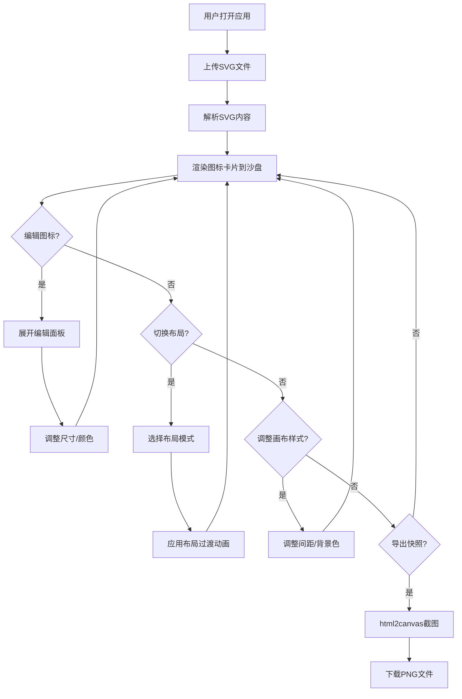

## 1. 产品概述

SVG图标库与布局沙盘应用，面向独立开发者，解决零散设计稿整合为项目展示页面的效率问题。支持SVG图标上传预览、个性化编辑、三种布局模式切换、画布样式调整及截图导出，帮助用户快速构建和分享图标展示方案。

- 目标用户：独立开发者、UI设计师、前端工程师
- 核心价值：将散乱的SVG设计素材一键整合为美观的展示页面，实时预览不同布局与配色方案，快速导出快照用于文档或分享

## 2. 核心功能

### 2.1 用户角色

| 角色 | 注册方式 | 核心权限 |
|------|----------|----------|
| 普通用户 | 无需注册 | 上传、编辑、布局、截图全部功能 |

### 2.2 功能模块

1. **主页面**：工具栏（上传、布局切换、间距调整、背景色、截图导出）+ 布局沙盘画布（图标卡片展示区）

### 2.3 页面详情

| 页面名称 | 模块名称 | 功能描述 |
|----------|----------|----------|
| 主页面 | 顶部工具栏 | SVG上传按钮（支持多选）、布局模式切换（网格/弹性/瀑布流）、间距滑块（8-48px）、背景颜色选择器（10色+HEX）、导出快照按钮 |
| 主页面 | 图标卡片 | SVG预览（最大128x128保持宽高比）、文件名显示（去.svg后缀，截取15字符）、点击展开编辑面板（尺寸滑块16-256px、颜色选择器10色+HEX） |
| 主页面 | 布局沙盘画布 | 根据布局模式渲染图标卡片、布局切换0.3s过渡动画、悬停缩放效果、响应式适配 |

## 3. 核心流程

用户打开应用 → 点击上传按钮选择SVG文件 → 文件解析后以图标卡片形式展示在沙盘画布中 → 用户可点击卡片展开编辑面板调整尺寸和颜色 → 通过工具栏切换布局模式（网格/弹性/瀑布流）→ 调整间距和背景色 → 点击导出快照生成PNG下载

## 4. 用户界面设计

### 4.1 设计风格

- 主背景色：浅灰蓝 `#f0f4f8`
- 工具栏：白色卡片 `#ffffff`，阴影 `0 2px 8px rgba(0,0,0,0.06)`，圆角 `12px`
- 图标卡片：默认浅灰 `#fafafa` 背景，边框 `1px solid #e2e8f0`，悬停边框蓝色 `#3b82f6` + `translateY(-2px)` 过渡 `0.2s ease-out`
- 编辑面板：从卡片底部折叠弹出，`max-height` 从0变到160px，`0.3s ease-in-out`
- 字体：系统字体栈，编辑面板内14px
- 布局切换和间距调整：平滑过渡动画
- 色板预设：青 `#06b6d4`、红 `#ef4444`、橙 `#f97316`、绿 `#22c55e`、紫 `#8b5cf6`、蓝 `#3b82f6`、粉 `#ec4899`、灰 `#6b7280`、黑 `#000000`、白 `#ffffff`

### 4.2 页面设计概览

| 页面名称 | 模块名称 | UI元素 |
|----------|----------|--------|
| 主页面 | 顶部工具栏 | 白色卡片容器、上传按钮（蓝色主色调）、布局切换按钮组（图标+文字）、间距滑块、背景色选择器、导出按钮 |
| 主页面 | 图标卡片 | 浅灰卡片、SVG预览区、文件名文字、编辑面板（滑块+色板+HEX输入） |
| 主页面 | 布局沙盘画布 | 根据布局模式动态排列卡片、背景色可调、间距可调 |

### 4.3 响应式设计

- 桌面端（>768px）：网格3列、弹性flex-wrap自动折行、瀑布流3列
- 平板端（481-768px）：网格2列、弹性自适应、瀑布流2列
- 移动端（≤480px）：所有布局单列

### 4.4 性能目标

- 60个图标首次加载不超过2秒
- 布局切换动画保持60fps
- 截图生成1秒内完成
