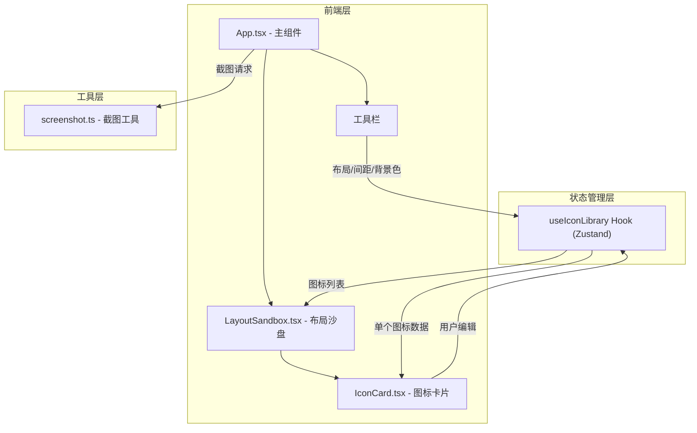

## 1. 架构设计



## 2. 技术说明

- 前端框架：React 18 + TypeScript
- 构建工具：Vite
- 状态管理：Zustand
- 截图工具：html2canvas
- 唯一标识：uuid
- 样式方案：CSS Modules + 内联样式（用于动态值）
- 布局动画：CSS Grid + Flexbox + CSS columns + CSS transition
- 初始化工具：vite-init（react-ts模板）

## 3. 路由定义

| 路由 | 用途 |
|------|------|
| / | 单页应用，包含所有功能模块 |

## 4. 数据模型

### 4.1 核心数据类型

```typescript
interface IconItem {
  id: string;
  name: string;
  svgContent: string;
  size: number;
  color: string;
  isSelected: boolean;
}

interface LayoutState {
  mode: 'grid' | 'flex' | 'waterfall';
  gap: number;
  backgroundColor: string;
}

interface IconLibraryState {
  icons: IconItem[];
  layout: LayoutState;
  addIcons: (files: File[]) => Promise<void>;
  removeIcon: (id: string) => void;
  updateIconSize: (id: string, size: number) => void;
  updateIconColor: (id: string, color: string) => void;
  toggleIconSelection: (id: string) => void;
  setLayoutMode: (mode: LayoutState['mode']) => void;
  setGap: (gap: number) => void;
  setBackgroundColor: (color: string) => void;
}
```

### 4.2 数据流

```
用户操作 → Zustand Store 更新 → React 组件重新渲染
```

## 5. 文件结构

```
├── package.json
├── index.html
├── vite.config.js
├── tsconfig.json
├── src/
│   ├── App.tsx
│   ├── hooks/
│   │   └── useIconLibrary.ts
│   ├── components/
│   │   ├── IconCard.tsx
│   │   └── LayoutSandbox.tsx
│   └── utils/
│       └── screenshot.ts
```

## 6. 关键实现细节

### 6.1 SVG上传与解析

- 使用 `FileReader.readAsText()` 读取SVG文件内容
- 使用 `DOMParser` 验证SVG有效性
- 提取SVG内部内容用于React组件渲染

### 6.2 SVG颜色修改

- 通过CSS `fill` 属性修改单色SVG颜色
- 对SVG内部元素应用 `currentColor` 策略，外层设置 `color` 样式

### 6.3 布局模式实现

- **网格模式**：`display: grid; grid-template-columns: repeat(3, 1fr); min-width: 200px`
- **弹性模式**：`display: flex; flex-wrap: wrap; justify-content: space-around`
- **瀑布流模式**：`column-count: 3; column-gap` 配合 `break-inside: avoid`

### 6.4 截图导出

- 获取沙盘容器DOM引用
- 调用 `html2canvas` 渲染为Canvas
- 转换为PNG Blob并触发下载
- 文件名格式：`icon-layout-snapshot-{timestamp}.png`
