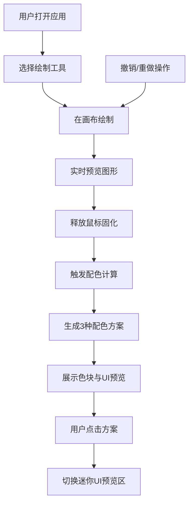

## 1. 产品概述

网页沙盒绘制与动态配色方案生成应用，让用户在无限画布上自由创作，同时智能推荐互补配色方案并提供UI控件预览效果。

- 主要用途：创意绘制工具 + 配色方案生成器
- 目标用户：设计师、前端开发者、创意工作者
- 核心价值：将图形绘制与配色设计一体化，提升设计效率

## 2. 核心功能

### 2.1 功能模块

1. **无限画布绘制**：支持矩形、圆形、多边形、自由线条四种绘制工具
2. **动态配色方案**：根据当前颜色和图形布局实时计算3种互补配色方案
3. **UI控件预览**：展示配色方案在按钮、卡片、输入框上的实际效果
4. **画布操作**：缩放、平移、撤销/重做、历史记录

### 2.2 页面详情

| 页面名称 | 模块名称 | 功能描述 |
|-----------|-------------|---------------------|
| 主应用页 | 左侧工具栏 | 绘制工具切换、颜色选择器、线条粗细滑块 |
| 主应用页 | 中央画布区 | 无限画布、图形绘制、缩放平移、网格背景 |
| 主应用页 | 右侧配色面板 | 3种配色方案展示、色块悬停放大、UI预览区 |
| 主应用页 | Toast提示 | 操作反馈、撤销重做提示 |

## 3. 核心流程

### 3.1 绘制流程

用户选择绘制工具 → 在画布上拖拽/点击绘制 → 实时预览半透明图形 → 释放鼠标固化图形 → 自动更新配色方案

### 3.2 配色流程

用户选择颜色 → 配色算法计算 → 生成3种互补方案 → 展示色块与UI预览 → 用户点击方案切换预览效果

### 3.3 流程图

## 4. 用户界面设计

### 4.1 设计风格

- **主题**：深色模式，专业创意工具风格
- **主色调**：深色背景 #2c2c2c，文字 #e0e0e0
- **强调色**：蓝色指示条，选中状态高亮
- **按钮风格**：圆形工具按钮，36px直径，选中底部2px蓝色指示条
- **字体**：现代无衬线字体，清晰易读
- **布局**：三栏布局 - 左侧工具栏、中央画布、右侧配色面板
- **动效**：0.3秒ease过渡动画，流畅自然

### 4.2 页面设计概述

| 页面名称 | 模块名称 | UI 元素 |
|-----------|-------------|-------------|
| 主应用页 | 左侧工具栏 | 垂直固定64px宽，深色背景，圆形工具按钮，颜色选择器，粗细滑块 |
| 主应用页 | 中央画布 | 全屏填充，#f5f5f5背景，20px网格，十字准星光标 |
| 主应用页 | 右侧配色面板 | 320px宽可折叠，3种配色方案，5色块/方案，UI预览区 |
| 主应用页 | Toast提示 | 顶部滑入，绿色背景，0.4秒淡出 |

### 4.3 响应式设计

- 桌面端：三栏布局
- 平板/移动端（<768px）：右侧面板折叠为底部抽屉
- 触控优化：触摸手势支持

### 4.4 交互细节

- 工具切换：0.2秒渐变色过渡
- 色块悬停：放大1.1倍，显示色值
- UI控件悬停：0.3秒亮度变化闪烁
- 面板折叠：0.3秒宽度渐变动画
- 画布绘制：光标十字准星，拖拽手型

## 5. 性能要求

- 画布绘制响应时间：≤50ms（60FPS）
- 配色计算时间：≤300ms
- 历史记录：最多50步
- 缩放范围：0.5x - 5x
