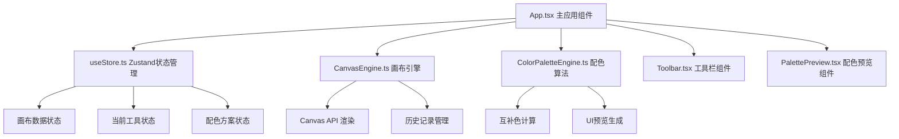

## 1. 架构设计



## 2. 技术描述

- **前端框架**：React 18 + TypeScript
- **构建工具**：Vite 5
- **状态管理**：Zustand 4
- **绘制引擎**：Canvas API
- **唯一ID生成**：uuid
- **样式方案**：CSS Modules / 内联样式（Styled Components 不使用

## 3. 文件结构

```
项目根目录/
├── package.json          # 项目依赖与脚本
├── index.html          # 入口HTML
├── vite.config.js      # Vite配置
├── tsconfig.json      # TypeScript配置
└── src/
    ├── App.tsx                 # 主应用组件
    ├── core/
    │   ├── CanvasEngine.ts         # 画布引擎
    │   └── ColorPaletteEngine.ts  # 配色算法引擎
    ├── components/
    │   ├── Toolbar.tsx           # 工具栏组件
    │   └── PalettePreview.tsx    # 配色预览组件
    └── store/
        └── useStore.ts            # Zustand状态管理
```

## 4. 核心模块说明

### 4.1 状态管理 (useStore.ts)

**State:
- `shapes: Shape[]` - 画布上的所有图形
- `currentTool: ToolType` - 当前选中的绘制工具
- `currentColor: string` - 当前颜色
- `lineWidth: number` - 线条粗细
- `palettes: Palette[]` - 推荐的配色方案
- `selectedPaletteIndex: number` - 当前选中的配色方案索引
- `history: Shape[][]` - 历史记录栈
- `historyIndex: number` - 当前历史位置
- `isPanning: boolean` - 是否处于平移状态
- `zoom: number` - 缩放比例
- `offset: { x: number, y: number }` - 画布偏移量

**Actions:**
- `setTool(tool)` - 设置当前工具
- `setColor(color)` - 设置当前颜色
- `setLineWidth(width)` - 设置线条粗细
- `addShape(shape)` - 添加图形
- `undo()` - 撤销
- `redo()` - 重做
- `setZoom(zoom)` - 设置缩放
- `setOffset(offset)` - 设置偏移
- `generatePalettes()` - 生成配色方案

### 4.2 画布引擎 (CanvasEngine.ts)

**类：CanvasEngine

**属性：
- canvas: HTMLCanvasElement
- ctx: CanvasRenderingContext2D
- shapes: Shape[]
- zoom: number
- offset: { x, y }

**方法：
- `init(canvas)` - 初始化画布
- `render()` - 渲染循环
- `drawShape(shape)` - 绘制单个图形
- `drawGrid()` - 绘制网格背景
- `handleMouseDown(e)` - 鼠标按下
- `handleMouseMove(e)` - 鼠标移动
- `handleMouseUp(e)` - 鼠标释放
- `handleWheel(e)` - 滚轮缩放
- `screenToWorld(x, y)` - 屏幕坐标转世界坐标

### 4.3 配色算法引擎 (ColorPaletteEngine.ts)

**类：ColorPaletteEngine

**方法：
- `generateComplementaryPalettes(baseColor, shapes)` - 生成互补配色方案
- `generateAnalogousPalette(baseColor)` - 生成类似色方案
- `generateTriadicPalette(baseColor)` - 生成三角色方案
- `generateSplitComplementaryPalette(baseColor)` - 生成分裂互补色方案
- `hexToHsl(hex)` - HEX转HSL
- `hslToHex(h, s, l)` - HSL转HEX

### 4.4 工具栏组件 (Toolbar.tsx)

**功能：
- 工具切换按钮（矩形、圆形、多边形、自由线条）
- 颜色选择器
- 线条粗细滑块
- 拾色器工具
- 撤销/重做按钮

### 4.5 配色预览组件 (PalettePreview.tsx)

**功能：
- 展示3种配色方案
- 每个方案5个色块
- 色块悬停放大显示色值
- 迷你UI预览区（按钮、卡片、输入框）
- 面板折叠功能

## 5. 数据模型

### 5.1 Shape 类型定义

```typescript
type ToolType = 'rectangle' | 'circle' | 'polygon' | 'freehand';

interface BaseShape {
  id: string;
  type: ToolType;
  color: string;
  lineWidth: number;
  fill?: string;
}

interface RectangleShape extends BaseShape {
  type: 'rectangle';
  x: number;
  y: number;
  width: number;
  height: number;
}

interface CircleShape extends BaseShape {
  type: 'circle';
  cx: number;
  cy: number;
  radiusX: number;
  radiusY: number;
}

interface PolygonShape extends BaseShape {
  type: 'polygon';
  points: { x: number; y: number }[];
  isComplete: boolean;
}

interface FreehandShape extends BaseShape {
  type: 'freehand';
  points: { x: number; y: number }[];
}

type Shape = RectangleShape | CircleShape | PolygonShape | FreehandShape;
```

### 5.2 Palette 类型定义

```typescript
interface Palette {
  name: string;
  colors: string[];
  type: 'complementary' | 'analogous' | 'triadic';
}
```

## 6. 性能优化

- Canvas 渲染使用 requestAnimationFrame
- 历史记录限制50步
- 配色计算防抖处理
- 图形对象复用，
