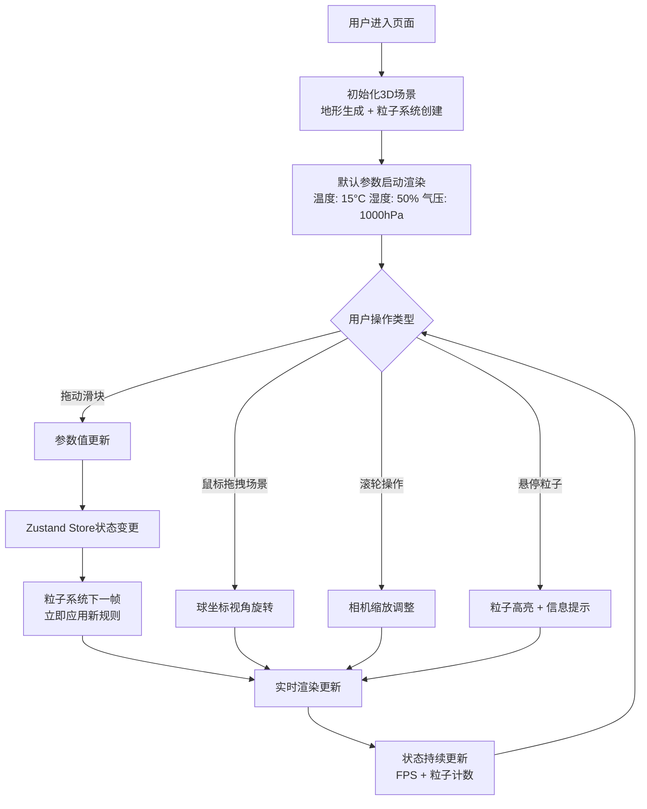

## 1. 产品概述
气象粒子沙盘是一款可交互的微型气候模拟可视化工具，通过调节温度、湿度、气压三个核心气象参数，在3D立体地形上实时观察风向粒子流、降雨粒子密度和云层形态的动态变化。
- 主要用途：气象科普教育、气候参数可视化演示、交互型学习工具
- 目标用户：气象爱好者、学生、教育工作者、对气候系统感兴趣的公众
- 核心价值：将抽象的气象参数转化为直观可见的3D动态粒子效果，实现"所见即所得"的交互式学习体验

## 2. 核心功能

### 2.1 功能模块
1. **3D地形场景**：柏林噪声高度图地形、渐变着色材质、包围盒空间
2. **粒子系统**：风向粒子、降雨粒子、云层粒子的生成与动态模拟
3. **参数控制面板**：温度、湿度、气压三个滑块实时调节
4. **气候状态摘要**：顶部实时显示当前参数值，带数值变化动画
5. **视角控制**：鼠标拖拽旋转、滚轮缩放、球坐标视角控制
6. **粒子交互**：悬停高亮、信息提示框、粒子类型识别
7. **状态栏**：底部显示粒子总数和FPS性能指标

### 2.2 页面详情

| 页面名称 | 模块名称 | 功能描述 |
|-----------|-------------|---------------------|
| 主界面 - 3D沙盘场景 | 地形渲染 | 长宽比2:1矩形地形，柏林噪声生成高度起伏（-1到1单位），深绿到灰白渐变材质 |
| 主界面 - 3D沙盘场景 | 包围盒 | 8x4x5单位空间，作为粒子发射的约束区域 |
| 主界面 - 3D沙盘场景 | 风向粒子 | 蓝色#42a5f5半透明长条形粒子，移动方向随温度场偏转 |
| 主界面 - 3D沙盘场景 | 降雨粒子 | 青色#00e5ff圆形粒子（半径0.03），下落速度与湿度成正比，密度100-500个 |
| 主界面 - 3D沙盘场景 | 云层粒子 | 白色#ffffff半透明不规则片状粒子，高度和密度随气压变化 |
| 主界面 - 3D沙盘场景 | 视角控制 | 水平360°旋转、垂直-30°到60°俯仰、缩放2到15单位、灵敏度0.05 |
| 主界面 - 3D沙盘场景 | 粒子交互 | 悬停高亮（白色1.5倍放大，0.2秒），右上角信息提示框 |
| 主界面 - 左侧控制面板 | 温度滑块 | -10°C到40°C，步长1°C，映射风向偏转角-30°到+30° |
| 主界面 - 左侧控制面板 | 湿度滑块 | 0%到100%，步长1%，线性插值降雨粒子数量100到500 |
| 主界面 - 左侧控制面板 | 气压滑块 | 950hPa到1050hPa，步长1hPa，映射云层基准高度2到4单位 |
| 主界面 - 顶部摘要条 | 参数显示 | 温度(#ff7043)、湿度(#42a5f5)、气压(#66bb6a)三项均分，数值变化带0.3秒弹跳动画 |
| 主界面 - 底部状态栏 | 性能指标 | 粒子总数 + FPS（每秒更新一次） |

## 3. 核心流程

## 4. 用户界面设计

### 4.1 设计风格
- **主色调**：科技感暗色调，深色背景#1e1e2e / #1a1a2e
- **辅助色**：温度橙#ff7043、湿度蓝#42a5f5、气压绿#66bb6a、粒子青#00e5ff
- **滑块设计**：圆形按钮直径16px，拖动时#ffab91发光光晕（3px宽，透明度0.5）
- **字体选择**：数值使用monospace等宽字体，保证数字对齐
- **布局风格**：左侧固定面板 + 中央3D场景 + 顶部摘要条 + 底部状态栏
- **动画风格**：所有过渡使用0.3秒ease-in-out，数值变化使用cubic-bezier(0.68, -0.55, 0.27, 1.55)弹跳曲线

### 4.2 页面设计概览

| 页面区域 | 模块名称 | UI元素细节 |
|-----------|-------------|-------------|
| 左侧面板(260px) | 控制滑块组 | 背景#1e1e2e，内边距16px，滑块轨道200x6px背景#3a3a4a，数值#e0e0e0/14px/monospace |
| 顶部摘要条(36px) | 参数摘要 | 背景#2a2a3e，白色16px粗体，三项均分布局，数值0.3秒缩放弹跳 |
| 中央场景 | 3D渲染区 | 除面板外全部空间，与面板间1px分隔线#3a3a4a |
| 右上角提示框 | 粒子信息 | 背景rgba(0,0,0,0.7)，圆角8px，内边距8px，白色12px，0.3秒渐变消失 |
| 底部状态栏(28px) | 性能指标 | 背景#1a1a2e，白色12px居中显示 |

### 4.3 响应式设计
- 桌面端优先设计，固定面板宽度260px
- 最小支持宽度：1024px
- 3D场景自适应剩余空间

### 4.4 3D场景指引
- **环境与氛围**：纯黑深色背景，营造科技观测台氛围，轻微环境光+方向光照明
- **光照设置**：AmbientLight(0xffffff, 0.4) + DirectionalLight(0xffffff, 0.8)从上方45°照射
- **相机设置**：球坐标控制，初始距离6单位，俯仰角30°，方位角0°
- **构图焦点**：地形居中，粒子包围盒正好覆盖地形上方空间
- **交互与动画**：粒子连续运动（每帧更新位置），参数变更立即作用于所有粒子
- **性能优化**：对象池模式管理2000个以内粒子，使用BufferGeometry和PointsMaterial批量渲染，避免频繁创建销毁
