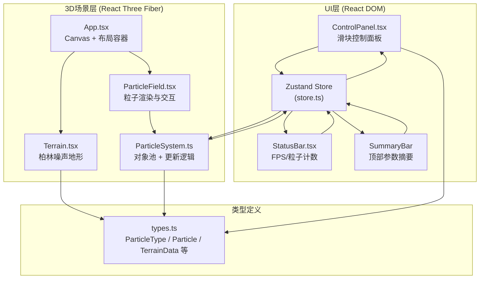

## 1. 架构设计



## 2. 技术栈说明

- **前端框架**：React@18 + TypeScript@5
- **构建工具**：Vite@5
- **3D渲染**：Three.js@0.160 + @react-three/fiber@8 + @react-three/drei@9
- **状态管理**：Zustand@4
- **样式方案**：纯CSS（style属性 + CSS-in-JS内联样式），不引入额外CSS框架
- **对象池模式**：自定义ParticleSystem类手动管理粒子生命周期

## 3. 项目文件结构

| 路径 | 目的 | 说明 |
|------|------|------|
| `package.json` | 依赖与脚本 | react, react-dom, typescript, three, @react-three/fiber, @react-three/drei, zustand |
| `index.html` | Vite入口 | `<div id="root"></div>` 挂载点 |
| `vite.config.js` | 构建配置 | 开启TypeScript支持，使用@vitejs/plugin-react |
| `tsconfig.json` | TS配置 | 严格模式strict:true，target:es2020，jsx:react-jsx |
| `src/main.tsx` | React入口 | `ReactDOM.createRoot` 渲染 `<App />` |
| `src/App.tsx` | 主组件 | 布局组合：SummaryBar + ControlPanel + R3F Canvas + StatusBar |
| `src/types.ts` | 类型定义 | ParticleType枚举、Particle接口、TerrainData接口、ClimateParams接口 |
| `src/store.ts` | Zustand状态 | temperature/humidity/pressure + setters + particleSystem引用 + 地形高度数据 |
| `src/Terrain.tsx` | 地形组件 | PlaneGeometry + Berlin噪声高度扰动 + vertexColors渐变着色 |
| `src/ParticleSystem.ts` | 粒子系统核心类 | 对象池(3类粒子池，上限2000)、emit()、update(dt)、setClimateParams() |
| `src/ParticleField.tsx` | R3F粒子组件 | useFrame驱动ParticleSystem.update、BufferGeometry+PointsMaterial渲染、raycaster悬停检测 |
| `src/ControlPanel.tsx` | 控制面板 | 三个自定义滑块组件、onChange触发store更新、拖动发光光晕效果 |
| `src/StatusBar.tsx` | 状态栏 | useRef统计FPS（requestAnimationFrame采样，每秒平均）、显示store中的粒子总数 |

## 4. 核心数据模型 (types.ts)

```typescript
// 粒子类型枚举
export enum ParticleType {
  WIND = 'wind',      // 风向粒子
  RAIN = 'rain',      // 降雨粒子
  CLOUD = 'cloud'     // 云层粒子
}

// 单个粒子对象（对象池使用）
export interface Particle {
  id: number;
  type: ParticleType;
  active: boolean;
  position: THREE.Vector3;   // 位置
  velocity: THREE.Vector3;   // 速度
  size: number;              // 粒子尺寸
  opacity: number;           // 透明度
  age: number;               // 存活时间
  lifetime: number;          // 生命周期
  rotation: number;          // 旋转角度（风向条形粒子）
}

// 地形高度数据接口
export interface TerrainData {
  width: number;             // 地形宽度 (X方向)
  depth: number;             // 地形深度 (Z方向)
  segmentsX: number;         // X方向分段数
  segmentsZ: number;         // Z方向分段数
  heights: Float32Array;     // 高度值数组 [-1, 1]
  getHeightAt: (x: number, z: number) => number;  // 采样某点高度
}

// 气候参数
export interface ClimateParams {
  temperature: number;       // -10 到 40 °C
  humidity: number;          // 0 到 100 %
  pressure: number;          // 950 到 1050 hPa
}

// 粒子悬停信息
export interface HoverInfo {
  type: ParticleType | null;
  index: number;
  params: ClimateParams;
}
```

## 5. 参数映射规则

### 5.1 温度 → 风向偏转角
```
输入范围:  -10°C  ~  40°C   (跨度 50°C)
输出范围:  -30°   ~  +30°   (跨度 60°)
公式: angle = (temperature - 15) * (60 / 50) = (temperature - 15) * 1.2
```

### 5.2 湿度 → 降雨粒子数量
```
输入范围:  0%  ~  100%
输出范围:  100  ~  500 个
公式: count = 100 + humidity * (400 / 100) = 100 + humidity * 4
```

### 5.3 气压 → 云层基准高度
```
输入范围:  950 hPa  ~  1050 hPa   (跨度 100)
输出范围:  4 单位   ~   2 单位     (反相关：低压→高云，高压→低云)
公式: baseHeight = 4 - (pressure - 950) * (2 / 100) = 4 - (pressure - 950) * 0.02
```

## 6. 粒子系统架构 (ParticleSystem.ts)

### 6.1 约束条件
- **粒子总数上限**：2000个（风向约800 + 降雨约500 + 云层约700）
- **粒子包围盒**：X ∈ [-4, 4]，Y ∈ [0, 4]，Z ∈ [-2.5, 2.5]（大小8×4×5）

### 6.2 对象池模式
```typescript
class ParticleSystem {
  private pool: Particle[];                    // 总对象池（预分配2000个）
  private windPool: Particle[];                // 风向活跃粒子索引
  private rainPool: Particle[];                // 降雨活跃粒子索引  
  private cloudPool: Particle[];               // 云层活跃粒子索引
  
  constructor() {
    this.pool = Array(2000).fill(null).map((_, i) => createEmptyParticle(i));
  }
  
  setClimateParams(t, h, p) { /* 立即更新，下一帧生效 */ }
  emitWind() { /* 从池获取非活跃粒子，重置属性后放入windPool */ }
  emitRain() { /* 根据湿度控制数量 */ }
  emitCloud() { /* 根据气压控制高度和密度 */ }
  update(dt: number) { /* 每帧更新所有活跃粒子位置，超出边界/到期回收 */ }
  getGeometryAttributes() { /* 返回positions/colors/sizes数组供BufferGeometry使用 */ }
}
```

### 6.3 粒子运动规则
| 粒子类型 | 运动行为 | 生命周期 |
|---------|---------|---------|
| Wind风向 | 沿XZ平面运动，速度向量使用温度映射的偏转角旋转，速度~2单位/秒 | 6秒，循环发射 |
| Rain降雨 | 下落速度= 0.5 + humidity×0.02 单位/秒，轻微XZ随机漂移 | 落到地形或到达Y<0时回收 |
| Cloud云层 | 慢速漂移（0.3单位/秒），Y值在baseHeight±0.3内浮动，片状缩放抖动 | 15秒，循环 |

## 7. R3F 场景渲染层级

```
<Canvas camera={{ position: [0, 3, 6], fov: 50 }}>
  <ambientLight intensity={0.4} />
  <directionalLight position={[5, 8, 5]} intensity={0.8} />
  
  {/* 1. 地形层 */}
  <Terrain onDataReady={(data) => store.setTerrainData(data)} />
  
  {/* 2. 包围盒线框（可视化参考）*/}
  <lineSegments position={[0, 2, 0]}>
    <edgesGeometry args={[new BoxGeometry(8, 4, 5)]} />
    <lineBasicMaterial color="#444466" transparent opacity={0.3} />
  </lineSegments>
  
  {/* 3. 粒子层 */}
  <ParticleField />
  
  {/* 4. 轨道控制（球坐标自定义实现）*/}
  <SphericalControls />
</Canvas>
```

## 8. 性能保障措施

1. **BufferGeometry + drawRange**：三类粒子共享一个BufferGeometry，使用drawRange分别控制各类粒子的渲染数量
2. **PointsMaterial + shader**：自定义shader实现圆形/条形/片状粒子形态差异，避免使用多个Material造成draw call分裂
3. **对象池预分配**：初始化时一次性创建2000个Particle对象，update时仅修改active状态和属性，零GC
4. **raycaster优化**：悬停检测使用Points的raycast检测，距离阈值0.15单位，命中即停止遍历
5. **useFrame节流**：粒子更新逻辑使用delta时间累加，渲染同步，独立60FPS运行
