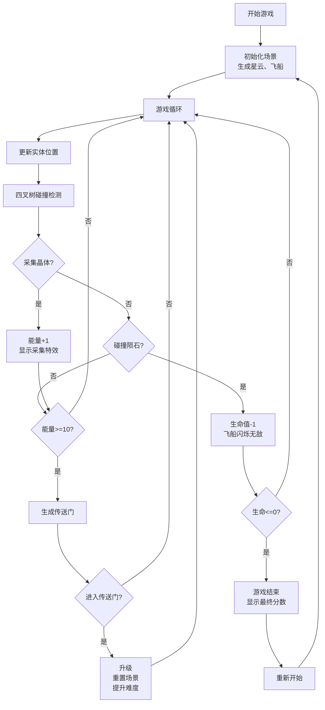

## 1. 产品概述

宇宙飞船星云生存是一款2D太空生存游戏，玩家操控飞船在随机生成的星云环境中采集能量晶体、躲避陨石，通过传送门升级飞船挑战更高难度。

- **核心玩法**：资源采集 + 躲避生存 + 等级升级
- **目标用户**：休闲游戏玩家，喜欢快节奏反应类游戏的用户
- **产品价值**：提供沉浸式太空冒险体验，通过逐步升级机制保持游戏趣味性和挑战性

## 2. 核心功能

### 2.1 功能模块
1. **游戏主场景**：星云背景渲染、实体管理、碰撞检测
2. **飞船控制系统**：WASD/方向键移动、采集光束、尾迹特效
3. **资源采集系统**：能量晶体生成、采集判定、收集特效
4. **障碍躲避系统**：陨石生成、碰撞检测、伤害反馈、破碎特效
5. **升级传送系统**：传送门生成、升级判定、场景重置、难度提升
6. **UI状态显示**：能量点数、生命值、等级、游戏结束界面

### 2.2 页面详情

| 页面名称 | 模块名称 | 功能描述 |
|-----------|-------------|---------------------|
| 游戏主页面 | Canvas画布 | 800x600逻辑分辨率，16:9自适应显示，包含所有游戏实体渲染 |
| 游戏主页面 | 状态HUD | 左上角能量点数、中央上方生命值、右上角等级显示 |
| 游戏主页面 | 游戏结束界面 | 中央显示"游戏结束"大字和最终分数 |

## 3. 核心流程

## 4. 用户界面设计

### 4.1 设计风格
- **主色调**：深空色 #0a0a1a 到 #1a1a3e 径向渐变背景
- **强调色**：飞船亮蓝色 #00e5ff、陨石灰褐色 #8d6e63、晶体三色 #ff6b6b/#ffd93d/#4fc3f7、传送门紫品渐变 #9c27b0→#e91e63
- **字体**：无衬线字体，UI文字清晰可辨
- **动效**：晶体自旋、传送门旋转、陨石破碎、采集波扩散、飞船尾迹、受伤闪烁、游戏结束脉动缩放

### 4.2 页面设计概述

| 页面名称 | 模块名称 | UI元素 |
|-----------|-------------|-------------|
| 游戏主页面 | Canvas画布 | 星云背景（漂移小点+闪烁星星）、飞船（三角形+尾迹+采集光束）、陨石（不规则多边形）、能量晶体（旋转六边形）、传送门（旋转椭圆） |
| 游戏主页面 | 状态HUD | 能量：白色16px字体 + 彩色六边形图标；生命：红色心形图标；等级：金色16px带发光阴影 |
| 游戏主页面 | 游戏结束界面 | 红色40px"游戏结束"文字（脉动缩放动画）、最终分数显示 |

### 4.3 响应式设计
- **桌面优先**，保持16:9比例自适应
- 画布宽度不超过视口宽度，高度不超过视口高度
- 画布始终居中显示

## 5. 性能要求
- 稳定60FPS帧率
- 四叉树优化碰撞检测（4x4网格分区）
- 实体数量限制：陨石≤30颗，晶体≤15颗
- requestAnimationFrame驱动游戏循环
