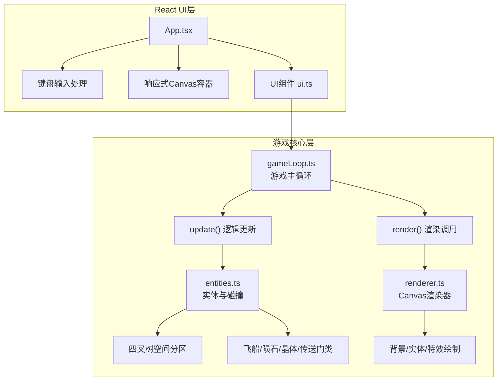

## 1. 架构设计



## 2. 技术描述

- **前端框架**：React 18 + TypeScript
- **构建工具**：Vite 5
- **渲染引擎**：Canvas 2D API
- **游戏循环**：requestAnimationFrame
- **碰撞优化**：四叉树（Quadtree）空间分区
- **状态管理**：React useState/useRef + 游戏循环内部状态

## 3. 文件结构

| 文件路径 | 用途 |
|-------|---------|
| `package.json` | 项目依赖配置（react, react-dom, typescript），启动脚本 `npm run dev` |
| `index.html` | 入口页面，挂载点 #root |
| `vite.config.js` | Vite构建配置 |
| `tsconfig.json` | TypeScript配置（严格模式） |
| `src/entities.ts` | 实体数据结构 + 四叉树碰撞检测 |
| `src/gameLoop.ts` | 游戏主循环，管理更新和渲染 |
| `src/renderer.ts` | Canvas 2D渲染器，绘制背景、实体、特效 |
| `src/ui.ts` | UI元素定义，供React组件使用 |
| `src/App.tsx` | React根组件，初始化Canvas、启动游戏循环、处理键盘输入 |

## 4. 核心数据模型

### 4.1 实体类型定义

```typescript
interface Vector2 {
  x: number;
  y: number;
}

interface Entity {
  id: number;
  position: Vector2;
  velocity: Vector2;
  radius: number;
  type: 'ship' | 'asteroid' | 'crystal' | 'portal';
}

interface Ship extends Entity {
  angle: number;
  health: number;
  invincible: boolean;
  invincibleTimer: number;
  trail: TrailParticle[];
}

interface Asteroid extends Entity {
  vertices: Vector2[];
  rotation: number;
  rotationSpeed: number;
}

interface Crystal extends Entity {
  color: string;
  rotation: number;
}

interface Portal extends Entity {
  rotation: number;
}

interface Quadtree {
  bounds: Rectangle;
  capacity: number;
  objects: Entity[];
  divided: boolean;
  northwest?: Quadtree;
  northeast?: Quadtree;
  southwest?: Quadtree;
  southeast?: Quadtree;
}
```

### 4.2 游戏状态

```typescript
interface GameState {
  ship: Ship;
  asteroids: Asteroid[];
  crystals: Crystal[];
  portal: Portal | null;
  energy: number;
  level: number;
  score: number;
  gameOver: boolean;
  whiteFlash: number;
  effects: Effect[];
  asteroidSpawnRate: number;
  crystalSpawnRate: number;
}
```

## 5. 核心算法

### 5.1 四叉树碰撞检测
- 画布分为4x4网格区域
- 每帧重建四叉树
- 仅检测同格和相邻8格内的实体碰撞
- 时间复杂度从O(n²)优化到O(n log n)

### 5.2 碰撞检测算法
- 圆形碰撞检测（飞船、晶体、传送门）
- 多边形与圆形碰撞检测（陨石使用边界圆简化）
- 光束锥形碰撞检测（点在三角形内判定）

### 5.3 实体生成控制
- 陨石：最大30颗，边缘生成，速度1-2px/帧
- 晶体：最大15颗，随机位置生成
- 传送门：能量≥10时随机位置生成

## 6. 渲染流程

```
每帧渲染顺序：
1. 绘制深空径向渐变背景
2. 绘制星云小点（缓慢漂移）
3. 绘制闪烁星星
4. 绘制能量晶体（旋转六边形）
5. 绘制传送门（旋转椭圆+渐变边框）
6. 绘制陨石（不规则多边形）
7. 绘制飞船尾迹（渐隐颗粒）
8. 绘制飞船（三角形+采集光束）
9. 绘制特效（采集波、陨石碎片）
10. 绘制白屏过渡（升级时）
```

## 7. 键盘控制映射

| 按键 | 动作 |
|------|------|
| W / ↑ | 向上移动 |
| S / ↓ | 向下移动 |
| A / ← | 向左移动 |
| D / → | 向右移动 |
| 空格 | 游戏结束后重新开始 |

## 8. 难度升级规则

| 升级效果 | 数值 |
|---------|------|
| 陨石生成速度提升 | +20% / 每级 |
| 晶体生成速度提升 | +10% / 每级 |
| 初始等级 | 1 |
| 升级所需能量 | 10点 |
