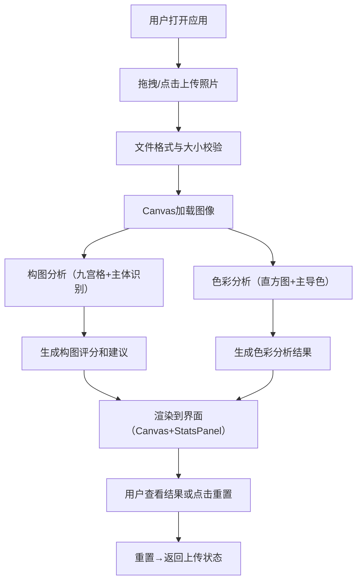

## 1. 产品概述

本产品是一款面向独立摄影师的交互式摄影构图与色彩分析看板应用，帮助摄影师在户外拍摄时通过浏览器快速分析照片的构图平衡和色彩氛围，减少后期裁剪调色的时间浪费。

- **核心价值**：即时提供专业级构图评分和调色建议，提升拍摄质量和后期效率
- **目标用户**：户外摄影师、摄影爱好者、摄影学习者

## 2. 核心功能

### 2.1 用户角色
| 角色 | 注册方式 | 核心权限 |
|------|----------|----------|
| 普通用户 | 无需注册，直接使用 | 照片上传、构图分析、色彩分析、评分查看 |

### 2.2 功能模块
1. **照片上传模块**：拖拽上传区域、文件选择、格式校验、大小限制
2. **构图分析模块**：九宫格参考线、主体识别、水平线检测、构图评分
3. **色彩分析模块**：RGB直方图、主导色提取、色板展示
4. **评分建议模块**：综合评分计算、自然语言建议生成
5. **重置功能**：清除当前照片和分析结果，恢复初始状态

### 2.3 页面详情
| 页面名称 | 模块名称 | 功能描述 |
|----------|----------|----------|
| 主页面 | 拖拽上传区 | 支持拖拽和点击上传，显示上传提示，拖拽高亮效果 |
| 主页面 | 照片Canvas区 | 原图显示、九宫格参考线叠加、主体位置标记 |
| 主页面 | 统计面板 | 直方图展示、主导色色板、构图评分数字、调色建议文本 |
| 主页面 | 重置按钮 | 清除所有数据，返回初始上传状态 |

## 3. 核心流程

用户打开应用 → 拖拽或点击选择照片 → 系统自动进行构图和色彩分析 → 实时显示分析结果（九宫格线、主体标记、直方图、主导色、评分、建议） → 用户可点击重置上传新照片

## 4. 用户界面设计

### 4.1 设计风格
- **设计基调**：暗色专业摄影风格，类似Lightroom界面
- **主背景**：#1a1a2e，次级卡片背景：#16213e
- **强调色**：#007aff（蓝色），警告色：#ff3b30（红色）
- **文字颜色**：#e0e0e0，分隔线：#333
- **按钮风格**：圆角8px，悬停过渡0.2s ease-out
- **字体**：专业无衬线字体，评分数字大号48px

### 4.2 页面设计概述
| 页面名称 | 模块名称 | UI元素 |
|----------|----------|----------|
| 主页面 | 拖拽上传区 | 80%视口宽，150px高，#f0f0f0背景，虚线边框#333，拖拽高亮淡蓝背景 |
| 主页面 | 照片Canvas | 宽100%高540px，最大960px，#222背景，居中等比缩放 |
| 主页面 | 九宫格参考线 | 白色虚线，线宽1px，透明度0.6，三等分线 |
| 主页面 | 主体标记 | 8px红色#ff3b30实心圆点，2px白色描边 |
| 主页面 | 统计面板 | 左侧直方图640x200px，右侧主导色块40x40px圆角8px |
| 主页面 | 评分数字 | 48px字号，#ff6b6b颜色，0滚动到终值动画1s |
| 主页面 | 建议文本 | 14px字号，#e0e0e0颜色，10px左侧内边距 |
| 主页面 | 重置按钮 | 右上角，#ff3b30背景，白色文字，悬停#ff6348 |

### 4.3 响应式设计
- **桌面端（≥900px）**：左侧照片区域70%，右侧StatsPanel 30%（最小300px），固定视口高度可滚动
- **移动端（<900px）**：单列布局，StatsPanel移至底部，占100%宽度，高度自适应
- **所有交互元素**：0.2s ease-out过渡动画

### 4.4 动效设计
- 拖拽上传区域：渐入动画 opacity 0→1 持续0.3s
- 评分数字：0滚动到终值动画，持续1s，ease-out缓动
- 按钮悬停：背景色过渡0.2s
- 拖拽高亮：边框和背景过渡0.3s

## 5. 性能约束
- 整体分析时间（上传到显示结果）≤ 1.5秒
- 直方图渲染帧率 ≥ 30fps
- 主Canvas渲染无卡顿或闪烁
- 支持最大15MB的JPG/PNG图片
