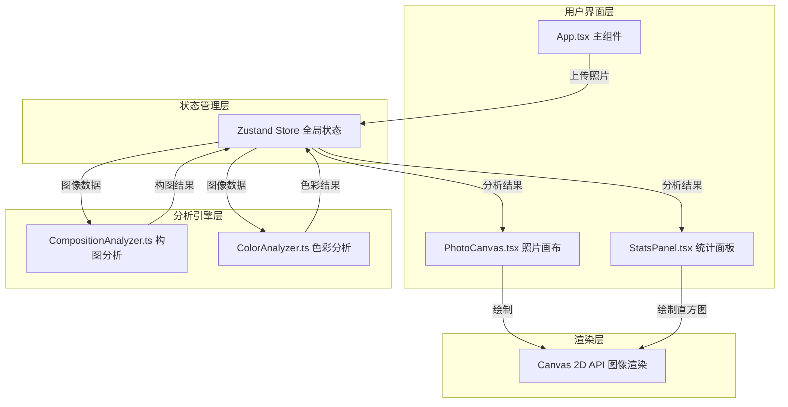

## 1. 架构设计



## 2. 技术描述

- **前端框架**：React@18 + TypeScript
- **构建工具**：Vite@5
- **状态管理**：Zustand@4
- **图像分析**：Canvas 2D API 原生实现
- **样式方案**：CSS3 + CSS Variables，响应式布局
- **开发语言**：TypeScript 严格模式（strict: true）

## 3. 文件结构与调用关系

```
src/
├── App.tsx                     # 主组件（入口）
│   ├── 接收用户拖拽/点击上传
│   ├── 调用analyzer进行分析
│   ├── 分发数据到子组件
│   └── 布局编排
├── store/
│   └── usePhotoStore.ts        # Zustand状态管理
│       ├── photo (ImageData|null)
│       ├── compositionResult
│       ├── colorResult
│       └── actions: setPhoto, analyze, reset
├── analyzer/
│   ├── CompositionAnalyzer.ts  # 构图分析模块
│   │   ├── analyze(imageData) => {score, advice, subjectPosition}
│   │   ├── detectSubject()     # Sobel边缘检测找主体
│   │   └── calculateScore()    # 九宫格评分逻辑
│   └── ColorAnalyzer.ts        # 色彩分析模块
│       ├── analyze(imageData) => {histogram, palette}
│       ├── calculateHistogram() # RGB直方图计算
│       └── extractPalette()    # K-Means主导色提取
├── components/
│   ├── PhotoCanvas.tsx         # 照片渲染组件
│   │   ├── 绘制原图（等比缩放）
│   │   ├── 绘制九宫格参考线
│   │   └── 绘制主体标记圆点
│   └── StatsPanel.tsx          # 统计面板组件
│       ├── 绘制RGB直方图
│       ├── 展示主导色色块
│       ├── 展示评分数字（滚动动画）
│       └── 展示调色建议文本
└── types/
    └── index.ts                # TypeScript类型定义
```

### 数据流向
1. **上传流程**：用户拖拽文件 → App.tsx处理文件 → 加载为Image → 获取ImageData → Store.setPhoto()
2. **分析流程**：Store触发分析 → 并行调用CompositionAnalyzer和ColorAnalyzer → 结果存入Store
3. **渲染流程**：Store状态变化 → PhotoCanvas/StatsPanel重渲染 → Canvas绘制结果

## 4. 核心数据结构

```typescript
// 构图分析结果
interface CompositionResult {
  score: number;           // 0-100分
  advice: string;          // 自然语言建议
  subjectPosition: {       // 主体中心位置（相对坐标0-1）
    x: number;
    y: number;
  };
  gridLines: {             // 九宫格线位置
    vertical: number[];    // [1/3, 2/3]
    horizontal: number[];  // [1/3, 2/3]
  };
}

// 色彩分析结果
interface ColorResult {
  histogram: number[];     // 256个bin，每个bin的频率
  palette: string[];       // 前3主导色，十六进制格式
}

// 全局状态
interface PhotoState {
  imageData: ImageData | null;
  imageUrl: string | null;
  imageSize: { width: number; height: number } | null;
  composition: CompositionResult | null;
  color: ColorResult | null;
  isAnalyzing: boolean;
  setPhoto: (data: ImageData, url: string, size: {w:number, h:number}) => void;
  analyze: () => void;
  reset: () => void;
}
```

## 5. 算法设计

### 5.1 主体识别算法（简化Sobel边缘检测）
1. 将图像转为灰度图
2. 使用Sobel算子计算水平和垂直梯度
3. 计算梯度幅值，找到梯度最大的区域中心
4. 返回主体相对坐标位置

### 5.2 构图评分算法
- 基础分：60分
- 主体落在九宫格交点附近（<10%偏移）：+20分/每个交点，最高+40
- 主体落在中央区域（中间1/3范围）：-10分
- 主体落在边缘区域（<10%或>90%位置）：-20分
- 最终分数限制在0-100范围

### 5.3 主导色提取算法（简化K-Means）
1. 对图像像素进行采样（每隔N个像素取一个）
2. 初始化3个聚类中心为最频繁的颜色
3. 迭代5轮：
   - 每个像素分配到最近的聚类中心
   - 更新聚类中心为该簇的平均颜色
4. 返回最终3个主导色的十六进制值

### 5.4 调色建议生成逻辑
根据构图评分和色板信息，使用规则引擎生成建议：
- 构图建议：根据主体位置与九宫格的关系
- 色彩建议：根据主导色的色温倾向（冷暖判断）
- 综合建议：组合构图和色彩建议

## 6. 性能优化策略

1. **Canvas渲染优化**：
   - 使用离屏Canvas进行分析计算
   - 避免不必要的重绘，使用requestAnimationFrame
   - 图像等比缩放后再分析，减少计算量

2. **分析性能优化**：
   - 像素采样：分析时对大图像进行降采样
   - 并行计算：构图分析和色彩分析可并行执行
   - 缓存机制：同一图像不重复分析

3. **动画优化**：
   - 使用CSS transform和opacity实现动画
   - 评分滚动动画使用requestAnimationFrame
   - 避免布局抖动（layout thrashing）

## 7. 路由定义
| 路由 | 用途 |
|------|------|
| / | 主应用页面，包含所有功能 |

本应用为单页面应用，无需多路由配置。
