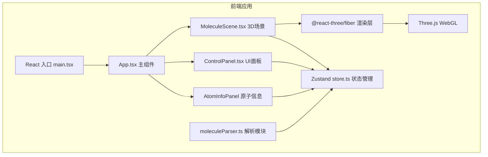
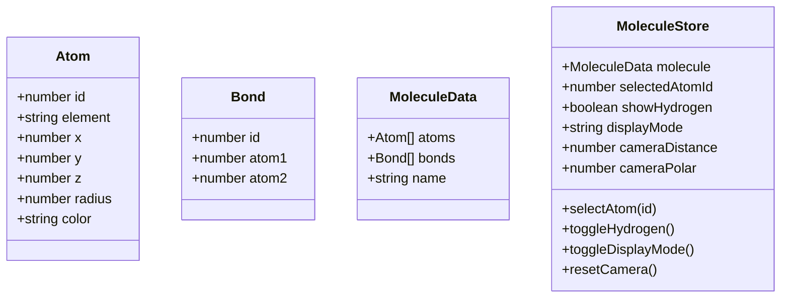

## 1. 架构设计



## 2. 技术说明

- **前端框架**：React 18 + TypeScript
- **构建工具**：Vite 5
- **3D渲染**：Three.js + @react-three/fiber + @react-three/drei
- **状态管理**：Zustand
- **样式方案**：原生 CSS（styled-components/inline styles），不使用 Tailwind，保持纯TS项目
- **初始化方式**：npm init vite-init@latest --template react-ts

## 3. 路由定义

| 路由 | 用途 |
|------|------|
| / | 主应用页面，包含3D场景和所有UI面板 |

单页面应用，无需路由系统。

## 4. 数据模型

### 4.1 数据模型定义



### 4.2 类型定义

```typescript
interface Atom {
  id: number;
  element: 'C' | 'O' | 'N' | 'H';
  x: number;
  y: number;
  z: number;
}

interface Bond {
  id: number;
  atom1: number;
  atom2: number;
}

interface MoleculeData {
  name: string;
  atoms: Atom[];
  bonds: Bond[];
}

type DisplayMode = 'ball-stick' | 'space-filling';
```

### 4.3 预设分子数据（咖啡因）

咖啡因分子式 C8H10N4O2，包含24个原子和25个化学键，需手动构建3D坐标。

## 5. 文件结构

```
auto110/
├── package.json
├── index.html
├── vite.config.js
├── tsconfig.json
└── src/
    ├── main.tsx          # React入口
    ├── App.tsx           # 主组件，布局协调
    ├── store.ts          # Zustand状态管理
    ├── moleculeParser.ts # 分子数据解析+预设数据
    ├── MoleculeScene.tsx # R3F 3D场景组件
    ├── ControlPanel.tsx  # 迷你控制面板
    └── AtomInfoPanel.tsx # 原子信息面板
```

## 6. 性能策略

- **渲染优化**：原子使用 <Sphere> 组件配合 useMemo 缓存几何体/材质；200原子上限通过InstancedMesh增强
- **交互响应**：raycaster点击检测在requestAnimationFrame中执行，高亮反馈<100ms
- **模式切换**：原子半径切换使用CSS transition onThree.js objects scale属性，过渡≤300ms
- **帧率保障**：避免频繁创建对象，复用几何体和材质
