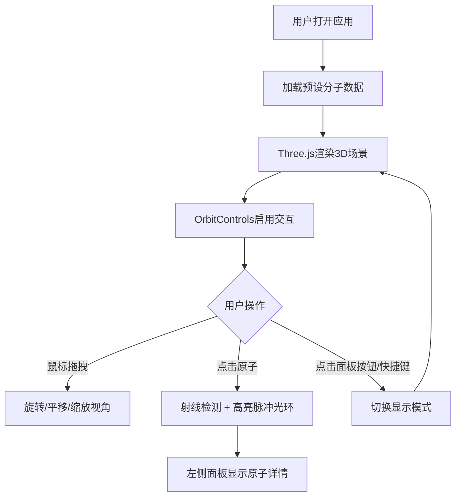

## 1. 产品概述

交互式分子结构可视化与编辑应用，面向化学研究人员、学生和教育工作者，提供直观的3D分子模型展示与交互体验。

- 主要用途：在浏览器中以3D形式展示小分子化合物（如咖啡因），支持交互式操作（旋转、平移、缩放）、原子高亮检测、显示模式切换
- 目标价值：降低分子结构学习门槛，提供即时视觉反馈的化学教育工具

## 2. 核心功能

### 2.1 用户角色

| 角色 | 注册方式 | 核心权限 |
|------|---------|---------|
| 普通用户 | 无需注册，直接访问 | 使用所有可视化和交互功能 |

### 2.2 功能模块

1. **3D分子场景**：原子球体渲染、化学键渲染、相机交互控制
2. **迷你控制面板**：氢原子开关、显示模式切换、视角重置
3. **原子信息面板**：元素符号、坐标信息、化学键列表
4. **键盘快捷键系统**：R重置视角、H切换氢原子、M切换模型

### 2.3 页面详情

| 页面名称 | 模块名称 | 功能描述 |
|---------|---------|---------|
| 主应用页面 | 3D分子场景 | Three.js渲染咖啡因分子，支持OrbitControls交互 |
| 主应用页面 | 迷你控制面板 | 右上角悬浮面板，三个功能开关按钮 |
| 主应用页面 | 原子信息面板 | 左侧显示选中原子的详细信息，支持滚动 |
| 主应用页面 | 快捷键系统 | 键盘事件监听，快速切换显示模式 |

## 3. 核心流程

用户打开应用 → 加载预设咖啡因分子 → 鼠标拖拽旋转/平移/缩放 → 点击原子查看详情 → 通过面板或快捷键切换显示模式 → 重置视角恢复初始状态

## 4. 用户界面设计

### 4.1 设计风格
- **主色调**：深蓝渐变背景（#0f0f23 → #1a1a2e），配合亮青色高亮（#00d4aa）
- **原子配色**：碳灰#808080、氧红#ff0000、氮蓝#0000ff、氢白#ffffff
- **按钮样式**：圆角方形，深灰背景#3a3a4a，选中态亮青#00d4aa，过渡0.2s
- **字体**：等宽字体用于坐标数值，颜色#e0e0e0，字号12px
- **布局风格**：全屏3D场景 + 悬浮半透明面板，毛玻璃效果（backdrop-filter: blur(10px)）
- **交互反馈**：悬停上浮 translateY(-2px)，颜色过渡0.2s

### 4.2 页面设计概览

| 页面名称 | 模块名称 | UI元素 |
|---------|---------|--------|
| 主应用页面 | 3D分子场景 | 全屏Canvas，渐变背景，光照环境 |
| 主应用页面 | 迷你控制面板 | 宽120px，rgba(30,30,46,0.85)，圆角10px，3个切换按钮 |
| 主应用页面 | 原子信息面板 | 宽220px，#1a1a2e背景，圆角8px，可滚动内容 |
| 主应用页面 | 响应式适配 | <768px时信息面板变为底部抽屉，圆角顶部16px |

### 4.3 响应式设计
- **桌面优先**：默认信息面板在左侧（220px宽），控制面板在右上角
- **移动端适配**：视口宽度<768px时，信息面板移至底部，高度自动扩展，宽度全屏，圆角仅保留顶部16px
- **触控优化**：OrbitControls原生支持多点触控手势

### 4.4 3D场景指导
- **环境氛围**：暗色系渐变背景，营造科学探索氛围
- **光照设置**：环境光 + 方向光，确保原子球体有足够立体感
- **相机设置**：初始距离模型中心4单位，俯仰角30度，OrbitControls控制
- **焦点元素**：分子模型居中展示，选中原子周围脉冲光环#00d4aa
- **交互动画**：选中光环脉动周期1.2s，透明度0.3-0.8，环宽0.06单位
- **性能优化**：使用instancedMesh优化原子和键的渲染（200原子上限流畅60fps）
