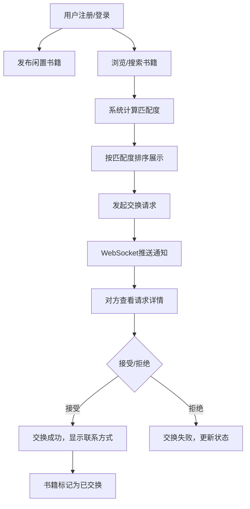

## 1. 产品概述

社区书店在线书籍交换平台，让读者可以上传闲置书籍并与其他读者进行交换，解决书籍闲置和个人购书成本高的问题，促进社区知识共享。

- 主要目的：构建一个便捷的书籍交换生态系统，降低阅读成本，促进社区文化交流
- 目标用户：爱读书的社区居民、学生、职场人士等有闲置书籍的读者
- 市场价值：减少资源浪费，建立社区文化纽带，形成可持续的阅读循环

## 2. 核心功能

### 2.1 用户角色

| 角色 | 注册方式 | 核心权限 |
|------|----------|----------|
| 普通用户 | 用户名+密码+邮箱注册 | 浏览书籍、发布书籍、发起交换、管理个人中心 |

### 2.2 功能模块

1. **首页/书籍列表页**：书籍网格展示、搜索过滤、匹配度排序
2. **书籍发布页**：书籍信息填写、封面上传、类别选择
3. **个人中心页**：用户信息、已发布书籍管理、交换请求管理
4. **登录/注册页**：用户认证、密码加密、token管理

### 2.3 页面详情

| 页面名称 | 模块名称 | 功能描述 |
|---------|----------|----------|
| 首页/书籍列表 | 搜索栏 | 支持书名、作者、类别模糊搜索，实时响应 |
| 首页/书籍列表 | 书籍卡片网格 | 4列布局，展示封面、书名、作者、状态、匹配度 |
| 首页/书籍列表 | 交换请求弹窗 | 选择自己的书籍发起交换请求 |
| 书籍发布页 | 表单模块 | 书名、作者、类别、状态、描述输入 |
| 书籍发布页 | 封面上传 | 支持jpg/png，最大5MB，multer处理 |
| 个人中心页 | 用户信息栏 | 头像、用户名、统计数据展示 |
| 个人中心页 | 已发布书籍列表 | 编辑、删除、状态管理 |
| 个人中心页 | 发起的交换请求 | 待确认/已接受/已拒绝状态展示 |
| 个人中心页 | 收到的交换请求 | 接受/拒绝操作，红点通知 |
| 登录/注册页 | 表单模块 | 用户名、密码、邮箱输入验证 |

## 3. 核心流程

用户注册登录后，可发布闲置书籍，浏览和搜索其他用户的书籍，系统自动计算匹配度并排序。用户发起交换请求后，对方通过WebSocket实时收到通知，可选择接受或拒绝，接受后双方获得联系方式。

## 4. 用户界面设计

### 4.1 设计风格
- **主色调**：浅木色背景 #f5e6d3，深木色标题 #8b6914，琥珀色强调色 #d4a76a
- **按钮风格**：圆角8px，按下缩放0.95，过渡0.15s
- **字体**：优雅衬线字体搭配清晰无衬线字体，标题16px加粗，正文14px
- **布局风格**：卡片式设计，顶部导航栏，左右分栏（个人中心）
- **状态徽章**：10px内边距，圆角20px，背景随状态变色
  - 全新：#4caf50
  - 良好：#ff9800
  - 一般：#f44336
  - 已交换：#9e9e9e

### 4.2 页面设计概述

| 页面名称 | 模块名称 | UI元素 |
|---------|----------|--------|
| 首页/书籍列表 | 顶部导航栏 | 高56px，背景#8b6914，白色文字，圆角8px |
| 首页/书籍列表 | 搜索栏 | 宽500px，高40px，圆角20px，边框#d4a76a，聚焦外发光 |
| 首页/书籍列表 | 书籍卡片 | 宽220px，白色圆角12px，阴影0 2px 8px，悬停上浮 |
| 首页/书籍列表 | 书籍封面 | 140x200px，object-fit cover，圆角8px |
| 个人中心页 | 左栏用户信息 | 280px宽，背景#f0ebe3 |
| 个人中心页 | 右栏列表 | 浅灰色分隔线1px solid #e0d6c8 |
| 全局 | Toast提示 | 顶部20px滑入，背景#d4a76a，白色文字 |
| 全局 | 加载动画 | 旋转圈，蓝色#4a90d9，24px |

### 4.3 响应式设计
- **桌面端**（≥768px）：4列网格，左右分栏布局，搜索栏固定宽度
- **移动端**（<768px）：2列网格，汉堡菜单导航，搜索栏100%宽度，上下排列布局
- **触摸优化**：按钮最小44x44px触控区域，列表项增加垂直内边距

### 4.4 动画与交互
- 页面加载： staggered卡片渐入动画
- 卡片悬停：阴影加深 + 上移2px，过渡0.3s
- 按钮按下：缩放0.95，过渡0.15s
- Toast消息：顶部滑入，消失时下滑淡出
- 交换通知：红点闪烁动画
