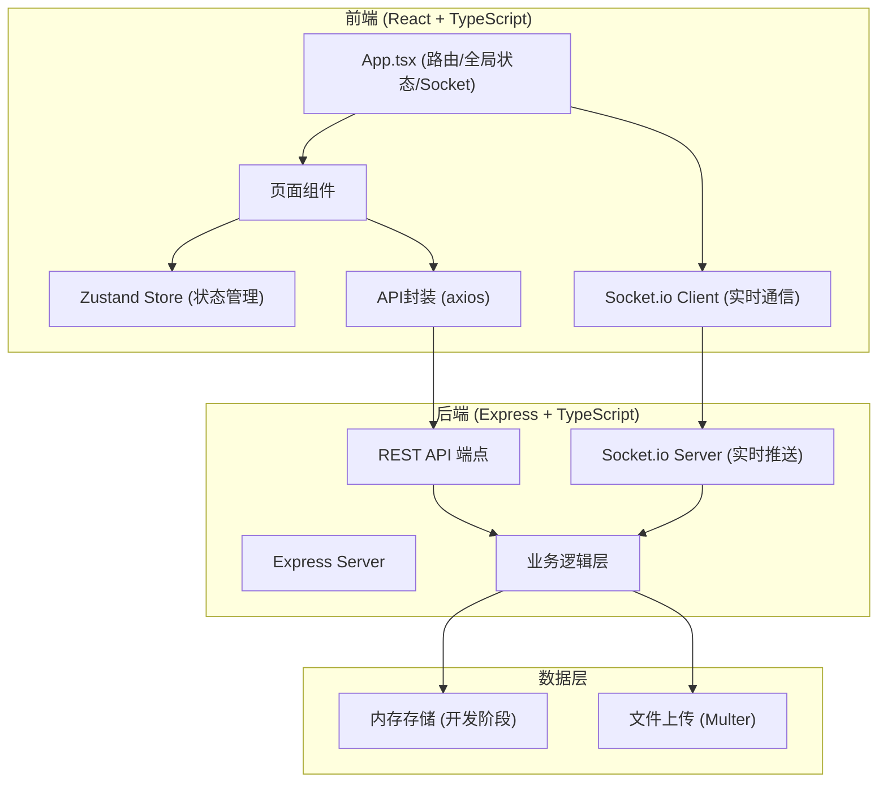
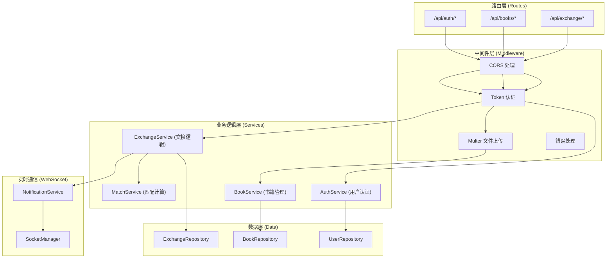
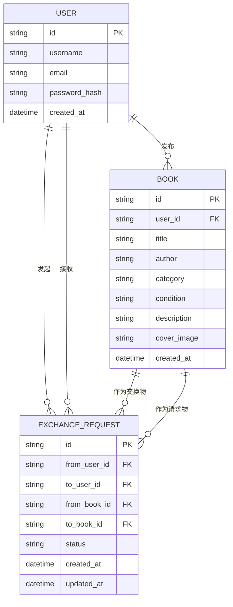

## 1. 架构设计



**数据流向说明：**
1. 用户操作 → 页面组件 → API封装 → REST端点 → 业务逻辑 → 数据存储
2. 实时消息：后端事件 → Socket.io Server → Socket.io Client → Zustand Store → 视图更新
3. 文件上传：表单 → Multer处理 → 文件系统存储 → 返回URL

## 2. 技术描述

- **前端**：React@18 + TypeScript + Vite + Zustand + axios + socket.io-client
- **后端**：Express@4 + TypeScript + socket.io + bcryptjs + multer + uuid + cors
- **状态管理**：Zustand（轻量级状态管理，支持持久化）
- **构建工具**：Vite（热更新，快速构建）
- **数据存储**：内存存储（开发阶段），可扩展为SQLite/PostgreSQL
- **认证方式**：JWT风格token + localStorage持久化

## 3. 路由定义

| 路由 (前端) | 页面 | 权限 |
|-------------|------|------|
| / | 首页/书籍列表 | 公开 |
| /publish | 发布书籍 | 需要登录 |
| /profile | 个人中心 | 需要登录 |
| /login | 登录页 | 公开 |
| /register | 注册页 | 公开 |

## 4. API 定义

### 4.1 TypeScript 类型定义

```typescript
// 用户类型
interface User {
  id: string;
  username: string;
  email: string;
  password: string; // 加密后
  createdAt: string;
}

// 书籍类型
interface Book {
  id: string;
  userId: string;
  title: string;
  author: string;
  category: '小说' | '非虚构' | '科技' | '艺术' | '其他';
  condition: '全新' | '良好' | '一般' | '已交换';
  description: string;
  coverImage: string; // 文件路径/URL
  createdAt: string;
}

// 交换请求类型
interface ExchangeRequest {
  id: string;
  fromUserId: string;
  toUserId: string;
  fromBookId: string;
  toBookId: string;
  status: 'pending' | 'accepted' | 'rejected';
  createdAt: string;
  updatedAt: string;
}

// 匹配度结果
interface BookWithMatch extends Book {
  matchScore: number;
  ownerUsername: string;
}
```

### 4.2 REST API 端点

| 方法 | 端点 | 描述 | 请求体 | 响应 |
|------|------|------|--------|------|
| POST | /api/auth/register | 用户注册 | {username, email, password} | {token, user} |
| POST | /api/auth/login | 用户登录 | {username, password} | {token, user} |
| GET | /api/books | 获取书籍列表（分页+搜索） | query: page, limit, search, category | {books: BookWithMatch[], total} |
| POST | /api/books | 发布书籍（multipart/form-data） | form: title, author, category, condition, description, cover | {book} |
| PUT | /api/books/:id | 更新书籍 | {title, author, category, condition, description} | {book} |
| DELETE | /api/books/:id | 删除书籍 | - | {success} |
| GET | /api/books/user/:userId | 获取用户发布的书籍 | - | {books} |
| POST | /api/exchange | 发起交换请求 | {toBookId, fromBookId} | {exchange} |
| PUT | /api/exchange/:id | 处理交换请求 | {status: 'accepted' | 'rejected'} | {exchange} |
| GET | /api/exchange/sent | 获取发起的交换请求 | - | {exchanges} |
| GET | /api/exchange/received | 获取收到的交换请求 | - | {exchanges} |

### 4.3 WebSocket 事件

| 事件名 | 方向 | 数据 | 描述 |
|--------|------|------|------|
| joinRoom | 客户端→服务端 | {userId} | 用户加入自己的通知房间 |
| exchangeRequest | 服务端→客户端 | {exchange, fromUser} | 推送新交换请求 |
| exchangeResponse | 服务端→客户端 | {exchange, toUser} | 推送请求处理结果 |
| notificationRead | 客户端→服务端 | {exchangeId} | 标记通知已读 |

## 5. 服务端架构



## 6. 数据模型

### 6.1 ER 图



### 6.2 匹配度计算公式

```
匹配度 = (双方发布书籍的类别重叠数) / (双方类别总数)

例如：
用户A发布的书籍类别：{小说, 科技, 小说} → 去重后 {小说, 科技}
用户B发布的书籍类别：{科技, 艺术, 科技} → 去重后 {科技, 艺术}
类别重叠数 = |{小说, 科技} ∩ {科技, 艺术}| = 1 (科技)
类别总数 = |{小说, 科技, 艺术}| = 3
匹配度 = 1/3 ≈ 0.333
```

### 6.3 项目文件结构

```
.
├── package.json
├── vite.config.js
├── tsconfig.json
├── index.html
├── src/
│   ├── client.tsx          # React入口
│   ├── App.tsx             # 主应用组件
│   ├── api.ts              # API封装
│   ├── store.ts            # Zustand状态管理
│   ├── types.ts            # 类型定义
│   ├── components/
│   │   ├── Navbar.tsx      # 导航栏
│   │   ├── BookCard.tsx    # 书籍卡片
│   │   ├── SearchBar.tsx   # 搜索栏
│   │   ├── Toast.tsx       # 提示消息
│   │   ├── Loading.tsx     # 加载动画
│   │   └── Modal.tsx       # 弹窗组件
│   └── pages/
│       ├── HomePage.tsx    # 首页/书籍列表
│       ├── PublishPage.tsx # 发布书籍
│       ├── ProfilePage.tsx # 个人中心
│       ├── LoginPage.tsx   # 登录
│       └── RegisterPage.tsx # 注册
├── server/
│   ├── index.ts            # Express入口
│   ├── types.ts            # 服务端类型
│   ├── middleware/
│   │   ├── auth.ts         # 认证中间件
│   │   └── upload.ts       # 文件上传中间件
│   ├── routes/
│   │   ├── auth.ts         # 认证路由
│   │   ├── books.ts        # 书籍路由
│   │   └── exchange.ts     # 交换路由
│   ├── services/
│   │   ├── authService.ts  # 认证服务
│   │   ├── bookService.ts  # 书籍服务
│   │   ├── exchangeService.ts # 交换服务
│   │   └── matchService.ts # 匹配服务
│   ├── repositories/
│   │   ├── userRepo.ts     # 用户数据访问
│   │   ├── bookRepo.ts     # 书籍数据访问
│   │   └── exchangeRepo.ts # 交换数据访问
│   └── socket/
│       └── socketManager.ts # Socket管理
└── uploads/                # 上传封面存储目录
```

### 6.4 性能约束实现方案

1. **书籍列表加载 ≤ 2秒**：分页加载（每页20条），Intersection Observer实现滚动加载
2. **搜索响应 ≤ 500ms**：前端防抖（300ms），后端索引，内存缓存热门搜索
3. **WebSocket推送 ≤ 300ms**：用户房间机制，直接推送，无需轮询
4. **前端缓存**：Zustand持久化，书籍列表localStorage缓存（5分钟过期）
