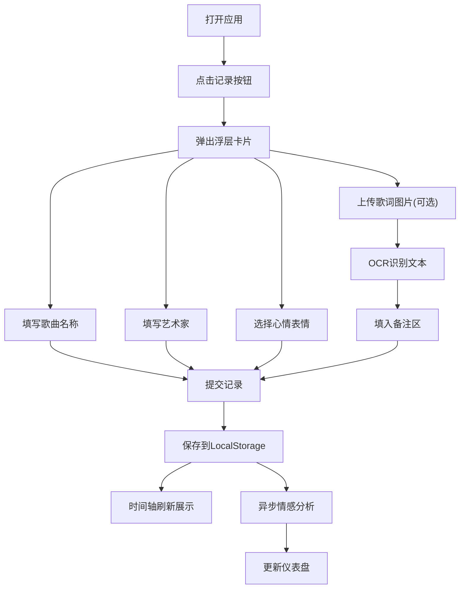

## 1. 产品概述

私人音乐旅程记录器是一款帮助用户记录音乐聆听感动时刻的个人应用。用户在听到触动自己的音乐时，可快速记录歌曲信息、当时的心情与场景，系统自动分析情感趋势并以时间轴画廊的形式展示。

- 核心目标：为音乐爱好者提供情感化的音乐记忆存档工具
- 目标用户：热爱音乐、希望记录聆听感受的个人用户
- 产品价值：将零散的音乐聆听体验转化为可追溯的情感旅程

## 2. 核心功能

### 2.1 用户角色

| 角色 | 注册方式 | 核心权限 |
|------|----------|----------|
| 普通用户 | 无需注册，本地存储 | 记录音乐、查看时间轴、分析情感数据 |

### 2.2 功能模块

1. **音乐记录模块**：快速记录入口、浮层表单、心情表情选择、歌词图片OCR识别
2. **时间轴画廊**：垂直时间轴、卡片节点、周筛选、搜索过滤
3. **情感分析仪表盘**：情感分布饼图、时段分布条形图、当日心情评分

### 2.3 页面详情

| 页面名称 | 模块名称 | 功能描述 |
|----------|----------|----------|
| 主页面 | 快速记录入口 | 圆形渐变按钮，点击波纹动画，弹出浮层卡片 |
| 主页面 | 记录浮层卡片 | 歌曲名称、艺术家、心情标签、歌词图片上传、OCR识别、备注文本区 |
| 主页面 | 情感时间轴 | 垂直时间轴、左右交替卡片、情感指示条、周筛选、搜索框 |
| 主页面 | 情感仪表盘 | 当日心情评分环、情感分布饼图、时段分布条形图 |

## 3. 核心流程

用户打开应用 → 点击顶部记录按钮 → 弹出浮层卡片 → 填写歌曲/艺术家 → 选择心情表情 → 可选上传歌词图片（自动OCR识别）→ 提交记录 → 保存到本地存储 → 时间轴自动刷新 → 情感分析异步更新仪表盘

## 4. 用户界面设计

### 4.1 设计风格
- **主色调**：#6c63ff（紫色）与 #ff6584（粉紫）的渐变搭配
- **背景色**：#fafafa 浅灰色
- **卡片背景**：白色 #ffffff 或淡紫 #f5f3ff
- **按钮风格**：圆形渐变按钮、圆角标签按钮
- **字体**：系统默认无衬线字体
- **整体风格**：现代简约、柔和渐变、微交互丰富

### 4.2 页面设计概述

| 页面名称 | 模块名称 | UI元素 |
|----------|----------|--------|
| 主页面 | 快速记录按钮 | 直径60px圆形、#6c63ff→#ff6584渐变、点击波纹扩散动画0.4s |
| 主页面 | 记录浮层卡片 | 宽400px、rgba(255,255,255,0.95)背景、圆角16px、阴影0 8px 32px rgba(0,0,0,0.12) |
| 主页面 | 输入框样式 | 浅色下划线、聚焦变#6c63ff、过渡0.3s |
| 主页面 | 心情表情 | 8个表情符号、40x40px、选中放大1.1倍+#ffd700发光、过渡0.2s |
| 主页面 | 时间轴 | 居中布局、3px线宽#e0e0e0、两侧各40px间距 |
| 主页面 | 时间轴卡片 | 宽320px、白色背景、圆角12px、阴影0 2px 8px、左右交替排列 |
| 主页面 | 情感指示条 | 高度4px、圆角2px、#ff4d4d→#4caf50渐变 |
| 主页面 | 周筛选标签 | 宽60px、圆角20px、选中#6c63ff白底白字、过渡0.3s |
| 主页面 | 仪表盘 | 宽260px、#f5f3ff背景、圆角16px、sticky定位top 100px |
| 主页面 | 当日评分环 | 直径80px、红→绿渐变、12点方向起始动画、周期1s |

### 4.3 响应式设计
- 桌面端（≥768px）：时间轴左右交替布局，右侧固定仪表盘
- 移动端（<768px）：时间轴单列居中，仪表盘收起为底部浮动按钮
- 触控优化：按钮点击区域≥44x44px

### 4.4 动画与微交互
- 记录按钮点击：波纹向外扩散 0.4s
- 心情表情选中：放大1.1倍 + 金色发光 0.2s
- 输入框聚焦：下划线颜色过渡 0.3s
- 提交按钮：加载旋转环 1s周期，完成绿色对勾缩放 0.5s
- 评分环：顺时针绘制动画 1s周期
- 条形图悬停：显示数值提示 0.2s过渡

## 5. 性能要求

- 时间轴滚动：使用虚拟列表，保持60fps
- 情感分析：记录变更时异步计算并缓存结果
- OCR识别：图片预处理+异步调用Tesseract.js
- 数据持久化：LocalStorage读写封装，防抖批量写入
