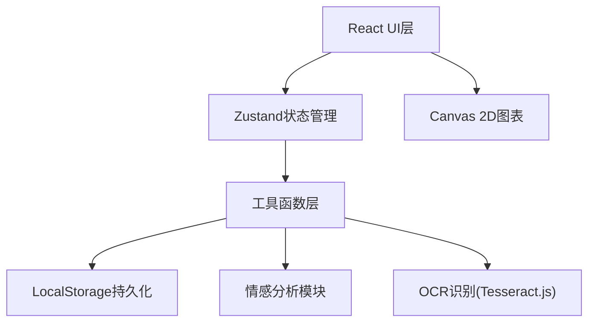
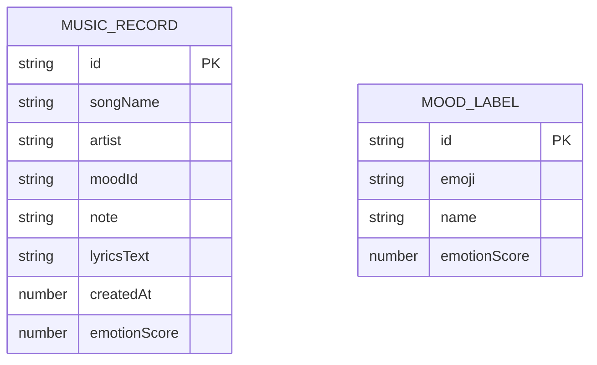

## 1. 架构设计



## 2. 技术选型

- **前端框架**: React 18 + TypeScript
- **构建工具**: Vite
- **状态管理**: Zustand
- **OCR识别**: Tesseract.js
- **图表绘制**: Canvas 2D API
- **数据持久化**: LocalStorage
- **样式方案**: CSS Modules + 原生CSS

## 3. 目录结构

```
auto117/
├── package.json
├── index.html
├── vite.config.js
├── tsconfig.json
└── src/
    ├── types.ts          # 类型定义
    ├── store.ts          # Zustand状态管理
    ├── App.tsx           # 根组件
    ├── main.tsx          # 入口文件
    ├── index.css         # 全局样式
    ├── components/
    │   ├── RecordForm.tsx   # 记录浮层卡片
    │   ├── Timeline.tsx     # 时间轴画廊
    │   └── Dashboard.tsx    # 情感仪表盘
    └── utils/
        ├── emotion.ts       # 情感分析工具
        └── storage.ts       # LocalStorage封装
```

## 4. 数据模型

### 4.1 核心类型定义

```typescript
// 心情标签类型
type MoodLabel = {
  id: string;
  emoji: string;
  name: string;
  emotionScore: number; // 0-100, 负面到正面
};

// 音乐记录类型
type MusicRecord = {
  id: string;
  songName: string;
  artist: string;
  mood: MoodLabel;
  note?: string;
  lyricsText?: string;
  createdAt: number; // timestamp
  emotionScore: number; // 0-100
};

// 情感分析缓存
type EmotionCache = {
  weekDistribution: Record<string, number>;
  timeDistribution: Record<string, number>;
  todayScore: number;
  weekAverageScore: number;
};

// 筛选状态
type FilterState = {
  weekOffset: number; // 0=本周, -1=上周, ...
  searchQuery: string;
};
```

### 4.2 ER图



## 5. 状态管理设计

### Zustand Store结构

```typescript
interface AppState {
  // 数据
  records: MusicRecord[];
  moodLabels: MoodLabel[];
  
  // UI状态
  isFormOpen: boolean;
  searchQuery: string;
  weekOffset: number;
  
  // 缓存
  emotionCache: EmotionCache | null;
  
  // Actions
  addRecord: (record: Omit<MusicRecord, 'id' | 'createdAt' | 'emotionScore'>) => void;
  deleteRecord: (id: string) => void;
  setFormOpen: (open: boolean) => void;
  setSearchQuery: (query: string) => void;
  setWeekOffset: (offset: number) => void;
  recalculateEmotionCache: () => void;
}
```

## 6. 关键模块实现要点

### 6.1 虚拟滚动 (Timeline组件)
- 使用IntersectionObserver或scroll事件计算可见区域
- 只渲染viewport范围内的卡片节点
- 卡片高度固定(约200px)，使用absolute定位
- 上下预留缓冲区域防止快速滚动白屏

### 6.2 Canvas图表绘制 (Dashboard组件)
- 饼图：arc()绘制扇形，fillText显示中心数字
- 条形图：fillRect绘制圆角条形，渐变填充
- 评分环：lineCap + arc绘制进度环，conic渐变
- 所有图表支持DPR适配(高分辨率屏幕清晰)

### 6.3 OCR识别 (RecordForm组件)
- 图片上传前压缩/缩放处理(最大2MB)
- 使用Tesseract.js识别中英文
- 识别过程显示loading状态
- 识别结果可编辑后保存

### 6.4 情感分析 (utils/emotion.ts)
- 基于心情标签的emotionScore计算(0-100)
- 可选用歌词关键词做微调
- 时间段划分：早上6-12, 下午12-18, 晚上18-24, 深夜0-6
- 周维度聚合计算

## 7. 性能优化策略

1. **虚拟列表**：时间轴只渲染可见卡片
2. **情感缓存**：记录变更时异步重算，避免阻塞UI
3. **防抖节流**：搜索输入、滚动事件使用debounce/throttle
4. **LocalStorage批量写入**：多次变更合并后持久化
5. **Canvas DPR适配**：一次绘制适配高DPI屏幕
6. **CSS硬件加速**：动画使用transform/opacity，避免reflow
