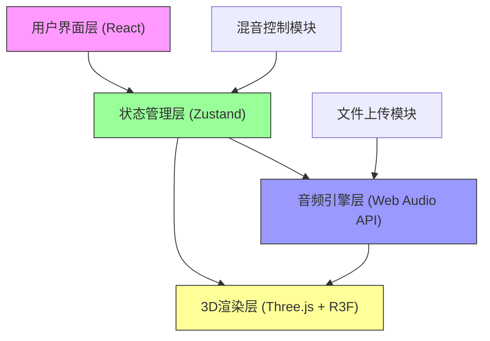
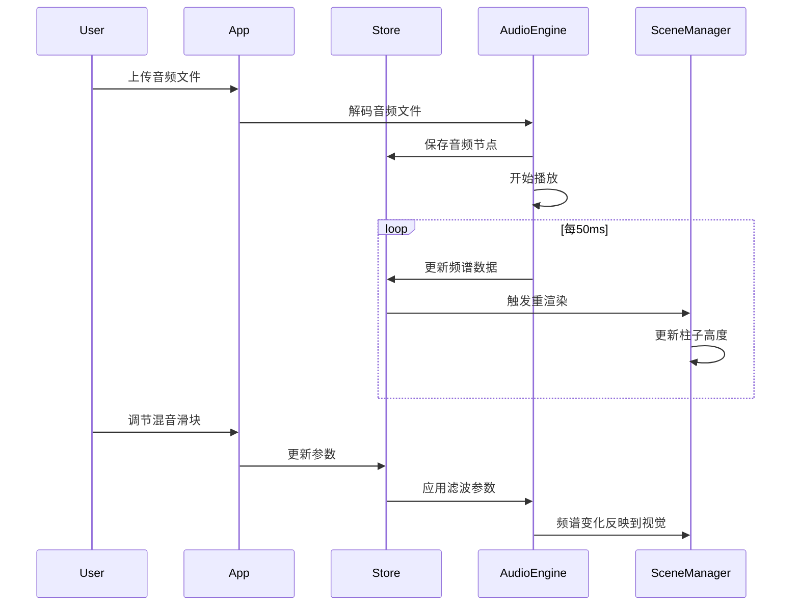

## 1. 架构设计



## 2. 技术描述

- **前端框架**：React 18 + TypeScript
- **构建工具**：Vite 5
- **3D渲染**：Three.js + @react-three/fiber + @react-three/drei
- **状态管理**：Zustand
- **音频处理**：Web Audio API（原生）
- **样式方案**：CSS Modules + 内联样式
- **包管理器**：npm

### 核心依赖版本
```json
{
  "react": "^18.2.0",
  "react-dom": "^18.2.0",
  "typescript": "^5.3.0",
  "three": "^0.160.0",
  "@react-three/fiber": "^8.15.0",
  "@react-three/drei": "^9.92.0",
  "zustand": "^4.4.0"
}
```

## 3. 目录结构

```
src/
├── audioEngine.ts      # 音频解码、频谱分析、混音处理
├── sceneManager.tsx    # 3D场景管理、柱状地形渲染、粒子系统
├── mixerPanel.tsx      # 混音控制面板UI组件
├── store.ts            # Zustand全局状态管理
├── App.tsx             # 主应用组件、文件上传、布局
├── main.tsx            # 应用入口
└── index.css           # 全局样式
```

## 4. 状态管理设计（Zustand）

### 状态接口定义
```typescript
interface AudioState {
  // 音频源
  audioSource: AudioBufferSourceNode | null;
  audioContext: AudioContext | null;
  analyser: AnalyserNode | null;
  
  // 频谱数据
  frequencyData: Uint8Array;
  timeData: Uint8Array;
  
  // 混音参数
  volume: number;           // 0 - 1.5
  bassGain: number;         // -12 to +12 dB
  trebleGain: number;       // -12 to +12 dB
  
  // 音频节点
  gainNode: GainNode | null;
  bassFilter: BiquadFilterNode | null;
  trebleFilter: BiquadFilterNode | null;
  
  // 播放状态
  isPlaying: boolean;
  fileName: string;
  
  // 视角控制
  autoRotate: boolean;
  
  // Actions
  setAudioSource: (source: AudioBufferSourceNode | null) => void;
  setFrequencyData: (data: Uint8Array) => void;
  setVolume: (value: number) => void;
  setBassGain: (value: number) => void;
  setTrebleGain: (value: number) => void;
  setPlaying: (playing: boolean) => void;
  setFileName: (name: string) => void;
  setAutoRotate: (value: boolean) => void;
  reset: () => void;
}
```

## 5. 模块设计

### 5.1 音频引擎 (audioEngine.ts)
- 职责：音频解码、频谱分析、混音节点管理
- 核心功能：
  - `loadAudioFile(file: File): Promise<AudioBuffer>` - 音频文件解码
  - `createAudioGraph(buffer: AudioBuffer): void` - 创建音频处理图
  - `getFrequencyData(): Uint8Array` - 获取实时频谱数据（400频段）
  - `updateMixParams(params: MixParams): void` - 更新混音参数
  - 低音滤波：80-250Hz 钟形滤波
  - 高频滤波：2k-8kHz 钟形滤波

### 5.2 3D场景管理 (sceneManager.tsx)
- 职责：声波可视化渲染、粒子系统、相机控制
- 核心组件：
  - `SonicTerrain` - 20x20柱状格栅地形
  - `StarParticles` - 5000粒子星空背景
  - `SceneController` - 相机与轨道控制
- 性能优化：
  - InstancedMesh 实现柱状体批量渲染
  - 频谱数据平滑过渡（lerp插值）
  - 按需更新减少重绘

### 5.3 混音面板 (mixerPanel.tsx)
- 职责：UI交互控制、参数调节反馈
- 核心组件：
  - `VerticalSlider` - 自定义垂直滑块组件
  - `MixerPanel` - 三个控制条组合
  - 参数实时数值显示

### 5.4 主组件 (App.tsx)
- 职责：整体布局、文件上传、模块组合
- 核心功能：
  - 拖拽上传区域
  - 响应式布局管理
  - 音频上传处理流程

## 6. 性能优化策略

### 6.1 3D渲染优化
- 使用 `InstancedMesh` 渲染400个柱子，减少draw call
- 柱子高度更新使用矩阵批量更新，避免逐个mesh更新
- 粒子系统使用 `Points` + `BufferGeometry`

### 6.2 音频处理优化
- 频谱分析使用 `AnalyserNode`，fftSize=2048
- 频谱数据节流更新，≤50ms一次
- 使用 `requestAnimationFrame` 同步渲染更新

### 6.3 动画优化
- 柱子高度变化使用lerp平滑过渡，100ms内完成
- CSS transform 实现面板动画，避免重排
- 使用 `will-change` 提示浏览器优化

## 7. 数据流程


