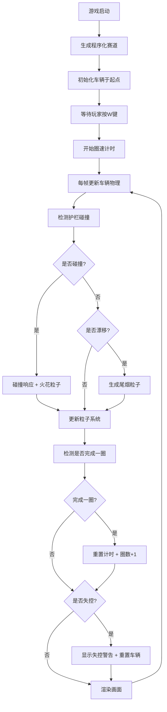

## 1. 产品概述

复古街机风格2D赛车游戏原型，用于独立游戏开发中快速验证程序化生成赛道与后驱赛车物理交互。解决缺少可快速验证赛道生成算法、车辆漂移物理和碰撞检测交互原型的问题。

- **核心目标**：提供一个可运行的2D赛车原型，包含程序化赛道生成、后驱赛车物理、碰撞检测和完整的UI显示
- **目标用户**：独立游戏开发者、游戏物理爱好者
- **产品价值**：快速迭代赛道生成算法和车辆物理参数，无需完整游戏引擎即可验证交互效果

## 2. 核心功能

### 2.1 功能模块

1. **游戏主界面**：赛道显示、车辆驾驶、粒子效果、UI信息
2. **赛道生成模块**：程序化生成闭合赛道，包含弯道、直道、护栏、路肩
3. **车辆物理模块**：后驱赛车加速、刹车、转向、漂移物理模拟
4. **碰撞检测模块**：分离轴定理检测车辆与护栏碰撞，提供碰撞响应
5. **粒子系统模块**：尾烟粒子（漂移时）、火花粒子（碰撞时）
6. **UI显示模块**：速度表、圈速计时、圈数计数器、小地图

### 2.2 页面详情

| 页面名称 | 模块名称 | 功能描述 |
|-----------|-------------|---------------------|
| 游戏主界面 | 赛道渲染 | 绘制深灰色赛道地面、白色护栏线、红白相间路肩、灰色中央虚线 |
| 游戏主界面 | 车辆控制 | W键加速、S键刹车、A/D键转向，支持漂移物理 |
| 游戏主界面 | 碰撞系统 | 车辆与护栏碰撞时弹回，产生火花粒子；冲出赛道时重置 |
| 游戏主界面 | 粒子系统 | 漂移时产生灰色尾烟，碰撞时产生白色火花 |
| 游戏主界面 | UI显示 | 速度数字+进度条、圈速计时、圈数计数器、黄色小地图 |
| 游戏主界面 | 视觉效果 | 屏幕抖动、赛道外像素树装饰、失控警告覆盖层 |

## 3. 核心流程

玩家进入游戏后，系统自动生成程序化赛道，玩家使用WASD控制赛车。当车辆漂移时产生尾烟粒子，碰撞护栏时产生火花粒子并弹回。每完成一圈重置计时并累加圈数，完成3圈后可重新开始。

## 4. 用户界面设计

### 4.1 设计风格

- **整体风格**：复古街机风格，像素感，高对比度配色
- **主色调**：深蓝色#0d1b2a（背景）、深灰色#2d2d2d（赛道）、红色#e53935（赛车）
- **辅助色**：绿色#4caf50（低速）、黄色#ffeb3b（中速）、红色#f44336（高速）
- **字体**：Bold Arial（标题）、Monospace（数字显示）
- **按钮/控件**：无UI按钮，纯键盘控制
- **布局**：全屏Canvas，信息叠加显示于四角

### 4.2 页面设计概述

| 页面名称 | 模块名称 | UI元素 |
|-----------|-------------|-------------|
| 游戏主界面 | 左上角 | 圈数计数器 "Lap 1/3"（白色#ffffff，24px，Bold Arial）、黄色半透明圆形小地图（半径30px） |
| 游戏主界面 | 右上角 | 速度数字（保留1位小数，20px，Monospace）、速度进度条（150x12px，绿-黄-红渐变）、圈速计时（00.00格式，20px，Monospace） |
| 游戏主界面 | 赛道 | 深灰色地面、白色2px护栏、红白相间路肩、灰色中央虚线 |
| 游戏主界面 | 赛道外 | 黑色填充、随机绿色像素树（三角形+棕色树干） |
| 游戏主界面 | 失控状态 | 红色半透明覆盖层 rgba(255,0,0,0.3)、白色大字 "失控！"（36px，Bold Arial） |
| 游戏主界面 | 视觉效果 | 速度>4时屏幕随机抖动0-2px |

### 4.3 响应式

- **桌面端优先**：固定分辨率Canvas，居中显示
- **无移动端适配**：纯键盘控制，针对桌面端设计
- **触摸优化**：不适用

### 4.4 视觉细节

- **像素树**：赛道边界外随机排列，间隔30-50单位，三角形树冠+矩形树干
- **路肩条纹**：内侧红白交替，每段长10单位
- **中央虚线**：每隔30单位绘制，长8单位，宽1单位
- **尾烟粒子**：灰色#9e9e9e，半透明，大小6px，1秒消散
- **火花粒子**：白色，大小4px，随机方向，0.3秒消散
