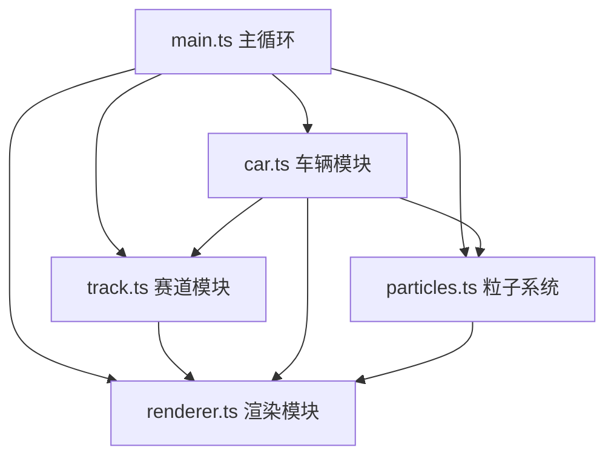

## 1. 架构设计

本项目采用模块化单层架构，所有模块通过主循环协调，使用纯Canvas 2D API进行渲染，不依赖任何游戏引擎。各模块职责单一，通过明确的接口进行通信。



| 层级 | 模块 | 职责 |
|------|------|------|
| 主控制层 | main.ts | 游戏主循环、帧率控制、输入处理、状态管理、模块协调 |
| 逻辑层 | track.ts | 赛道程序化生成、几何计算、碰撞检测接口 |
| 逻辑层 | car.ts | 车辆物理模拟、转向、加速、刹车、漂移、碰撞响应 |
| 逻辑层 | particles.ts | 粒子生成、更新、生命周期管理 |
| 渲染层 | renderer.ts | Canvas绘制、背景、UI、小地图、屏幕抖动 |

## 2. 技术描述

- **前端框架**：原生TypeScript + 纯Canvas 2D API（无React/Vue）
- **构建工具**：Vite 5.x
- **编程语言**：TypeScript 5.x（严格模式）
- **运行环境**：浏览器
- **无后端服务**：纯前端应用
- **无外部依赖**：除TypeScript和Vite外不使用任何第三方库

### 项目初始化方式

使用 `npm init vite-init` 创建 vanilla-ts 模板，然后按照需求修改配置文件和代码结构。

## 3. 目录结构与文件说明

```
e:\solo\VersionFastPro\tasks\auto119\
├── package.json          # 依赖配置与启动脚本
├── index.html            # 入口HTML页面
├── vite.config.js        # Vite构建配置
├── tsconfig.json         # TypeScript严格模式配置
└── src/
    ├── main.ts           # 游戏主循环、帧率控制、粒子管理、计时逻辑
    ├── track.ts          # 赛道生成、渲染、碰撞检测接口
    ├── car.ts            # 车辆物理、转向、碰撞响应、渲染
    ├── particles.ts      # 粒子系统（尾烟、火花）
    └── renderer.ts       # 背景、UI、小地图、屏幕抖动渲染
```

### 模块接口定义

#### track.ts 接口
```typescript
// 赛道点坐标
interface TrackPoint {
    x: number;
    y: number;
    angle: number;  // 赛道切线角度
}

// 护栏线段
interface GuardrailSegment {
    x1: number;
    y1: number;
    x2: number;
    y2: number;
    normal: { x: number; y: number };  // 指向赛道外侧的法线
}

// 赛道类
class Track {
    points: TrackPoint[];           // 赛道中心线点
    innerGuardrail: GuardrailSegment[];  // 内侧护栏
    outerGuardrail: GuardrailSegment[];  // 外侧护栏
    trees: { x: number; y: number }[];   // 赛道外像素树
    width: number;                   // 赛道宽度
    length: number;                  // 赛道总长
    startLine: { x1: number; y1: number; x2: number; y2: number };

    constructor(seed?: number);
    regenerate(): void;              // 重新生成赛道
    render(ctx: CanvasRenderingContext2D): void;
    checkCollision(car: Car): { collided: boolean; normal: { x: number; y: number }; point: { x: number; y: number } };
    isPointOnTrack(x: number, y: number): boolean;
    getNearestPoint(x: number, y: number): TrackPoint;
    checkLapCompletion(carX: number, carY: number, prevProgress: number): boolean;
}
```

#### car.ts 接口
```typescript
// 车辆状态
interface CarState {
    x: number;
    y: number;
    angle: number;           // 车头朝向（弧度）
    speed: number;           // 前进速度
    lateralSpeed: number;    // 侧向速度
    velocityX: number;       // X方向速度分量
    velocityY: number;       // Y方向速度分量
    driftAngle: number;      // 漂移偏移角
    isDrifting: boolean;     // 是否在漂移
    isOutOfControl: boolean; // 是否失控
}

// 车辆类
class Car {
    state: CarState;
    width: number = 18;
    height: number = 32;
    maxSpeed: number = 6;
    acceleration: number = 0.15;
    brakeForce: number = 0.2;
    turnSpeed: number = 0.04;
    drag: number = 0.02;

    constructor(startX: number, startY: number, startAngle: number);
    update(input: { w: boolean; s: boolean; a: boolean; d: boolean }, dt: number): void;
    render(ctx: CanvasRenderingContext2D): void;
    getCorners(): { x: number; y: number }[];  // 获取矩形四个角点（用于SAT碰撞检测）
    applyCollisionResponse(normal: { x: number; y: number }, elasticity: number): void;
    resetToTrack(track: Track): void;
}
```

#### particles.ts 接口
```typescript
// 粒子类型
type ParticleType = 'smoke' | 'spark';

// 粒子
interface Particle {
    type: ParticleType;
    x: number;
    y: number;
    vx: number;
    vy: number;
    life: number;        // 剩余生命周期（帧）
    maxLife: number;     // 总生命周期
    size: number;
    color: string;
    alpha: number;
}

// 粒子系统类
class ParticleSystem {
    particles: Particle[];
    maxParticles: number = 200;

    constructor();
    emitSmoke(x: number, y: number, angle: number): void;    // 生成尾烟
    emitSparks(x: number, y: number, count: number): void;   // 生成火花
    update(): void;
    render(ctx: CanvasRenderingContext2D): void;
    clear(): void;
}
```

#### renderer.ts 接口
```typescript
// 渲染器类
class Renderer {
    canvas: HTMLCanvasElement;
    ctx: CanvasRenderingContext2D;
    width: number;
    height: number;
    camera: { x: number; y: number };
    shakeOffset: { x: number; y: number };

    constructor(canvas: HTMLCanvasElement);
    clear(): void;
    drawBackground(): void;
    drawTrack(track: Track): void;
    drawCar(car: Car): void;
    drawParticles(particles: ParticleSystem): void;
    drawUI(speed: number, lapTime: number, lap: number, totalLaps: number, car: Car, track: Track): void;
    drawMinimap(car: Car, track: Track): void;
    drawOutOfControl(): void;
    applyScreenShake(speed: number): void;
    beginRender(): void;
    endRender(): void;
}
```

## 4. 数据模型

### 4.1 核心数据结构

```typescript
// 输入状态
interface InputState {
    w: boolean;  // 加速
    s: boolean;  // 刹车
    a: boolean;  // 左转
    d: boolean;  // 右转
}

// 游戏状态
type GameState = 'waiting' | 'racing' | 'finished';

// 游戏配置常量
const CONFIG = {
    // 赛道参数
    TRACK_WIDTH: 60,
    TRACK_LENGTH_TARGET: 1000,
    CURVE_RADIUS_MIN: 40,
    CURVE_RADIUS_MAX: 100,
    CURVE_ANGLE_MIN: Math.PI / 2,    // 90度
    CURVE_ANGLE_MAX: Math.PI,        // 180度
    STRAIGHT_LENGTH_MIN: 50,
    STRAIGHT_LENGTH_MAX: 120,
    GUARDRAIL_WIDTH: 2,

    // 车辆参数
    CAR_WIDTH: 18,
    CAR_HEIGHT: 32,
    MAX_SPEED: 6,
    ACCELERATION: 0.15,
    BRAKE_FORCE: 0.2,
    TURN_SPEED: 0.04,
    DRAG: 0.02,
    DRIFT_THRESHOLD: 0.5,
    MAX_DRIFT_ANGLE: Math.PI / 12,   // 15度

    // 粒子参数
    SMOKE_LIFETIME: 60,     // 1秒 @60fps
    SPARK_LIFETIME: 18,     // 0.3秒 @60fps
    MAX_PARTICLES: 200,

    // 物理参数
    COLLISION_ELASTICITY: 0.3,

    // 显示参数
    SPEED_BAR_WIDTH: 150,
    SPEED_BAR_HEIGHT: 12,
    MINIMAP_RADIUS: 30,
    SCREEN_SHAKE_THRESHOLD: 4,

    // 游戏参数
    TOTAL_LAPS: 3,
    FPS: 60,
} as const;
```

## 5. 核心算法

### 5.1 赛道生成算法

1. 初始化起点在原点(0,0)，初始方向为0弧度
2. 交替生成弯道和直道，直到累计长度接近1000单位
3. 每个弯道：随机半径(40-100)、随机角度(90-180°)、随机方向（左/右）
4. 每个直道：随机长度(50-120单位)
5. 生成完成后，计算闭合误差，调整最后一段使赛道闭合
6. 沿中心线偏移生成内外侧护栏
7. 在赛道外随机位置生成像素树

### 5.2 分离轴定理(SAT)碰撞检测

1. 获取车辆矩形的四个角点坐标
2. 对于每个护栏线段，计算线段法线作为分离轴
3. 将车辆四个角点投影到分离轴上
4. 将线段两个端点投影到分离轴上
5. 检查投影区间是否重叠
6. 如果所有轴上都重叠，则判定碰撞，返回最小穿透方向的法线

### 5.3 车辆物理模型

1. 计算前进方向向量和侧向方向向量
2. 根据输入施加加速/制动力（沿车头方向）
3. 应用阻力减速
4. 根据速度和转向输入计算转向角速度
5. 更新车辆位置和角度
6. 计算侧向速度，判断是否进入漂移状态
7. 漂移时计算视觉偏移角并生成尾烟粒子

### 5.4 圈数检测

1. 记录车辆上一帧的沿赛道进度（0-1）
2. 当前一帧进度 < 0.1 且 上一帧进度 > 0.9 时，判定完成一圈
3. 进度计算：找到赛道上离车辆最近的点，根据点的索引计算进度值

## 6. 性能优化

1. **帧率控制**：使用 `requestAnimationFrame` + 固定时间步长（1/60秒）
2. **碰撞检测优化**：只检测车辆附近的护栏线段（空间分区）
3. **粒子池**：使用固定大小数组，超过最大数量时复用最旧的粒子
4. **渲染优化**：使用离屏Canvas预渲染赛道静态元素
5. **内存管理**：及时清理已过期的粒子，避免内存泄漏
