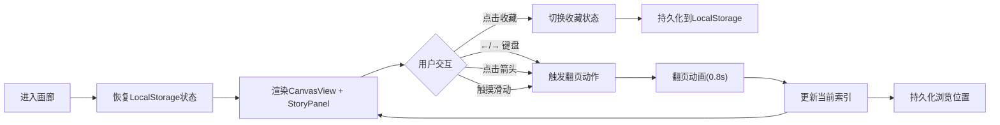

## 1. 产品概述

数字叙事画廊是一款为独立策展人和小众艺术家打造的沉浸式线上艺术品展示应用，通过翻页相册式交互与诗意叙事文本，让用户像翻阅艺术画册一样深度体验每幅画作背后的创作故事。

- **目标用户**：独立策展人、艺术爱好者、小众艺术家
- **核心价值**：将冰冷的在线展馆转化为富有叙事感和沉浸感的数字艺术体验

## 2. 核心功能

### 2.1 用户角色

| 角色 | 注册方式 | 核心权限 |
|------|----------|----------|
| 访客用户 | 无需注册 | 浏览艺术品、阅读叙事、收藏喜爱作品 |

### 2.2 功能模块

1. **主展示界面**：双栏布局（艺术品展示区 + 故事叙事区），翻页导航，顶部进度指示
2. **沉浸式翻页浏览**：CSS Transition + requestAnimationFrame 驱动的流畅翻页动画
3. **动态故事展示**：打字机逐词叙事效果，段落emoji分隔符，自适应首字放大
4. **配色自适应系统**：艺术品主色调提取，背景与渐变条实时联动
5. **多端交互控制**：键盘方向键、触摸滑动手势、鼠标点击导航
6. **收藏与进度持久化**：LocalStorage存储收藏状态与浏览进度

### 2.3 页面详情

| 页面名称 | 模块名称 | 功能描述 |
|----------|----------|----------|
| 画廊主页 | 顶部导航栏 | 固定高度60px，居中显示展馆标题与当前艺术品计数（如5/12） |
| 画廊主页 | CanvasView展示区 | 占65%宽度，展示当前艺术品大图、标题、创作年份、收藏按钮 |
| 画廊主页 | StoryPanel叙事面板 | 占35%宽度，打字机效果展示艺术品背景故事，顶部渐变条，底部阅读进度条 |
| 画廊主页 | 导航箭头 | 左右两侧半透明磨砂玻璃箭头，首末页自动隐藏，0.5秒淡入淡出 |

## 3. 核心流程

用户进入画廊应用 → 系统从LocalStorage恢复最后浏览位置和收藏状态 → 展示当前艺术品及对应叙事故事 → 用户通过键盘/触摸/点击箭头翻页 → 翻页动画触发（0.8秒）→ 新艺术品淡入，新故事以打字机效果逐词呈现 → 用户可点击心形按钮收藏作品 → 收藏状态和浏览索引实时持久化

## 4. 用户界面设计

### 4.1 设计风格

- **主色调**：暖白 `#faf3e0`、深褐 `#3e2723`，艺术品主色调动态适配
- **整体风格**：极简书香风，纸质画册质感，大量留白，焦点集中
- **按钮样式**：半透明磨砂玻璃效果（`rgba(255,255,255,0.1)`，`backdrop-filter: blur(8px)`），圆角过渡
- **字体建议**：衬线体用于标题（如Playfair Display），无衬线体用于正文（如Noto Serif SC / Source Han Serif），体现书香气质
- **布局方式**：桌面端双栏固定比例，响应式断点1024px切换比例
- **图标/Emoji**：段落分隔使用画笔🖌️、调色板🎨、画框🖼️等艺术相关emoji

### 4.2 页面设计概览

| 页面名称 | 模块名称 | UI元素 |
|----------|----------|--------|
| 画廊主页 | CanvasView | 艺术品大图(max-height:70vh)、标题+年份(#5d4037)、心形收藏按钮、背景渐变过渡(0.6s) |
| 画廊主页 | StoryPanel | 顶部10px水平渐变条、故事正文(16px/14px, 行高1.8, #3e2723)、首字放大1.3倍加粗、段落交替背景(#ffffff/#f9f9f9)、段落emoji分隔符、底部3px阅读进度条 |
| 画廊主页 | 导航箭头 | 80px高、半透明磨砂玻璃、三角形图标、首末页隐藏、0.5s淡入淡出 |
| 画廊主页 | 顶部导航 | 60px高、居中标题与计数、极简留白 |

### 4.3 响应式设计

- **桌面优先**：默认 ≥1024px，CanvasView 65% / StoryPanel 35%，正文字号16px
- **中等屏幕**：768px ≤ 宽度 < 1024px，CanvasView 55% / StoryPanel 45%，正文字号14px
- **最小支持宽度**：768px，低于此宽度提示横屏浏览
- **触摸优化**：CanvasView区域支持水平滑动手势（阈值60px），首尾页滑动触发红色边框闪烁反馈

### 4.4 动效规范

| 动效名称 | 持续时间 | 触发条件 | 细节描述 |
|----------|----------|----------|----------|
| 翻页退场 | 0.4s | 翻页触发 | 当前页缩放至0.9倍、向右平移100px、透明度降至0 |
| 翻页入场 | 0.4s | 退场完成 | 新页从左侧平移100px入场、放大至1倍、透明度恢复1 |
| 箭头显隐 | 0.5s | 到达首/末页 | 淡入淡出过渡 |
| 背景渐变 | 0.6s | 翻页完成 | CanvasView背景色与StoryPanel渐变条颜色平滑过渡 |
| 打字机效果 | 15词/秒 | StoryPanel内容切换 | 逐词呈现 |
| 收藏脉冲 | 0.5s | 点击收藏 | 心形粒子向外扩散，颜色由#ccc变为#e53935 |
| 边界反馈 | 0.3s | 首尾页无效滑动 | 红色边框闪烁，透明度0.7 |
