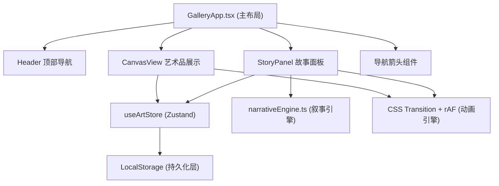

## 1. 架构设计



## 2. 技术选型

- **前端框架**：React 18 + TypeScript
- **构建工具**：Vite 5
- **状态管理**：Zustand
- **样式方案**：原生CSS + PostCSS
- **数据层**：LocalStorage 持久化

## 3. 文件结构与职责

| 文件路径 | 职责 | 调用关系 |
|-----------|------|-----------|
| `package.json` | 项目依赖与脚本配置 | 入口配置 |
| `index.html` | HTML入口，挂载React根节点 | 加载应用壳 |
| `vite.config.js` | Vite构建配置，启用PostCSS插件、路径别名 | 构建配置 |
| `tsconfig.json` | TypeScript严格模式配置，@别名配置 | 类型检查 |
| `src/main.tsx` | React应用入口，渲染GalleryApp | 启动入口 |
| `src/GalleryApp.tsx` | 主布局组件，组合Header/CanvasView/StoryPanel/导航箭头，翻页状态机调度 | 消费artStore，调度子组件 |
| `src/store/artStore.ts` | Zustand状态管理：艺术品数组、当前索引、收藏状态、翻页历史、LocalStorage持久化 | 所有组件通过hooks订阅 |
| `src/components/Header.tsx` | 顶部导航栏：展馆标题与艺术品计数 | 从artStore读取当前索引和总数 |
| `src/components/CanvasView.tsx` | 艺术品展示区：大图、标题、年份、收藏按钮、翻页动画、触摸手势 | 订阅artStore，触发翻页动作 |
| `src/components/StoryPanel.tsx` | 故事面板：打字机叙事、渐变条、阅读进度 | 订阅artStore，调用narrativeEngine |
| `src/utils/narrativeEngine.ts` | 纯函数叙事引擎：根据艺术品元数据生成诗意叙事文本 | 被StoryPanel调用 |
| `src/utils/colorExtractor.ts` | 颜色提取工具：从艺术品提取主色调 | 被CanvasView和StoryPanel使用 |
| `src/types/index.ts` | TypeScript类型定义 | 全局共享类型 |
| `src/styles/global.css` | 全局样式、CSS变量、动画关键帧 | 全局样式 |

## 4. 数据流向

```
artStore (Zustand)
├── artworks[] → GalleryApp → CanvasView (渲染大图/标题)
│                                ├── currentIndex → Header (显示 x/y)
│                                ├── favorites[] → CanvasView (收藏状态)
│                                └── narrativeEngine → StoryPanel (叙事文本)
├── currentIndex ───────────┘
└── favorites[] ────────────── CanvasView (心形按钮)
LocalStorage ←────────────── artStore (persist middleware)
```

## 5. 状态管理设计（Zustand Store）

```typescript
interface Artwork {
  id: string;
  title: string;
  year: number;
  style: string;
  imageUrl: string;
  dominantColors: [string, string];
}

interface ArtStore {
  artworks: Artwork[];
  currentIndex: number;
  favorites: string[];
  history: number[];
  isAnimating: boolean;
  next: () => void;
  prev: () => void;
  select: (index: number) => void;
  toggleFavorite: (id: string) => void;
  setAnimating: (v: boolean) => void;
}
```

## 6. 动画机制

### 6.1 翻页动画（CSS Transition + requestAnimationFrame）

```
翻页触发 → setAnimating(true) → 0.4s 退场动画(scale:0.9, translateX:100px, opacity:0)
→ rAF 下一帧更新currentIndex → 0.4s 入场动画(translateX:-100px→0, scale→1, opacity→1)
→ transitionend → setAnimating(false)
```

### 6.2 打字机动画

```
新艺术品切换 → 文本分词 → setInterval (1000/15 ≈ 67ms每词
→ 逐词追加显示 → 全部完成 → clearInterval
```

## 7. 类型定义

```typescript
interface Artwork {
  id: string;
  title: string;
  year: number;
  style: string;
  imageUrl: string;
  dominantColors: [string, string];
}

interface NarrativeParagraph {
  text: string;
  separator?: string;
}

type NarrativeResult = NarrativeParagraph[];
```

## 8. 性能优化策略

| 优化点 | 方案 |
|--------|------|
| 翻页帧率 | CSS硬件加速(transform+opacity)，避免layout thrashing |
| 首次加载 | 艺术品图片懒加载，首屏预加载 |
| 打字机动画 | requestAnimationFrame 调度，避免setInterval漂移 |
| 状态更新 | Zustand selector 避免不必要重渲染 |
| 颜色过渡 | CSS transition 仅对color/background-color做transition |
| 收藏持久化 | debounce LocalStorage写入 |
