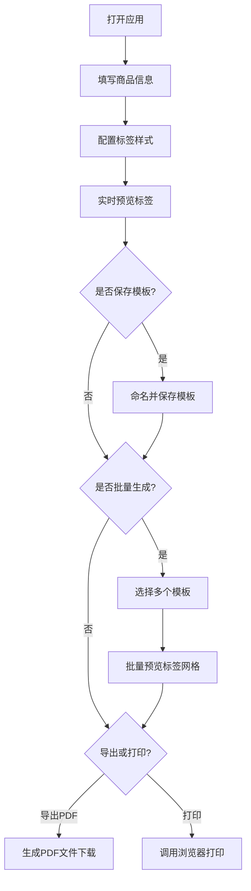

## 1. 产品概述

交互式商品标签与信息展示生成器，为创意市集摊主提供快速创建精美商品标签的工具。支持商品信息录入、二维码嵌入、模板保存、批量生成、PDF导出与打印功能。

- 目标用户：创意市集摊主、手工作坊店主、小型零售商
- 核心价值：减少手写/打印价格标签的时间成本，提供专业直观的商品展示方式

## 2. 核心功能

### 2.1 用户角色
| 角色 | 注册方式 | 核心权限 |
|------|----------|----------|
| 普通用户 | 无需注册，本地使用 | 使用全部标签编辑、导出、打印功能 |

### 2.2 功能模块
1. **标签编辑模块**：商品信息表单录入、实时标签预览
2. **二维码生成模块**：自定义链接二维码、默认链接自动生成
3. **模板管理模块**：模板保存、从模板创建、批量生成
4. **导出打印模块**：PDF导出、浏览器打印
5. **数据管理模块**：localStorage持久化、JSON导入导出

### 2.3 页面详情
| 页面名称 | 模块名称 | 功能描述 |
|----------|----------|----------|
| 主页面 | 顶部导航栏 | Logo展示、保存/导出/打印操作按钮 |
| 主页面 | 左侧表单区 | 商品名称、价格、描述、分类、图片、链接、样式配置录入 |
| 主页面 | 右侧预览区 | 单标签实时预览、批量标签网格展示 |
| 主页面 | 模板管理区 | 模板列表、保存模板、选择批量生成 |

## 3. 核心流程

用户打开应用后，在左侧表单填写商品信息（名称、价格、描述、分类、图片、链接），配置标签样式（颜色、尺寸、布局），右侧实时预览标签效果。可将当前配置保存为模板，后续从模板快速创建新标签，或选择多个模板批量生成。完成后可导出PDF或直接打印。

## 4. 用户界面设计

### 4.1 设计风格
- 主色调：深蓝 #2c3e50
- 辅助色：蓝色 #3498db、浅灰 #f4f4f9
- 错误色：红色 #e74c3c
- 按钮：圆角6px，白底蓝字/蓝底白字，点击缩放0.95倍，过渡0.15s
- 输入框：聚焦时蓝色边框+2px外发光，错误时红色边框
- 字体：系统无衬线字体，标题加粗，正文常规
- 布局：左右两栏（桌面）/上下布局（移动）
- 卡片：hover时上浮translateY(-2px)，阴影加深，过渡0.2s ease

### 4.2 页面设计概览
| 页面名称 | 模块名称 | UI元素 |
|----------|----------|--------|
| 主页面 | 顶部导航栏 | 高度50px，深蓝背景，左Logo，右三个操作按钮（保存/导出/打印） |
| 主页面 | 左侧表单区 | 宽度360px，浅灰背景#f4f4f9，24px内边距，8px圆角，浅灰边框#ddd |
| 主页面 | 右侧预览区 | 白色背景，最小高度500px，标签卡片居中，hover上浮效果 |
| 主页面 | 标签卡片 | 默认300x200px，白底深字，左下角80x80px二维码，淡入动画0.3s |

### 4.3 响应式设计
- 桌面端（≥768px）：左右两栏布局，表单区360px固定宽度，预览区自适应
- 移动端（<768px）：上下布局，表单区和预览区各占满宽度，顶部导航折叠为汉堡菜单
- 触摸优化：按钮最小点击区域44x44px，输入框足够大便于触摸输入

### 4.4 动画效果
- 二维码淡入：opacity 0→1，0.3s
- 批量生成标签：按顺序逐张出现，间隔100ms
- 卡片hover：translateY(-2px) + 阴影加深，0.2s ease
- 按钮点击：scale(0.95)，0.15s
