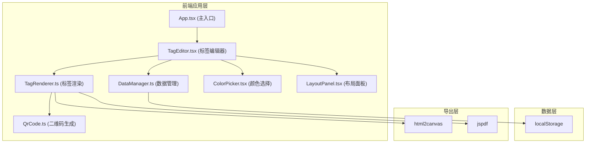

## 1. 架构设计



## 2. 技术描述

- 前端框架：React 18 + TypeScript
- 构建工具：Vite
- UI组件：纯CSS自定义组件（不使用UI库）
- 状态管理：React useState/useEffect + 自定义hooks
- 二维码生成：Canvas API自定义实现
- PDF导出：jspdf + html2canvas
- 数据持久化：localStorage
- 初始化方式：Vite react-ts模板

## 3. 文件结构与模块调用关系

```
src/
├── modules/
│   ├── tagBuilder/
│   │   ├── TagEditor.tsx      # 调用 TagRenderer, DataManager, ColorPicker, LayoutPanel
│   │   └── TagRenderer.ts     # 调用 QrCode, html2canvas, jspdf
│   ├── qrGenerator/
│   │   └── QrCode.ts          # 独立模块，仅依赖 Canvas API
│   ├── dataManager/
│   │   └── DataManager.ts     # 独立模块，仅依赖 localStorage
│   └── uiComponents/
│       ├── ColorPicker.tsx    # 独立UI组件
│       └── LayoutPanel.tsx    # 独立UI组件
├── types/
│   └── index.ts               # 全局类型定义
├── styles/
│   └── global.css             # 全局样式
├── App.tsx                    # 应用主入口，调用 TagEditor
└── main.tsx                   # React 挂载入口
```

## 4. 类型定义

```typescript
// 商品分类
type ProductCategory = '饰品' | '手作' | '食品' | '文创';

// 商品数据
interface Product {
  id: string;
  name: string;           // 最多20字
  price: number;          // 数字
  description: string;    // 最多100字
  category: ProductCategory;
  image?: string;         // base64图片，裁剪为1:1
  qrLink: string;         // 二维码链接
}

// 标签样式
interface TagStyle {
  width: number;          // 默认300px
  height: number;         // 默认200px
  backgroundColor: string;// 默认#ffffff
  textColor: string;      // 默认#333333
  padding: number;        // 边距
  fontSize: {
    name: number;
    price: number;
    description: number;
  };
  qrSize: number;         // 默认80px
}

// 标签模板
interface TagTemplate {
  id: string;
  name: string;           // 最多20字
  product: Product;
  style: TagStyle;
  createdAt: number;
}
```

## 5. 核心模块数据流

### 5.1 标签编辑流程
```
TagEditor (表单输入)
    ↓ onChange (200ms 防抖)
TagRenderer.renderTag(product, style)
    ↓ 调用 QrCode.generate(qrLink)
    ↓ 绘制到 Canvas
返回 Canvas / ImageData
    ↓
TagEditor 更新预览区
```

### 5.2 数据管理流程
```
TagEditor 保存操作
    ↓
DataManager.saveTemplate(template)
    ↓ localStorage.setItem('tag_templates', JSON.stringify(templates))
返回成功状态
```

### 5.3 PDF导出流程
```
TagEditor 导出操作
    ↓
TagRenderer.exportPDF(templates[])
    ↓ 遍历每个模板调用 renderTag → html2canvas
    ↓ jspdf 添加每页 2x3 个标签
    ↓ 更新进度 0%→25%→50%→75%→100%
返回 Blob 触发下载
```

## 6. 性能优化策略

1. **实时预览**：使用 lodash-es debounce 200ms，避免频繁重绘
2. **Canvas渲染**：离屏Canvas渲染，减少DOM操作
3. **批量生成**：requestAnimationFrame 分批渲染，保证50fps以上
4. **PDF导出**：Promise.all 并行处理Canvas生成，控制12个标签5秒内完成
5. **图片处理**：FileReader + Canvas 压缩裁剪为正方形，限制2MB
6. **动画**：全部使用CSS transform/opacity，触发GPU加速
