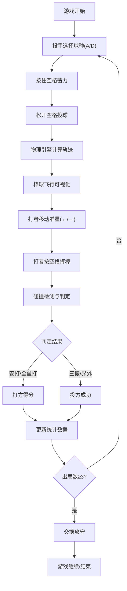

## 1. 产品概述

双人对战虚拟棒球投打模拟应用，玩家分别操控投手和打者进行本地对战，通过实时物理计算模拟真实棒球投打体验。

- 面向棒球爱好者和休闲游戏玩家，提供低门槛的本地双人对战体验
- 核心价值在于精准的物理模拟、即时的操作反馈和完整的攻防数据统计

## 2. 核心功能

### 2.1 用户角色

| 角色 | 操作方式 | 核心功能 |
|------|----------|----------|
| 投手玩家 | WASD + 空格（键盘左侧） | 选择球种、蓄力投球、观察球路轨迹 |
| 打者玩家 | 方向键 + 空格（键盘右侧） | 移动准星、选择击球方向、把握挥棒时机 |

### 2.2 功能模块

1. **投手模块**: 球种选择、力量条控制、球路轨迹预览
2. **打者模块**: 击球时机条、挥棒动画、击球区方向选择
3. **物理引擎模块**: 球速计算、旋转量模拟、空气阻力与重力、碰撞检测
4. **数据统计模块**: 投球数统计、好球/坏球统计、安打/全垒打统计、得分与出局数
5. **得分板模块**: 实时局数显示、双方比分、球员统计数据

### 2.3 页面详情

| 页面名称 | 模块名称 | 功能描述 |
|-----------|-------------|---------------------|
| 主游戏界面 | 得分板 | 顶部显示局数、比分、关键统计数据，每0.5秒更新 |
| 主游戏界面 | 投手区 | 左侧显示投手丘、球种选择、力量条、球路轨迹预览 |
| 主游戏界面 | 打者区 | 右侧显示本垒板、击球准星、时机条、挥棒动画 |
| 主游戏界面 | 棒球飞行 | 中间区域显示棒球飞行轨迹、旋转拖尾、碰撞效果 |

## 3. 核心流程

投手选择球种 → 按住空格蓄力 → 松开空格投球 → 棒球沿抛物线飞行 → 打者移动准星 → 把握时机挥棒 → 碰撞检测判定结果 → 统计数据更新 → 循环直至3出局交换攻守

## 4. 用户界面设计

### 4.1 设计风格

- 主色调：棒球场绿（#4caf50, #388e3c）、白色、红色（#ff3333）
- 按钮与文字：白字深背景，圆角设计
- 字体：sans-serif 无衬线字体
- 背景：棒球场草地俯视图纹理（深浅绿交替条纹，条纹宽20px）
- 装饰：四周篱笆网格纹理（半透明白色交叉线，透明度0.15）

### 4.2 页面设计概述

| 页面名称 | 模块名称 | UI元素 |
|-----------|-------------|-------------|
| 主游戏界面 | 得分板 | 半透明深灰背景rgba(0,0,0,0.75)、圆角8px、宽度70%居中 |
| 主游戏界面 | 投手区 | 投手丘（半透明棕色圆形，半径60px）、竖向力量条（绿到红渐变）、球种指示器 |
| 主游戏界面 | 打者区 | 本垒板（白色五边形，边长20px）、红色圆形准星（直径40px）、时机条 |
| 主游戏界面 | 棒球 | 白色小圆点（直径12px）、半透明虚线轨迹、旋转拖尾（球种对应颜色） |

### 4.3 动画效果

- 投手蓄力：力量条从底部向上填充，颜色从绿色渐变到红色，最大蓄力2秒
- 棒球飞行：尾迹长度60px，透明度从0.6渐变到0，飞行时间0.5-1.0秒
- 挥棒动画：球棒45度角挥出，白色弧光持续0.2秒，挥棒轨迹带拖尾
- 判定结果：屏幕中央显示醒目文字（安打/全垒打/三振等）

### 4.4 响应式设计

- 大屏（>1024px）：左右分屏，投手区与打者区各占一半
- 中屏（768-1024px）：上下排列，投手区在上，打者区在下
- 小屏（<768px）：所有元素缩小至0.7倍，简化部分动画以保持60fps

### 4.5 性能要求

- 全程维持60fps帧率
- 投球飞行和击球判定响应时间≤16ms
- 数据统计更新延迟≤50ms
