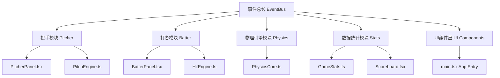

## 1. 架构设计



## 2. 技术描述

- 前端框架: React 18 + TypeScript + Vite
- 状态管理: React useState/useReducer + 自定义事件总线
- 物理引擎: 自定义PhysicsCore（纯TypeScript实现）
- 样式方案: 内联样式 + CSS变量
- 动画方案: requestAnimationFrame + CSS动画

## 3. 目录结构

```
src/
├── main.tsx              # React挂载入口
├── App.tsx               # 主应用组件
├── events/
│   └── EventBus.ts      # 事件总线
├── pitcher/
│   ├── PitcherPanel.tsx  # 投手UI
│   └── PitchEngine.ts     # 投手物理引擎
├── batter/
│   ├── BatterPanel.tsx   # 打者UI
│   └── HitEngine.ts    # 打者物理引擎
├── engine/
│   └── PhysicsCore.ts   # 核心物理模块
└── stats/
    ├── GameStats.ts     # 数据统计
    └── Scoreboard.tsx  # 得分板UI
```

## 4. 事件总线事件定义

| 事件名 | 触发时机 | 数据结构 |
|--------|-----------|----------|
| PITCH_SELECTED | 投手选择球种 | { pitchType, speed, spin } |
| PITCH_CHARGING | 投手蓄力中 | { chargeLevel } |
| PITCH_RELEASED | 投手投出球 | { pitchType, speed, spin, position } |
| BALL_POSITION_UPDATED | 棒球位置更新 | { position, velocity, timestamp } |
| BALL_ENTERED_ZONE | 棒球进入击球区 | { position } |
| SWING | 打者挥棒 | { timestamp, aimPosition } |
| HIT_DETECTED | 击球碰撞检测 | { hitQuality, angle, speed } |
| HIT_RESULT | 击球结果判定 | { result, quality } |
| STATS_UPDATED | 统计数据更新 | { stats } |
| INNING_CHANGED | 局数变化 | { inning, isTop } |
| SIDE_CHANGED | 交换攻守 | { battingTeam } |
| GAME_OVER | 游戏结束 | { finalScore } |

## 5. 数据模型

### 5.1 核心类型定义

```typescript
// 球种类型
type PitchType = 'fastball' | 'curveball' | 'forkball' | 'slider';

// 棒球状态
interface BallState {
  position: { x: number; y: number };
  velocity: { x: number; y: number };
  speed: number;      // km/h
  spin: number;       // rpm
  pitchType: PitchType;
  trajectory: Array<{ x: number; y: number }>;
}

// 击球结果
type HitResult = 'strike' | 'ball' | 'foul' | 'single' | 'double' | 'homerun' | 'out';

// 打者状态
interface BatterState {
  aimPosition: { x: number; y: number };
  isSwinging: boolean;
  swingTiming: number | null;
}

// 投手统计
interface PitcherStats {
  totalPitches: number;
  strikes: number;
  balls: number;
  strikeouts: number;
}

// 打者统计
interface BatterStats {
  atBats: number;
  hits: number;
  homeRuns: number;
  rbi: number;
}

// 游戏状态
interface GameState {
  inning: number;
  isTop: boolean;
  awayScore: number;
  homeScore: number;
  outs: number;
  currentPitcherStats: PitcherStats;
  currentBatterStats: BatterStats;
}
```

### 5.2 物理引擎常量

| 常量名 | 值 | 说明 |
|--------|-----|------|
| GRAVITY | 9.8 | 重力加速度 m/s² |
| AIR_RESISTANCE | 0.001 | 空气阻力系数 |
| MAX_CHARGE_TIME | 2000 | 最大蓄力时间 ms |
| PITCH_DISTANCE | 18.44 | 投球距离 m |
| HIT_ZONE_DURATION | 100 | 击球时机窗口 ms |
| BALL_RADIUS | 6 | 棒球半径 px |
| AIM_RADIUS | 20 | 准星半径 px |

## 6. 关键技术实现

### 6.1 事件总线实现

采用发布-订阅模式，实现模块间解耦通信。

### 6.2 物理引擎实现

- 使用requestAnimationFrame驱动60fps循环
- 向量运算计算抛物线轨迹
- 实时更新棒球位置
- 碰撞检测采用圆形碰撞算法

### 6.3 渲染优化

- 使用useMemo/useCallback减少重渲染
- 轨迹数据采用增量更新
- 小屏设备简化动画效果
