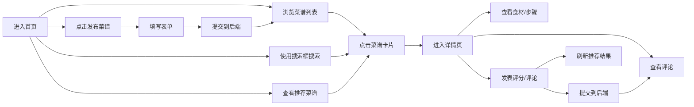

## 1. 产品概述

线上美食分享社区应用，让用户能够发布拿手菜谱、为菜谱评分评论，并根据口味偏好获取智能推荐。

- 核心价值：连接美食爱好者，通过用户评分和智能推荐发现符合口味的优质菜谱
- 目标用户：喜欢烹饪和分享美食的用户群体
- 产品定位：轻量级、高互动性的美食分享社交平台

## 2. 核心功能

### 2.1 用户角色
| 角色 | 注册方式 | 核心权限 |
|------|----------|----------|
| 普通用户 | 模拟登录（固定用户ID） | 浏览菜谱、搜索、评分评论、发布菜谱、查看个性化推荐 |

### 2.2 功能模块
1. **首页（菜谱列表页）**：瀑布流菜谱卡片、搜索框、推荐侧边栏、发布菜谱入口
2. **菜谱详情页**：大图展示、食材列表、步骤说明、用户评论区、评价入口
3. **用户评价组件**：星级评分、文字评论、提交功能
4. **推荐引擎模块**：基于余弦相似度的个性化菜谱推荐
5. **菜谱发布功能**：模态框表单，支持填写完整菜谱信息

### 2.3 页面详情
| 页面名称 | 模块名称 | 功能描述 |
|----------|----------|------------|
| 首页 | 瀑布流菜谱卡片 | 自适应列数展示，每卡片含图片、名称、作者、评分、口味标签，hover上移动效 |
| 首页 | 搜索框 | 实时过滤菜谱，防抖300ms，聚焦边框变色动效 |
| 首页 | 推荐侧边栏 | "为你推荐" Top5推荐菜谱，纵向列表展示，点击跳转详情 |
| 首页 | 发布菜谱按钮 | 打开模态框，提交后刷新列表 |
| 详情页 | 菜谱大图 | 100%宽度，最大高度400px |
| 详情页 | 食材列表 | 灰色背景卡片，圆角8px |
| 详情页 | 步骤列表 | 序号圆形标记，红色背景白色数字 |
| 详情页 | 评论区 | 显示已有评论，支持发表新评论，提交后自动刷新 |
| 详情页 | 星级评分 | 1-5星可点击，0.2s高亮动画 |

## 3. 核心流程

## 4. 用户界面设计

### 4.1 设计风格
- **主色调**：#ff6b6b（菜品红），用于按钮、关键标记
- **辅助色**：#ffd700（评分金），用于星级评分
- **背景色**：#ffffff（主背景）、#fafafa（侧边栏/卡片背景）
- **字体**：标题18px粗体，正文14px常规，注释12px灰色
- **按钮风格**：圆角8px，hover变深，阴影效果，点击scale(0.95)
- **布局风格**：卡片式布局，瀑布流网格，顶部导航
- **动效**：卡片hover上移(-4px)，阴影加深，过渡0.3s；星星高亮动画0.2s

### 4.2 页面设计概述
| 页面名称 | 模块名称 | UI元素 |
|----------|----------|--------|
| 首页 | 瀑布流卡片 | 4:3图片，名称18px粗体，作者14px灰色，金色星星评分，红色/粉色口味标签 |
| 首页 | 搜索框 | 宽60%，高48px，圆角24px，背景#f0f0f0，聚焦边框#ff6b6b，过渡0.3s |
| 首页 | 推荐侧边栏 | 宽300px，背景#fafafa，圆角12px，标题下分割线，60x60px小图 |
| 首页 | 发布按钮 | 背景#ff6b6b，白色文字，阴影0 2px 8px rgba(255,107,107,0.4) |
| 详情页 | 评论项 | 40px圆形头像，用户名，星星评分，评论文字，时间戳（xx分钟前） |

### 4.3 响应式
- **桌面端（≥768px）**：瀑布流多列，搜索框60%宽度，右侧sidebar推荐区
- **移动端（<768px）**：瀑布流单列，搜索框100%宽度，sidebar折叠到页面底部

## 5. 性能要求
- 推荐引擎计算时间 ≤ 300ms
- 菜谱列表首次加载时间 < 1.5s
- 评论提交后列表更新 < 800ms
