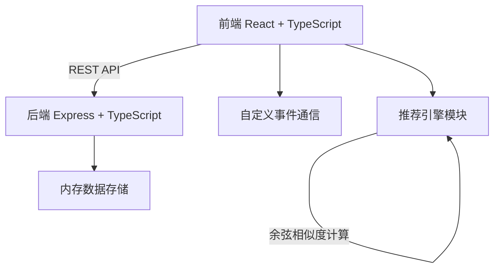
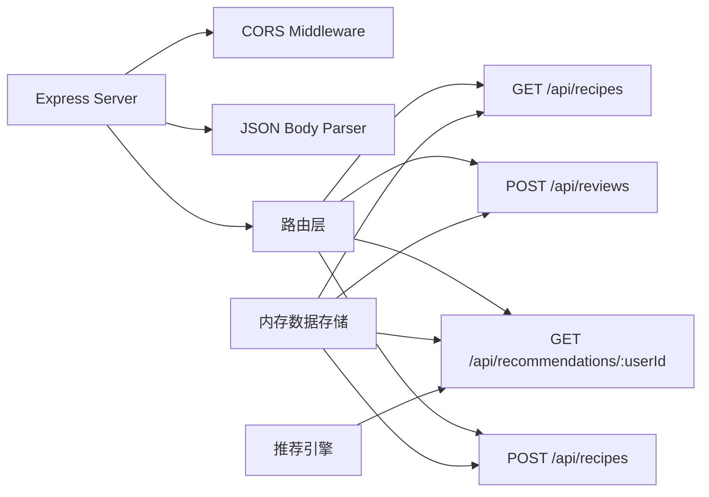
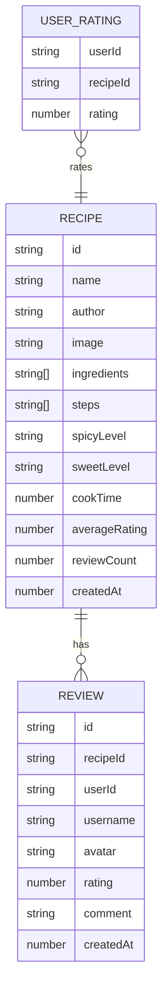

## 1. 架构设计



## 2. 技术描述

- **前端**：React 18 + TypeScript + Vite + Zustand + Axios + React Router
- **后端**：Express 4 + TypeScript + CORS
- **状态管理**：Zustand
- **构建工具**：Vite
- **数据存储**：内存数组（开发/演示用）
- **推荐算法**：基于用户评分的余弦相似度

## 3. 路由定义
| 路由 | 用途 |
|------|------|
| / | 首页 - 菜谱列表、搜索、推荐、发布入口 |
| /recipe/:id | 菜谱详情页 - 完整信息、评论区、评价入口 |

## 4. API 定义

### 类型定义
```typescript
interface Recipe {
  id: string;
  name: string;
  author: string;
  image: string;
  ingredients: string[];
  steps: string[];
  spicyLevel: '不辣' | '微辣' | '中辣' | '重辣';
  sweetLevel: '不甜' | '微甜' | '中甜' | '很甜';
  cookTime: number;
  averageRating: number;
  reviewCount: number;
  createdAt: number;
}

interface Review {
  id: string;
  recipeId: string;
  userId: string;
  username: string;
  avatar: string;
  rating: number;
  comment: string;
  createdAt: number;
}

interface UserRating {
  userId: string;
  recipeId: string;
  rating: number;
}
```

### API 接口
| 方法 | 路径 | 请求体 | 响应 |
|------|------|--------|------|
| GET | /api/recipes | - | Recipe[] |
| POST | /api/reviews | { recipeId, userId, username, avatar, rating, comment } | { success: boolean, review: Review } |
| GET | /api/recommendations/:userId | - | Recipe[] |
| POST | /api/recipes | { name, author, image, ingredients, steps, spicyLevel, sweetLevel, cookTime } | { success: boolean, recipe: Recipe } |

## 5. 服务器架构图



## 6. 数据模型

### 6.1 数据模型定义



### 6.2 初始化数据

启动时预置示例菜谱和用户评分数据，用于演示推荐功能。

## 7. 项目结构

```
├── package.json
├── index.html
├── vite.config.js
├── tsconfig.json
├── src/
│   ├── main.tsx          # 应用入口
│   ├── App.tsx           # 主应用组件，路由配置
│   ├── RecipeFeed.tsx    # 菜谱列表组件
│   ├── RecipeDetail.tsx  # 菜谱详情组件
│   ├── UserReview.tsx    # 用户评价组件
│   ├── recommendEngine.ts # 推荐引擎模块
│   └── index.css         # 全局样式
└── server/
    └── index.ts          # Express 后端服务器
```
