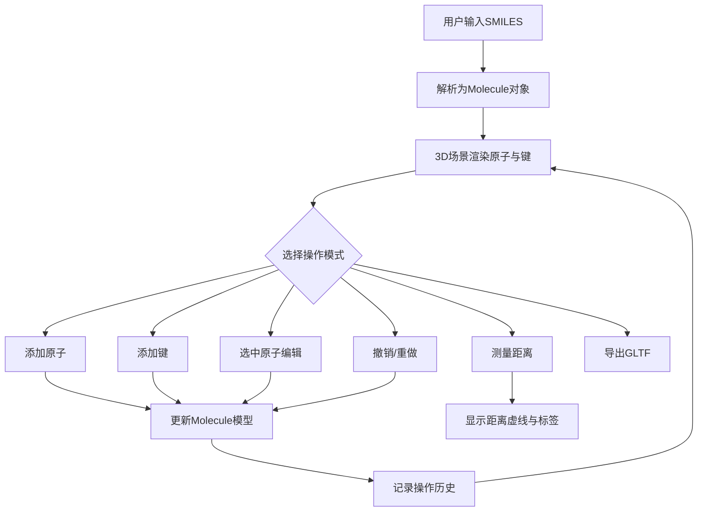

## 1. 产品概述

3D分子结构交互式编辑器——一款面向化学教育教师和医药研发人员的轻量级Web应用，解决无法快速创建和修改分子模型的问题。支持SMILES字符串解析为3D分子结构，提供原子/键的添加删除、属性编辑、视图旋转缩放、距离测量和GLTF导出等功能。

- 目标用户：化学教育教师、医药研发人员、学生
- 核心价值：零安装、浏览器内即开即用的3D分子编辑器

## 2. 核心功能

### 2.1 用户角色

| 角色 | 使用方式 | 核心权限 |
|------|----------|----------|
| 教师或研究人员 | 直接访问 | 全部编辑与可视化功能 |
| 学生 | 直接访问 | 浏览与查看，可选编辑 |

### 2.2 功能模块

1. **主编辑页面**：3D场景渲染区、SMILES输入区、工具栏、原子编辑面板、测量工具

### 2.3 页面详情

| 页面名称 | 模块名称 | 功能描述 |
|----------|----------|----------|
| 主编辑页面 | SMILES输入区 | 文本输入框输入SMILES字符串（如CCO），自动解析为3D分子模型 |
| 主编辑页面 | 3D场景渲染区 | 原子球体（元素颜色区分）、键圆柱体（单/双/三键区分）、等轴测默认视角、渐变背景、环境光+方向光 |
| 主编辑页面 | 交互式编辑 | 点击选中原子（发光轮廓脉冲）、属性面板编辑元素/坐标/键、点击空白添加原子、两原子间创建键 |
| 主编辑页面 | 操作历史 | 撤销(Ctrl+Z)、重做(Ctrl+Shift+Z) |
| 主编辑页面 | 工具栏 | 添加原子、添加键、测量距离、旋转模式、缩放模式、撤销、重做、重置视角、导出GLTF |
| 主编辑页面 | 测量工具 | 两原子间虚线连接+距离标签（埃，两位小数） |
| 主编辑页面 | 视图控制 | OrbitControls旋转、滚轮缩放、右键平移、轴辅助线指示 |

## 3. 核心流程

用户打开应用 → 输入SMILES字符串 → 系统解析并渲染3D分子 → 用户通过工具栏选择操作模式（添加原子/键/测量） → 点击场景交互 → 编辑面板修改属性 → 撤销/重做管理历史 → 导出GLTF

## 4. 用户界面设计

### 4.1 设计风格

- 深色科幻风格主题：主背景 #0a0a2e，卡片/面板背景 #1a1a3e，边框 #2a2a5e
- 高亮色：亮黄色 #ffcc00（选中/交互）、青色 #00e5ff（辅助高亮）
- 按钮：圆角，hover变为#ffcc00并放大1.1倍，点击弹缩动画scale(0.95)再恢复
- 字体：Inter或系统无衬线字体，标题14px、正文12px、辅助文字10px
- 面板与卡片：圆角12px，内边距16px，边框1px solid #2a2a5e
- 动画过渡：0.3s ease-out

### 4.2 页面设计概览

| 页面名称 | 模块名称 | UI元素 |
|----------|----------|--------|
| 主编辑页面 | 工具栏 | 固定顶部56px，背景#12122a半透明毛玻璃blur(12px)，SVG图标24x24px颜色#e0e0e0 |
| 主编辑页面 | 原子编辑面板 | 右侧滑入280px，背景#12122a，圆角12px 0 0 12px，滑动动画0.3s |
| 主编辑页面 | 3D场景 | 全屏背景渐变#0a0a2e到#1a1a3e，环境光0.4+两束方向光 |
| 主编辑页面 | 轴辅助线 | 左下角，红X绿Y蓝Z长度1.5单位，浅灰色半透明文字标签 |
| 主编辑页面 | 距离标签 | 虚线中点上方，背景#ffffff文字#12122a圆角4px字号12px |
| 主编辑页面 | 选中原子效果 | 半透明发光轮廓#ffcc00，0.3s脉冲动画 |

### 4.3 响应式适配

- 桌面端优先设计
- 屏幕宽度 < 768px：工具栏改为底部导航栏（高度64px），原子编辑面板变为全屏底部弹出层（高度50vh，圆角16px 16px 0 0）
- 移动端：双指缩放、单指旋转

### 4.4 3D场景设计

- 环境：渐变背景从深蓝紫#0a0a2e到#1a1a3e，科幻氛围
- 光照：环境光强度0.4 + 左上方向光 + 右下方向光，柔和均匀
- 相机：等轴测默认视角，OrbitControls交互
- 原子渲染：球体，元素类型决定颜色与半径（C灰#808080/0.5, O红#ff0000/0.45, H白#ffffff/0.3, N蓝#0000ff/0.45）
- 键渲染：圆柱体，单键1根、双键2根间距0.1、三键3根间距0.08
- 动画：新元素添加时0.5s轻微缩放和旋转聚焦动画
- 性能目标：50原子+100键，≥30fps；编辑操作响应≤200ms

## 5. 技术约束

- 前端技术栈：React 18 + TypeScript + Three.js + @react-three/fiber + @react-three/drei
- 状态管理：Zustand
- 构建工具：Vite
- 无后端依赖，纯前端应用
- 文件结构严格按需求组织
