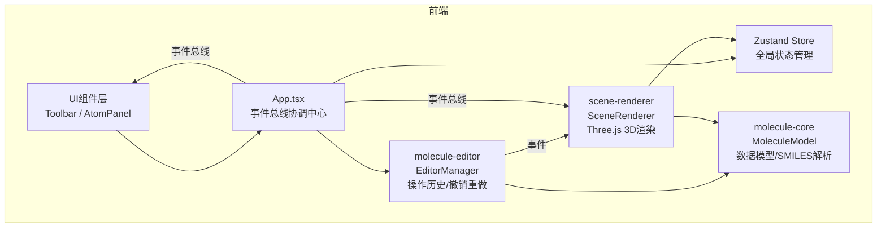

## 1. 架构设计



## 2. 技术说明

- 前端框架：React 18 + TypeScript
- 3D渲染：Three.js + @react-three/fiber + @react-three/drei
- 状态管理：Zustand
- 构建工具：Vite + @vitejs/plugin-react
- 无后端、无数据库
- 模块通信：事件总线（mitt或自定义EventEmitter）

## 3. 路由定义

| 路由 | 用途 |
|------|------|
| / | 主编辑页面（单页应用，无额外路由） |

## 4. 模块职责

### 4.1 molecule-core/MoleculeModel.ts

- 定义 Atom 接口（id, element, x, y, z）
- 定义 Bond 接口（id, atom1Id, atom2Id, type: single/double/triple）
- 定义 Molecule 接口（atoms: Atom[], bonds: Bond[]）
- SMILES 解析函数：parseSMILES(smiles: string) => Molecule
  - 支持基础SMILES：C, H, O, N, S, P元素
  - 支持单键、双键(=)、三键(#)
  - 支持分支(())
  - 输出包含原子坐标的Molecule对象（基于简单力场布局）

### 4.2 molecule-editor/EditorManager.ts

- 原子操作：addAtom, removeAtom, updateAtom
- 键操作：addBond, removeBond, updateBond
- 选中管理：selectAtom, deselectAtom
- 操作历史：undo, redo
- 历史栈：使用命令模式，每个操作封装为可撤销的Command对象
- 事件触发：通过事件总线通知场景和UI更新

### 4.3 scene-renderer/SceneRenderer.tsx

- React Three Fiber Canvas组件
- 原子球体渲染（MeshStandardMaterial，元素颜色和半径）
- 键圆柱体渲染（单/双/三键视觉区分）
- 选中原子发光轮廓效果
- 测量虚线与距离标签
- 轴辅助线（AxesHelper自定义）
- OrbitControls视图控制
- 光照设置（环境光+方向光）
- 渐变背景
- GLTF导出功能

### 4.4 ui-components/Toolbar.tsx

- 固定顶部工具栏（56px高）
- 毛玻璃背景效果
- SVG图标按钮：添加原子、添加键、测量距离、旋转、缩放、撤销、重做、重置视角、导出GLTF
- hover/click动画效果
- 响应式：小屏幕变底部导航

### 4.5 ui-components/AtomPanel.tsx

- 右侧滑入面板（280px宽）
- 元素类型下拉菜单（C, H, O, N, S, P）
- 坐标输入框（X/Y/Z，-10到10，步长0.1）
- 所连键列表（可删除）
- 关闭按钮
- 响应式：小屏幕变底部弹出层

## 5. 状态管理（Zustand Store）

```typescript
interface MoleculeStore {
  molecule: Molecule;
  selectedAtomId: string | null;
  activeTool: 'select' | 'addAtom' | 'addBond' | 'measure' | 'rotate' | 'zoom';
  history: Command[];
  historyIndex: number;
  measurePoints: [string, string] | [];
  setMolecule: (m: Molecule) => void;
  setSelectedAtomId: (id: string | null) => void;
  setActiveTool: (tool: string) => void;
  addAtom: (atom: Atom) => void;
  removeAtom: (id: string) => void;
  updateAtom: (id: string, updates: Partial<Atom>) => void;
  addBond: (bond: Bond) => void;
  removeBond: (id: string) => void;
  undo: () => void;
  redo: () => void;
}
```

## 6. 文件结构

```
├── package.json
├── index.html
├── vite.config.js
├── tsconfig.json
└── src/
    ├── main.tsx
    ├── App.tsx
    ├── store/
    │   └── useMoleculeStore.ts
    ├── molecule-core/
    │   └── MoleculeModel.ts
    ├── molecule-editor/
    │   └── EditorManager.ts
    ├── scene-renderer/
    │   └── SceneRenderer.tsx
    └── ui-components/
        ├── Toolbar.tsx
        └── AtomPanel.tsx
```
