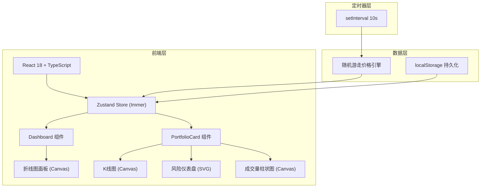
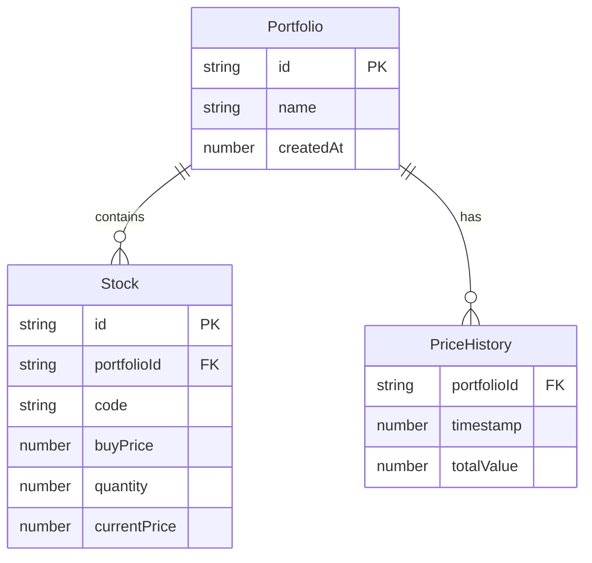

## 1. 架构设计



纯前端项目，无后端依赖。价格模拟通过随机游走算法在客户端完成，状态管理使用Zustand+Immer实现不可变更新。

## 2. 技术说明
- 前端：React@18 + TypeScript + Tailwind CSS + Vite
- 初始化工具：vite-init (react-ts 模板)
- 后端：无
- 数据库：无（使用localStorage做简单持久化）
- 状态管理：Zustand + Immer中间件

## 3. 路由定义
| 路由 | 用途 |
|------|------|
| / | 仪表盘首页，展示组合列表和折线图汇总 |

单页应用，组合详情通过卡片展开/收起在同一页面展示，无需路由切换。

## 4. API定义
无后端API。所有数据在客户端生成和模拟。

### 4.1 价格模拟算法
- 随机游走模型：`newPrice = lastPrice * (1 + (Math.random() - 0.48) * 0.02)`
- 每10秒触发一次模拟更新
- 增量计算：仅更新变化的价格数据，避免全量重渲染

### 4.2 风险指标计算
- 波动率：历史日收益率的标准差 * √252（年化）
- 最大回撤：从峰值到谷值的最大跌幅百分比

## 5. 服务器架构图
不适用（纯前端项目）

## 6. 数据模型

### 6.1 数据模型定义



### 6.2 数据定义

```typescript
interface Portfolio {
  id: string;
  name: string;
  stocks: Stock[];
  priceHistory: PricePoint[];
  createdAt: number;
}

interface Stock {
  id: string;
  code: string;
  buyPrice: number;
  quantity: number;
  currentPrice: number;
}

interface PricePoint {
  timestamp: number;
  totalValue: number;
}
```

### 6.3 文件结构

```
├── package.json
├── index.html
├── vite.config.js
├── tsconfig.json
├── src/
│   ├── main.tsx          # ReactDOM入口
│   ├── App.tsx           # 根组件
│   ├── store.ts          # Zustand store
│   ├── components/
│   │   ├── Dashboard.tsx # 仪表盘主组件
│   │   ├── PortfolioCard.tsx # 组合卡片
│   │   ├── KlineChart.tsx # K线图Canvas组件
│   │   ├── VolumeChart.tsx # 成交量柱状图
│   │   ├── RiskGauge.tsx # 风险仪表盘
│   │   ├── LineChart.tsx # 折线图面板
│   │   └── CreatePortfolioModal.tsx # 新建组合弹窗
│   ├── hooks/
│   │   └── useSimulation.ts # 价格模拟定时器hook
│   └── utils/
│       └── simulation.ts # 随机游走算法
```
