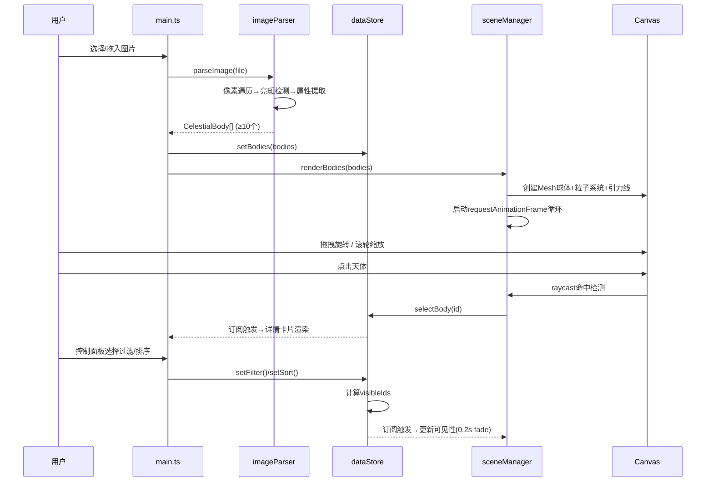

## 1. 架构设计

```mermaid
graph TD
    "用户界面(UI)" --> "main.ts 应用入口"
    "main.ts 应用入口" --> "imageParser.ts 图片解析模块"
    "imageParser.ts 图片解析模块" --> "输出CelestialBody[]"
    "输出CelestialBody[]" --> "dataStore.ts Zustand状态管理"
    "输出CelestialBody[]" --> "sceneManager.ts Three.js渲染"
    "dataStore.ts Zustand状态管理" --> "sceneManager.ts Three.js渲染"
    "sceneManager.ts Three.js渲染" --> "用户交互(点击/悬停/旋转)"
    "用户交互(点击/悬停/旋转)" --> "dataStore.ts Zustand状态管理"
    "dataStore.ts Zustand状态管理" --> "UI更新(详情卡片/过滤排序)"
```

**数据流向说明**：
1. main.ts → 监听上传事件 → 调用imageParser.parse()获取天体数组
2. main.ts → 将天体数组传入dataStore初始化 + sceneManager.render()
3. sceneManager → 捕获交互事件 → 调用dataStore更新选中/过滤状态
4. dataStore订阅 → UI层(详情卡片/控制面板)自动响应式更新

---

## 2. 技术选型说明

| 层级 | 技术 | 版本 | 用途 |
|------|------|------|------|
| 前端框架 | Vanilla TypeScript | 5.x | 纯TS无UI框架，按用户需求 |
| 3D引擎 | three | ^0.160.0 | WebGL 3D渲染，球体/粒子/光照 |
| 状态管理 | zustand | ^4.4.0 | 轻量级状态容器，管理天体元数据 |
| 构建工具 | vite | ^5.0.0 | 极速开发服务器+构建 |
| 语言 | TypeScript | ^5.3.0 | strict严格模式，类型安全 |

**初始化工具**：vite-init vanilla-ts 模板

---

## 3. 模块文件清单与职责

| 文件路径 | 职责定义 | 对外接口 |
|---------|---------|---------|
| `src/main.ts` | 应用入口，协调各模块，创建UI，管理生命周期 | `initApp()` 启动应用 |
| `src/imageParser.ts` | 图片→Canvas像素分析→提取亮斑属性 | `parseImage(file): Promise<CelestialBody[]>` |
| `src/sceneManager.ts` | Three.js场景/相机/渲染器/控件/交互 | `initScene(container), renderBodies(data), dispose()` |
| `src/dataStore.ts` | Zustand store：存储天体、选中、过滤、排序状态 | `useCelestialStore.getState().{setBodies, selectBody, filterBrightness, sortBodies}` |
| `src/types.ts` | 共享类型定义 | `CelestialBody, FilterOption, SortOption` |

---

## 4. 核心数据模型

### 4.1 CelestialBody 类型定义

```typescript
export interface CelestialBody {
  id: string;                    // 唯一标识 UUID
  index: number;                 // 序号（用于显示"天体 #N"）
  name: string;                  // 显示名称
  x: number;                     // 原图x坐标(0-1归一化)
  y: number;                     // 原图y坐标(0-1归一化)
  position3D: { x: number; y: number; z: number };  // 3D空间坐标
  brightness: number;            // 亮度 0-100
  color: string;                 // Hex颜色代码
  size: number;                  // 估算尺寸 0.3-2.0
  radius: number;                // 球体半径(映射自brightness)
  thumbnailDataUrl?: string;     // 裁剪放大后的缩略图DataURL
  pixelX: number;                // 原图像素坐标x
  pixelY: number;                // 原图像素坐标y
}
```

### 4.2 Store 状态结构

```typescript
interface CelestialStore {
  bodies: CelestialBody[];
  visibleIds: Set<string>;
  selectedId: string | null;
  hoveredId: string | null;
  filterOption: 'all' | 'bright' | 'medium' | 'dim';
  sortOption: 'brightnessDesc' | 'brightnessAsc' | 'xAsc';
  
  setBodies(bodies: CelestialBody[]): void;
  selectBody(id: string | null): void;
  setHovered(id: string | null): void;
  setFilter(option: FilterOption): void;
  setSort(option: SortOption): void;
  getBodyById(id: string): CelestialBody | undefined;
  getVisibleBodies(): CelestialBody[];
}
```

---

## 5. 模块间调用时序



---

## 6. 性能优化策略

| 优化点 | 技术方案 | 目标指标 |
|-------|---------|---------|
| 图片解析速度 | 降采样分析(最大500px宽) + WebWorker可选 + 分块像素遍历 | 2000×1500图≤3s |
| 渲染帧率 | 粒子数分档(20-80) + frustumCulled + 几何/材质复用 | 旋转/缩放≥60FPS |
| 内存管理 | 图片解析后释放canvas +  dispose()清理BufferGeometry + Material.dispose | 无明显泄漏 |
| 动画流畅度 | 手动lerp实现聚焦过渡 + CSS transform属性做UI动画 | 卡片显示≤0.4s |
