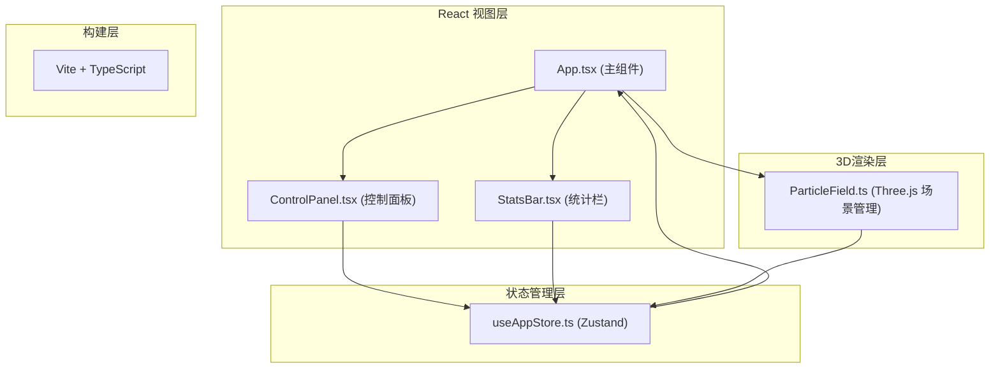

## 1. 架构设计



## 2. 技术描述

- **前端框架**：React 18 + TypeScript（严格模式）
- **构建工具**：Vite
- **3D渲染**：Three.js
- **状态管理**：Zustand
- **工具库**：uuid（粒子ID生成）
- **初始化方式**：Vite react-ts 模板

## 3. 路由定义

| 路由 | 用途 |
|-------|---------|
| / | 主画布页面（单页应用） |

## 4. 文件结构

```
.
├── index.html                 # 入口HTML
├── package.json               # 依赖与脚本
├── vite.config.js             # Vite配置
├── tsconfig.json              # TypeScript配置（严格模式）
└── src/
    ├── main.tsx              # React入口
    ├── App.tsx               # 主组件
    ├── store/
    │   └── useAppStore.ts    # Zustand状态管理
    ├── scene/
    │   └── ParticleField.ts  # 3D场景核心类
    └── components/
        ├── ControlPanel.tsx  # 左侧控制面板
        └── StatsBar.tsx      # 右侧统计栏
```

## 5. 核心数据模型

### 5.1 粒子数据结构

```typescript
interface Particle {
  id: string;
  position: { x: number; y: number; z: number };
  targetPosition: { x: number; y: number; z: number };
  velocity: { x: number; y: number; z: number };
  color: string;
  baseRadius: number;
  isDragging: boolean;
  spawnTime: number;
  trail: TrailPoint[];
}

interface TrailPoint {
  position: { x: number; y: number; z: number };
  time: number;
}
```

### 5.2 Store 状态

```typescript
interface AppState {
  particles: Particle[];
  selectedParticleId: string | null;
  colorPalette: 'warm' | 'cool' | 'neon';
  particleSizeMultiplier: number;
  showConnections: boolean;
  addParticle: (p: Particle) => void;
  updateParticle: (id: string, updates: Partial<Particle>) => void;
  removeParticle: (id: string) => void;
  setSelectedParticle: (id: string | null) => void;
  setColorPalette: (p: 'warm' | 'cool' | 'neon') => void;
  setParticleSizeMultiplier: (v: number) => void;
  setShowConnections: (v: boolean) => void;
  reset: () => void;
}
```

## 6. 性能优化策略

- **连线渲染**：使用 LineSegments + BufferGeometry 批量绘制，而非逐根 Line
- **距离计算**：空间网格划分或平方距离比较（避免开方）
- **帧率控制**：requestAnimationFrame 自适应，目标 60FPS，最低保障 30FPS
- **粒子限制**：最大粒子数 200（可配置），超出时提示用户
- **尾迹优化**：限制单个粒子尾迹点数量，使用 BufferGeometry 渲染
