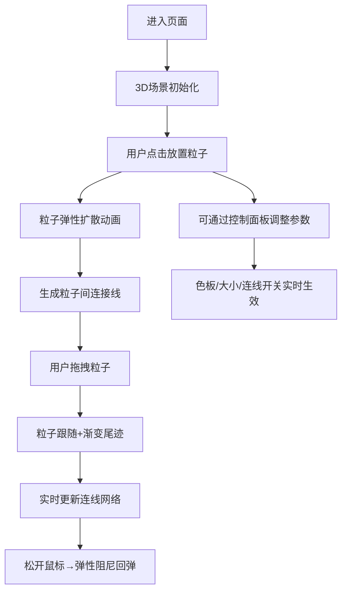

## 1. 产品概述

脑波画布（Brainwave Canvas）是一款沉浸式3D粒子艺术创作工具，用户通过在3D空间中放置和操控浮动粒子来生成动态的抽象艺术作品。粒子间自动形成半透明连接线，构成不断变化的网状结构。

- 目标用户：艺术爱好者、设计师、创意工作者
- 核心价值：提供极简且富有表现力的创作方式，让用户无需专业技能即可生成独特的数字艺术

## 2. 核心功能

### 2.1 功能模块

1. **主画布页面**：3D粒子场景、左侧控制面板、右侧统计栏

### 2.2 页面详情

| 页面名称 | 模块名称 | 功能描述 |
|-----------|-------------|---------------------|
| 主画布页面 | 3D粒子场景 | 点击放置粒子、拖拽移动粒子、粒子脉动动画、拖拽尾迹效果、弹性回弹 |
| 主画布页面 | 粒子网络 | 距离触发连线、连线粗细渐变、颜色混合、动态重绘 |
| 主画布页面 | 控制面板 | 色板切换（暖色系/冷色系/霓虹系）、粒子大小滑块、连线开关、重置按钮 |
| 主画布页面 | 统计栏 | 实时粒子数量、绘制区域面积数据 |

## 3. 核心流程

## 4. 用户界面设计

### 4.1 设计风格

- **主色调**：深邃宇宙黑（#0a0a0f）为背景，粒子颜色从预设色板中选取
- **色板系统**：
  - 暖色系：#FF6B6B, #FFA94D, #FFD43B, #FF8787, #FA5252, #E8590C
  - 冷色系：#339AF0, #22B8CF, #4DABF7, #15AABF, #1C7ED6, #0C8599
  - 霓虹系：#F06595, #CC5DE8, #845EF7, #5C7CFA, #BE4BDB, #7950F2
- **控制面板**：280px宽度，半透明毛玻璃效果（blur 12px），深灰背景（rgba 0.15, 0.15, 0.2, 0.6）
- **字体**：现代几何无衬线字体，标题字号16px，正文13px
- **整体风格**：极简未来主义、沉浸式深色空间、柔和辉光粒子

### 4.2 页面设计概述

| 页面名称 | 模块名称 | UI Elements |
|-----------|-------------|-------------|
| 主画布页面 | 3D场景 | 全屏画布，黑色空间背景，透视相机，鼠标悬停光标变化 |
| 主画布页面 | 控制面板 | 左侧固定，可折叠展开，圆角卡片，滑块控件，切换按钮 |
| 主画布页面 | 统计栏 | 右上角浮动，透明胶囊样式，实时数字更新动画 |

### 4.3 响应式

- 桌面端优先设计
- 控制面板在移动端自动折叠为图标按钮
- 统计栏自适应位置

### 4.4 3D场景指引

- **环境**：纯黑背景营造宇宙空间感，无额外光源，粒子自发光
- **相机**：PerspectiveCamera，初始位置(0, 0, 8)，fov 60
- **交互**：Raycaster实现3D空间点击/拖拽，正交投影鼠标坐标映射
- **动画**：粒子脉动（sin函数0.5s周期缩放1.0-1.08）、弹性动画（0.4s）、尾迹渐变（1.5s衰减）
- **性能**：200+粒子稳定30FPS+，连线使用BufferGeometry批量渲染
