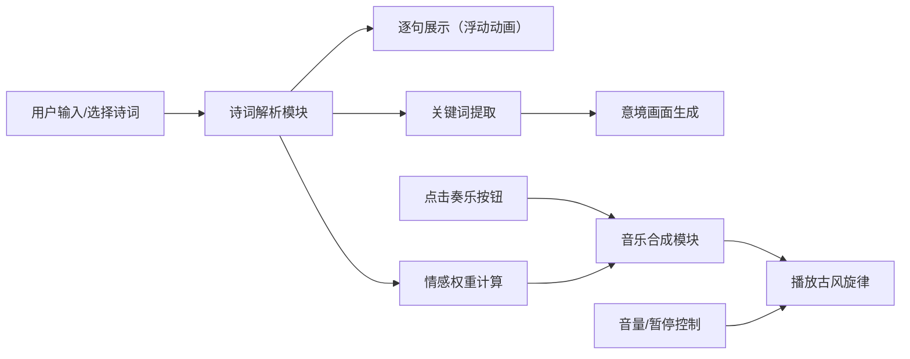

## 1. 产品概述

古诗词AI语音配乐与意境可视化展板是一个沉浸式的古诗词欣赏平台，通过AI技术将传统诗词与现代音画艺术相结合。用户选择或输入古诗词后，系统自动为每句诗生成水墨画风格的意境画面，并配以情感匹配的古风背景音乐，打造身临其境的诗词欣赏体验。

- 核心价值：让传统文化以更生动、更具沉浸感的方式呈现，提升古诗词的欣赏体验
- 目标用户：古诗词爱好者、学生、文化艺术从业者
- 市场定位：文化教育类创新应用，结合AI音画生成技术的传统文化传播工具

## 2. 核心功能

### 2.1 用户角色

| 角色 | 注册方式 | 核心权限 |
|------|----------|----------|
| 普通用户 | 无需注册，直接使用 | 诗词输入/选择、意境画面生成、背景音乐播放、音量控制 |

### 2.2 功能模块

1. **主展示页**：诗词输入区、卷轴展示区、意境画生成区、音乐控制区
2. **诗词解析模块**：逐句拆分、关键词提取、情感权重计算
3. **意境画面生成模块**：基于Canvas的水墨画风格生成、色彩渐变、笔触纹理
4. **背景音乐合成模块**：五声音阶旋律生成、Web Audio API播放、音量控制

### 2.3 页面详情

| 页面名称 | 模块名称 | 功能描述 |
|----------|----------|------------|
| 主展示页 | 诗词输入区 | 下拉选择经典诗词或手动输入自定义诗词 |
| 主展示页 | 卷轴展示区 | 中式卷轴风格布局，逐句展示诗词，每句有浮动动画 |
| 主展示页 | 意境画生成区 | 每句诗对应一幅300x200px的水墨画，基于关键词生成 |
| 主展示页 | 音乐控制区 | 奏乐按钮、音量滑块、暂停/播放控制 |

## 3. 核心流程

用户选择或输入诗词 → 系统解析诗词（逐句拆分、提取关键词、计算情感权重）→ 逐句展示诗词（带动画效果）→ 同步生成对应意境画面 → 用户点击奏乐按钮 → 生成并播放匹配情感的古风音乐 → 用户可调节音量或暂停播放

## 4. 用户界面设计

### 4.1 设计风格

- **主色调**：米白#f5f0e8、赭石#8b5a2b、墨灰#3a3226、花青#2c5f7c、藤黄#e6a23c
- **辅助色**：rgba(255,255,240,0.7)（半透明卡片）
- **按钮风格**：圆形按钮，柔和阴影，hover有颜色变化，点击有缩放动画
- **字体**：诗词使用楷体，标题使用衬线字体，正文使用优雅的宋体/衬线字体
- **字号**：诗词24px，小标题18px，正文14px
- **布局风格**：纵向卷轴布局，仿古宣纸质感，左右有卷轴装饰条
- **视觉元素**：水墨笔触纹理、色彩渐变、磨砂玻璃效果卡片

### 4.2 页面设计概述

| 页面名称 | 模块名称 | UI元素 |
|----------|----------|--------|
| 主展示页 | 诗词输入区 | 下拉选择框、输入框、确认按钮，暖色调圆角设计 |
| 主展示页 | 卷轴展示区 | 米白背景#f5f0e8，宽80%最大1200px，圆角4px，左右仿古卷轴装饰条 |
| 主展示页 | 诗词卡片 | 半透明磨砂卡片，圆角8px，背景rgba(255,255,240,0.7)，文字深灰#3a3226，从底部向上浮动动画0.6s |
| 主展示页 | 意境画布 | 300x200px Canvas，水墨风格，色彩渐变背景，随机笔触 |
| 主展示页 | 音乐控制区 | 左侧圆形奏乐按钮直径40px，背景#8b5a2b，hover#d07040，音量滑块，暂停按钮 |

### 4.3 响应式设计

- **设计原则**：Desktop-first，移动端自适应
- **桌面端**：诗词卡片与意境画面横向并排，左右卷轴装饰
- **平板端**：保持横向布局，适当缩小尺寸
- **移动端**：卡片自适应为单列布局，诗词在上、画面在下，隐藏侧边卷轴装饰条
- **触摸优化**：按钮最小触摸区域48x48px，滑块增加触摸响应区域

### 4.4 动画与交互

- **入场动画**：页面加载时卷轴展开效果，诗词卡片逐句从底部向上浮动（0.6s ease-out）
- **交错过渡**：诗词展示与画面生成之间有1.2s的交错过渡动画
- **按钮交互**：hover颜色变化，点击0.2s缩放动画
- **滑块交互**：柔和的阴影和圆角，拖动时有平滑过渡

## 5. 性能要求

- 画面重新生成时间：< 50ms
- 音乐合成延迟：< 100ms
- 动画帧率：60fps
- 首屏加载时间：< 2s
