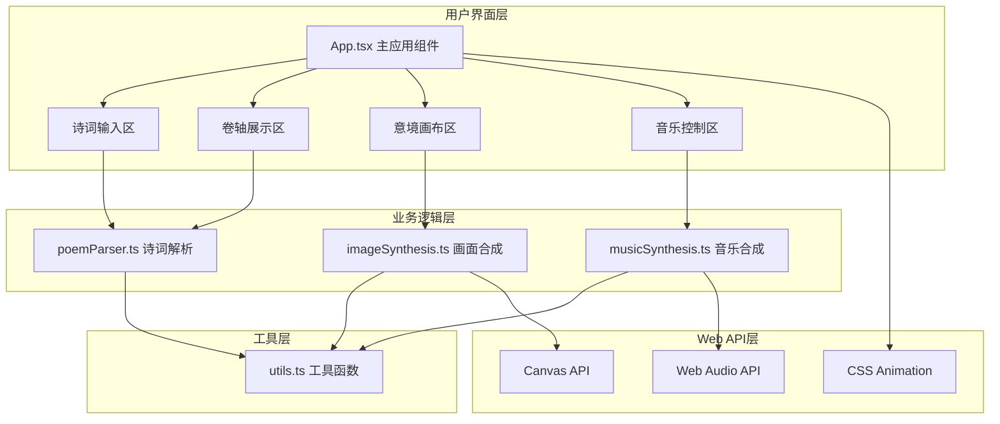
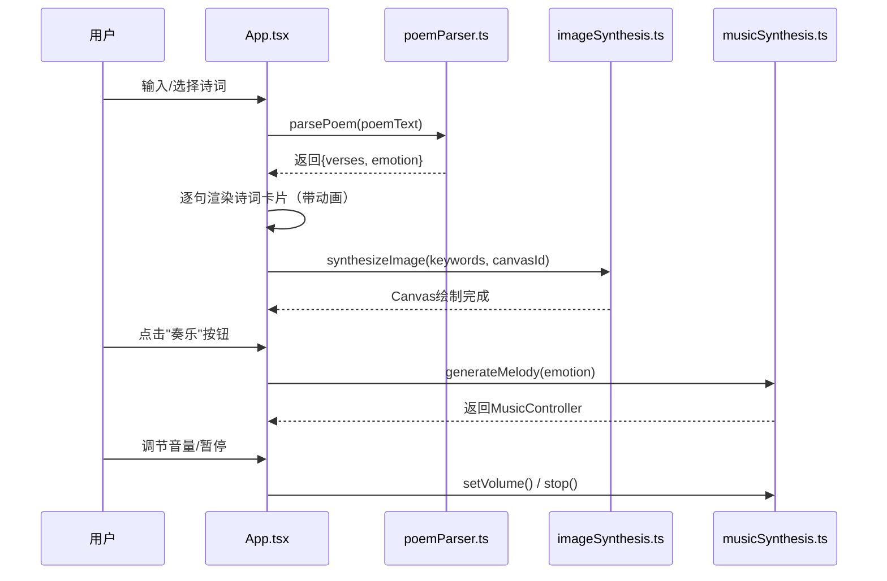

## 1. 架构设计



## 2. 技术描述

- **前端框架**：React 18 + TypeScript 5
- **构建工具**：Vite 5
- **渲染引擎**：Canvas 2D API（意境画面生成）
- **音频引擎**：Web Audio API（背景音乐合成）
- **样式方案**：原生CSS3 + CSS Variables + Keyframes动画
- **无后端设计**：纯前端应用，所有功能在浏览器端实现

## 3. 项目文件结构

```
e:\solo\VersionFastPro\tasks\auto140\
├── package.json          # 项目依赖与脚本
├── index.html            # 入口HTML文件
├── vite.config.js        # Vite构建配置
├── tsconfig.json         # TypeScript配置
└── src/
    ├── App.tsx           # 主应用组件
    ├── poemParser.ts     # 诗词解析模块
    ├── imageSynthesis.ts # 意境画面合成模块
    ├── musicSynthesis.ts # 背景音乐合成模块
    ├── utils.ts          # 工具函数模块
    └── styles.css        # 全局样式文件
```

## 4. 模块接口定义

### 4.1 诗词解析模块 (poemParser.ts)

```typescript
export interface VerseData {
  verse: string;
  keywords: string[];
}

export interface PoemData {
  verses: VerseData[];
  emotion: {
    joy: number;
    sorrow: number;
  };
}

export function parsePoem(poemText: string): PoemData;
```

### 4.2 意境画面合成模块 (imageSynthesis.ts)

```typescript
export function synthesizeImage(
  keywords: string[],
  canvasId: string,
  width?: number,
  height?: number
): void;
```

### 4.3 背景音乐合成模块 (musicSynthesis.ts)

```typescript
export interface MusicController {
  play: () => void;
  stop: () => void;
  setVolume: (volume: number) => void;
  isPlaying: () => boolean;
}

export interface EmotionWeights {
  joy: number;
  sorrow: number;
}

export function generateMelody(emotion: EmotionWeights): MusicController;
```

### 4.4 工具函数模块 (utils.ts)

```typescript
export const ANCIENT_COLORS = {
  inkBlack: '#1a1a1a',
  ochre: '#8b5a2b',
  cyanine: '#2c5f7c',
  rattanYellow: '#e6a23c',
  paperWhite: '#f5f0e8',
  inkGray: '#3a3226',
} as const;

export function calculateEmotionWeights(verses: string[]): { joy: number; sorrow: number };
export function randomInt(min: number, max: number): number;
export function randomFloat(min: number, max: number): number;
export function extractKeywords(verse: string): string[];
```

## 5. 数据流向



## 6. 性能优化策略

### 6.1 画面生成优化（< 50ms）
- 使用离屏Canvas预渲染
- 缓存常用笔触图案
- 限制随机笔触数量（每幅画8-15笔）
- 使用requestAnimationFrame进行异步绘制

### 6.2 音乐合成优化（< 100ms）
- 预生成五声音阶频率表
- 使用AudioBuffer缓存低音样本
- 音符调度采用setTimeout精确控制
- 懒加载音频上下文，首次点击时初始化

### 6.3 动画优化
- 使用transform和opacity属性触发GPU加速
- 避免布局抖动，使用will-change提示
- 诗词卡片动画使用CSS Keyframes，而非JS动画
- 交错过渡通过animation-delay实现

## 7. 浏览器兼容性

- Chrome/Edge 90+
- Firefox 88+
- Safari 14+
- 需支持Web Audio API和Canvas 2D API
