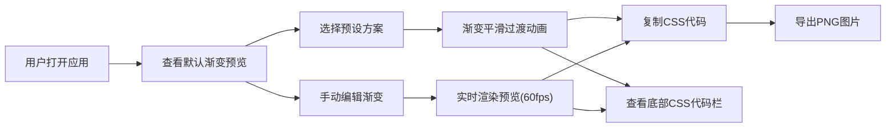

## 1. 产品概述

渐变配色方案预览与分享工具，帮助UI设计师快速调试、预览和导出渐变配色。解决设计师反复尝试渐变组合、截图分享效率低下的问题，提供交互式的渐变编辑、预设方案库、一键CSS/PNG导出能力。

## 2. 核心功能

### 2.1 功能模块
1. **渐变编辑器**：4个可拖拽色标点（颜色+位置）、旋转角度旋钮控制
2. **预设方案库**：15+分类预设（日出、海洋、霓虹、森林等），每类3种方案
3. **导出与分享**：CSS代码一键复制、PNG图片自动下载（800x400）
4. **实时预览区**：完整渐变矩形渲染、色标点位置指示器

### 2.2 页面详情
| 页面名称 | 模块名称 | 功能描述 |
|-----------|-------------|---------------------|
| 主应用页 | 渐变编辑器 | 4色标自定义（色相条+饱和度/明度选取器+位置滑块）、角度旋钮（0-360度） |
| 主应用页 | 预设方案库 | 6列响应式网格，分类标签切换，卡片悬停/点击动效 |
| 主应用页 | 实时预览区 | 渐变矩形渲染、色标点位置指示、平滑过渡动画 |
| 主应用页 | 导出面板 | CSS代码展示与复制、PNG导出按钮 |
| 主应用页 | 底部代码栏 | 固定显示当前CSS代码，一键复制 |

## 3. 核心流程

## 4. 用户界面设计

### 4.1 设计风格
- **主题**：深色主题，背景#1a1a2e，卡片#16213e
- **主色**：#6c63ff（紫色强调色），悬停#5a52d5
- **字体**：monospace用于代码展示，系统无衬线字体用于UI
- **圆角**：按钮8px，卡片12px
- **阴影**：悬停卡片 0 12px 24px rgba(0,0,0,0.15)

### 4.2 页面设计概览
| 页面名称 | 模块名称 | UI元素 |
|-----------|-------------|-------------|
| 主应用页 | 渐变编辑器 | 4色标卡片、色相条(360x24px)、SV选取器、位置滑块(0-100%)、圆形角度旋钮(60px) |
| 主应用页 | 预设方案库 | 分类Tab、6列网格卡片(180x120px)、悬停上浮8px、选中脉冲动画0.2s |
| 主应用页 | 预览区 | 渐变矩形、4个12px色标点指示器(2px白色边框) |
| 主应用页 | 导出按钮 | #6c63ff背景、白色文字、圆角8px、hover缩放1.05 |
| 主应用页 | 底部代码栏 | 固定底部、13px monospace、#0f3460背景、圆角8px、复制按钮 |

### 4.3 响应式
- **桌面端(>768px)**：编辑面板右侧320px宽，主预览区占剩余宽度
- **移动端(<768px)**：编辑面板改为底部抽屉式，预设网格改为2列
- **动画时长**：暗色模式下所有交互动画保持不变

### 4.4 性能指标
- 渐变预览重新渲染 ≤ 16ms (60fps)
- PNG图片导出生成时间 ≤ 300ms
- 预设切换过渡动画 0.4s ease-in-out
- 色标拖拽缓动动画 0.15s
