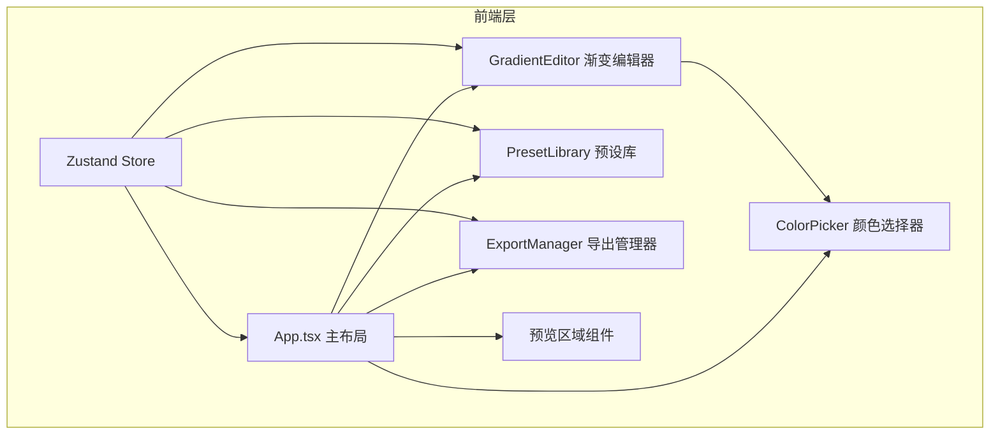

## 1. 架构设计



## 2. 技术描述
- **前端框架**：React 18 + TypeScript 5
- **构建工具**：Vite 5
- **状态管理**：zustand 4
- **样式方案**：原生CSS (styles.css) + CSS变量
- **图片导出**：HTML5 Canvas API

## 3. 项目文件结构
```
├── package.json          # 依赖配置(react, react-dom, typescript, zustand)
├── index.html            # 入口HTML
├── vite.config.js        # Vite构建配置
├── tsconfig.json         # TypeScript配置(严格模式, target ES2020)
└── src/
    ├── App.tsx           # 主应用组件
    ├── GradientEditor.tsx    # 渐变编辑器(4色标+角度旋钮)
    ├── ColorPicker.tsx       # 颜色选择器(色相条+SV面板)
    ├── PresetLibrary.tsx     # 预设方案库(分类+卡片网格)
    ├── ExportManager.tsx     # 导出逻辑(CSS+PNG)
    ├── store.ts              # Zustand状态管理
    ├── types.ts              # 类型定义
    ├── presets.ts            # 预设数据(15+分类)
    └── styles.css            # 全局样式
```

## 4. 状态管理设计
```typescript
interface GradientStop {
  color: string;    // HSL格式
  position: number; // 0-100
}

interface GradientState {
  stops: GradientStop[];  // 4个色标点
  angle: number;          // 0-360度
  activeStopIndex: number;
  setStopColor: (index: number, color: string) => void;
  setStopPosition: (index: number, position: number) => void;
  setAngle: (angle: number) => void;
  setActiveStop: (index: number) => void;
  applyPreset: (stops: GradientStop[], angle: number) => void;
}
```

## 5. 关键数据模型

### 5.1 预设数据
```typescript
interface PresetCategory {
  id: string;
  name: string;
  gradients: PresetGradient[];
}

interface PresetGradient {
  id: string;
  name: string;
  stops: GradientStop[];
  angle: number;
}
```

### 5.2 HSL颜色模型
```typescript
interface HSL {
  h: number; // 0-360
  s: number; // 0-100
  l: number; // 0-100
}
```
