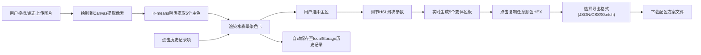

## 1. 产品概述

水彩调色灵感探索工具，为独立插画师设计的手绘风格色彩搭配工具。帮助创作者从上传的图片中自动提取主色调，生成水彩风格色卡，并灵活调节色相/饱和度/明度生成变体色板，支持一键导出多种格式。

- 目标用户：独立插画师、平面设计师、手绘爱好者
- 解决问题：配色瓶颈、手动取色繁琐、缺乏灵感参考、配色方案导出不便
- 产品价值：快速从参考图提取专业配色方案，以手绘美学呈现，灵活调节并即时导出

## 2. 核心功能

### 2.1 功能模块

1. **图片上传与色彩提取区**：拖放上传、自动提取5个主色、色块条展示、颜色详情弹窗
2. **手绘风格色卡展示区**：水彩晕染边缘效果、悬停动画、颜色名称与HEX显示
3. **色彩变体生成器**：HSL三轴滑块调节、实时生成5个变体色板、点击复制HEX、复制成功提示
4. **配色方案导出**：右下角浮层、JSON/CSS/Sketch三种格式、磨砂玻璃背景
5. **历史记录侧边栏**：localStorage持久化、缩略图+主色点展示、一键恢复状态、滑动展开动画

### 2.2 功能详情

| 页面/区域 | 模块名称 | 功能描述 |
|-----------|----------|----------|
| 主页面 | 拖放上传区 | 400x200px虚线框(#c0c0c0, 圆角16px, 淡灰底纹)，拖拽时边框变#a0a0a0+蓝色光晕+嵌入动画 |
| 主页面 | 提取色块条 | 5个色块(80x60px, 圆角8px)，点击弹出HEX值+位置占比百分比 |
| 主页面 | 手绘色卡 | 220x160px卡片(#f8f4e8, 圆角12px, 柔和阴影)，上半色块用水彩边缘滤镜(blur+contrast)，下半颜色名称+HEX，悬停上移3px+阴影加深 |
| 主页面 | 变体滑块 | 色相(-30~+30°)、饱和度(-20%~+20%)、明度(-20%~+20%)，灰色轨道#d0d0d0，圆点#5a7a9a(φ16px)，数值实时显示 |
| 主页面 | 变体色板 | 5个变体卡(同手绘风格)，点击复制HEX，中央绿色"已复制"淡入淡出提示(0.2s入/1.2s出) |
| 主页面 | 导出浮层 | 右下角固定280px宽，磨砂玻璃(backdrop-filter:blur(10px), 圆角16px)，下拉+导出按钮(#4a6fa5→#3a5f95, 0.3s过渡) |
| 左侧 | 历史侧边栏 | 280px宽，收起/展开(0.3s滑动)，80x80px缩略图(圆角8px)+5个φ12px主色点，点击恢复状态 |

## 3. 核心流程

用户从灵感图片上传→自动提取色彩→手绘色卡呈现→调节变体参数→导出配色方案的完整工作流：

## 4. 用户界面设计

### 4.1 设计风格

- **整体调性**：水彩手账本风格，温润自然，手绘质感
- **主背景色**：#f5efe0（暖米色纸本质感）
- **卡片背景**：#f8f4e8（淡米白宣纸色）
- **主色调**：#4a6fa5（水蓝色，用于按钮/交互）
- **辅助色**：#5a7a9a（灰蓝色，滑块圆点）、#c0c0c0/#a0a0a0（边框灰）
- **按钮**：圆角矩形，平滑颜色渐变过渡0.3s
- **字体**：
  - 标题：Caveat / Dancing Script（手写风格开源字体）
  - 正文：Inter（常规无衬线）
- **阴影**：3px 3px 8px rgba(0,0,0,0.1) 柔和投影
- **动效**：所有交互元素微妙过渡（悬停/点击/拖拽），0.2-0.3s ease-out

### 4.2 页面设计总览

| 区域 | 模块 | UI关键要素 |
|------|------|-----------|
| 顶部左侧 | 历史展开按钮 | 图标按钮，点击触发280px侧边栏0.3s滑出 |
| 顶部中央 | 应用标题 | 手写字体大标题"水彩调色板"，副标题说明 |
| 上部 | 上传区+提取色块条 | 拖放框居中，下方横向5色块条，响应式768px断点纵向排列 |
| 中部 | 色卡展示网格 | 5张手绘色卡网格排列，gap:24px，响应式自适应列数 |
| 下部 | 变体调节+变体面板 | 三滑块居左/上，变体色板网格居右/下 |
| 右下角 | 导出浮层 | fixed定位，磨砂玻璃，下拉+按钮 |
| 左侧(隐藏) | 历史记录栏 | 纵向滚动列表，每项目缩略图+5色点 |

### 4.3 响应式设计

- **桌面优先（≥768px）**：上传区+色块横向排列，色卡区多列网格，变体区左右分栏
- **窄屏（<768px）**：所有模块纵向堆叠，上传区全宽，色卡单列，变体滑块全宽
- **触摸优化**：滑块触摸热区≥44x44px，按钮最小尺寸36x36px

### 4.4 动效细节

- **拖放区**：dragover时边框色变化(0.2s) + scale(0.98)嵌入感 + box-shadow蓝色光晕
- **色卡悬停**：transform: translateY(-3px) (0.25s ease-out) + 阴影加深至5px 5px 16px rgba(0,0,0,0.15)
- **复制提示**：opacity 0→1→0，定位卡片中央，颜色#2e8b57(海绿色)
- **历史侧栏**：transform: translateX(-280px) → translateX(0)，0.3s cubic-bezier(0.4,0,0.2,1)
- **滑块交互**：拖动时圆点scale(1.1) + 阴影
