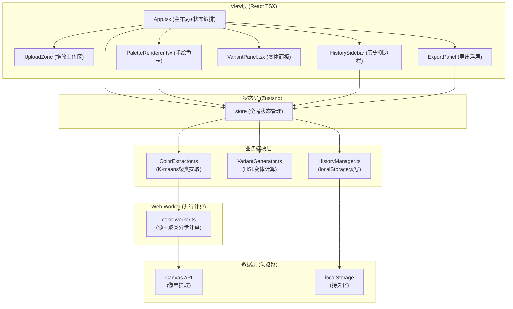

## 1. 架构设计

纯前端单页应用，采用模块化分层架构，所有计算在浏览器端完成（含Web Worker并行计算），无需后端服务：



## 2. 技术选型说明

| 层级 | 技术方案 | 版本要求 | 选型理由 |
|------|---------|---------|---------|
| 构建工具 | Vite | ^5.0 | 极速冷启动/HMR，原生ESM支持 |
| 视图框架 | React | ^18.2 | 组件化开发，生态完善 |
| 语言 | TypeScript | ^5.3 | 严格类型安全，减少运行时错误 |
| 状态管理 | Zustand | ^4.5 | 极简API，无Provider嵌套，按需订阅 |
| 样式 | 原生CSS + CSS变量 | - | 水彩滤镜效果需精细CSS控制，无需Tailwind |
| 图标 | lucide-react | ^0.400 | 轻量矢量图标，按需引入 |
| 并行计算 | Web Worker | - | K-means像素计算放后台线程，保证UI帧率 |
| 字体 | Caveat/Dancing Script (Google Fonts) | - | 手写风格，CDN加载 |

## 3. 目录结构

```
auto148/
├── index.html                         # 入口HTML（含Google Fonts引入）
├── package.json                       # 依赖配置
├── vite.config.js                     # Vite构建配置
├── tsconfig.json                      # TypeScript严格模式
└── src/
    ├── main.tsx                       # React入口
    ├── App.tsx                        # 主应用组件（布局+状态编排）
    ├── App.css                        # 全局样式（水彩手账本主题）
    ├── store/
    │   └── useAppStore.ts             # Zustand全局Store
    ├── modules/
    │   ├── color-extraction/
    │   │   ├── ColorExtractor.ts      # K-means色彩提取算法
    │   │   ├── PaletteRenderer.tsx    # 手绘色卡渲染组件
    │   │   └── types.ts               # 色彩模块类型定义
    │   └── variants/
    │       ├── VariantGenerator.ts    # HSL变体色板生成算法
    │       └── VariantPanel.tsx       # 滑块+变体色板UI
    ├── history/
    │   └── HistoryManager.ts          # localStorage持久化管理
    ├── workers/
    │   └── colorWorker.ts             # Web Worker（色彩提取并行计算）
    ├── components/
    │   ├── UploadZone.tsx             # 拖放上传区
    │   ├── ColorSwatchBar.tsx         # 提取色块条
    │   ├── HistorySidebar.tsx         # 历史侧边栏
    │   └── ExportPanel.tsx            # 导出浮层
    └── utils/
        ├── colorUtils.ts              # HEX/RGB/HSL转换工具
        └── colorNames.ts              # 中文颜色名称映射
```

## 4. 核心数据结构

### 4.1 颜色对象

```typescript
interface ColorData {
  hex: string;           // #RRGGBB
  rgb: { r: number; g: number; b: number };  // 0-255
  hsl: { h: number; s: number; l: number };  // h:0-360, s/l:0-100
  name?: string;         // 中文颜色名称（如"朱砂红"）
  percentage?: number;   // 在图片中的占比 0-100%
}
```

### 4.2 变体调节参数

```typescript
interface VariantParams {
  hueShift: number;      // -30 ~ +30 度
  saturationShift: number; // -20 ~ +20 %
  lightnessShift: number;  // -20 ~ +20 %
}
```

### 4.3 历史记录项

```typescript
interface HistoryItem {
  id: string;            // UUID
  timestamp: number;     // 创建时间戳
  thumbnail: string;     // 80x80图片Base64
  extractedColors: ColorData[];  // 提取的5主色
  selectedColorIndex: number;    // 选中主色索引
  variantParams: VariantParams;   // 变体参数
  variants: ColorData[];          // 生成的变体色板
}
```

### 4.4 导出格式

```typescript
// JSON格式
interface PaletteExportJSON {
  name: string;
  createdAt: string;
  primaryColors: ColorData[];
  variantColors: ColorData[];
}

// CSS变量格式
// :root {
//   --color-primary-1: #e74c3c;
//   --color-primary-2: ...;
//   --color-variant-1: ...;
// }

// Sketch调色板格式 (.clr / NSColorList)
```

## 5. 状态管理（Zustand Store）

```typescript
interface AppState {
  // 上传相关
  uploadedImage: string | null;  // Base64
  isDragging: boolean;

  // 颜色提取结果
  extractedColors: ColorData[];
  isExtracting: boolean;

  // 当前选中
  selectedColorIndex: number;

  // 变体参数与结果
  variantParams: VariantParams;
  variants: ColorData[];

  // 历史记录
  history: HistoryItem[];
  isHistoryOpen: boolean;

  // UI状态
  copiedIndex: string | null;  // 用于显示"已复制"提示
  activePopup: { color: ColorData; index: number } | null;

  // Actions
  setDragging: (v: boolean) => void;
  handleFileUpload: (file: File) => Promise<void>;
  setSelectedColorIndex: (i: number) => void;
  updateVariantParams: (p: Partial<VariantParams>) => void;
  copyHex: (hex: string, key: string) => void;
  showPopup: (color: ColorData, index: number) => void;
  hidePopup: () => void;
  toggleHistory: () => void;
  restoreFromHistory: (id: string) => void;
  clearHistory: () => void;
  exportPalette: (format: 'json' | 'css' | 'sketch') => void;
}
```

## 6. 核心算法说明

### 6.1 K-means色彩提取流程

1. Canvas降采样：将图片缩放至最大100x100px，减少像素量
2. 像素采样：均匀采样1000-5000个像素点（按区域密度）
3. 初始化K=5个聚类中心（随机选取或使用HSV空间分布）
4. 迭代收敛：
   - 每个像素分配到最近的聚类中心（欧式距离）
   - 重新计算聚类中心（像素均值）
   - 直到中心位移 < 阈值（最多20次迭代）
5. 计算每个聚类占比，按占比降序排列输出

### 6.2 HSL变体生成算法

对选中主色 + 参数偏移，生成5个等间距变体：

```
index 0: 主色 + (-2/3偏移量)
index 1: 主色 + (-1/3偏移量)
index 2: 主色（基准）
index 3: 主色 + (+1/3偏移量)
index 4: 主色 + (+2/3偏移量)
```

每个变体值需边界钳制（hue取模360，s/l钳制0-100）

## 7. 性能优化策略

- **降采样**：色彩提取前将图片缩至≤100px，计算量降低99%
- **Web Worker**：K-means计算剥离至Worker线程，主线程不阻塞
- **防抖节流**：滑块调节用requestAnimationFrame节流变体生成
- **缓存命中**：相同参数重复调节直接用缓存结果
- **localStorage分批**：历史记录仅存10条，超出自动淘汰最早

## 8. 性能指标

| 指标 | 目标值 |
|------|--------|
| 颜色提取耗时（含Worker通信） | ≤100ms |
| 变体生成单次计算 | ≤5ms |
| UI帧率 | ≥55fps |
| 首屏加载（无缓存） | ≤2s |
