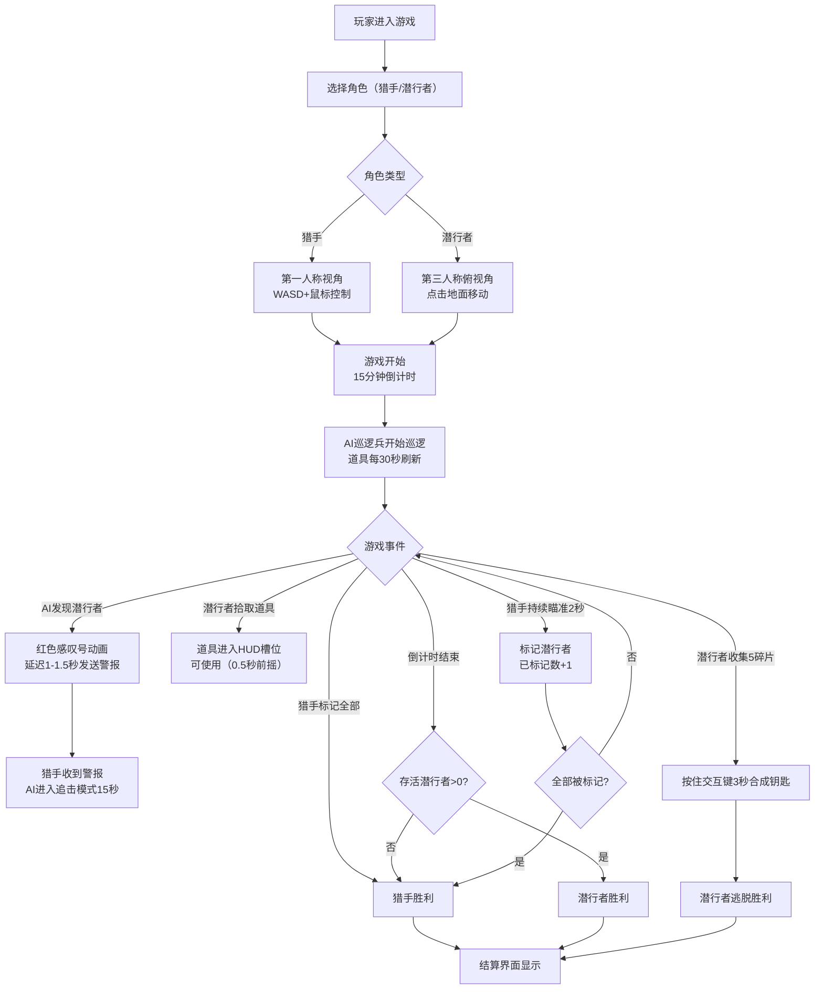

## 1. 产品概述
暗夜森林是一款非对称多人在线捉迷藏游戏原型，一名玩家扮演"猎手"在3D暗夜森林中追踪，其他玩家扮演"潜行者"利用伪装和道具躲避。游戏融合了生存、策略和动作元素，通过不对称的视角和能力设计带来独特的多人对抗体验。

- 核心玩法：猎手（第一人称）vs 潜行者（第三人称俯视角）的非对称对抗
- 目标用户：独立游戏爱好者、多人对战游戏玩家
- 市场价值：探索非对称游戏设计空间，为正式版本提供可验证的核心玩法原型

## 2. 核心功能

### 2.1 用户角色

| 角色 | 加入方式 | 核心能力 |
|------|----------|----------|
| 猎手 | 房间创建/加入选择 | WASD移动+鼠标视角，标记潜行者（持续瞄准2秒），接收AI警报 |
| 潜行者 | 房间创建/加入选择 | 点击地面移动（A*寻路），草丛隐身，使用道具干扰猎手 |
| AI巡逻兵 | 系统自动生成 | 沿固定路径巡逻，锥形视野检测，发现目标后触发警报和追击 |

### 2.2 功能模块

1. **游戏主场景**：3D暗夜森林渲染，双视角切换，光照与氛围效果
2. **角色控制系统**：猎手FPS控制（灵敏度可调），潜行者点击移动（A*寻路）
3. **道具系统**：四种道具随机生成、拾取、使用，冷却计时
4. **AI巡逻系统**：路径规划、状态机、视野检测、警报机制
5. **网络同步系统**：WebSocket实时状态同步，客户端预测
6. **UI界面系统**：HUD显示、小地图、结算界面、角色切换动画
7. **胜利条件系统**：倒计时、标记计数、道具碎片收集、钥匙合成

### 2.3 页面详情

| 页面名称 | 模块名称 | 功能描述 |
|---------|---------|----------|
| 游戏主界面 | 3D场景渲染 | Three.js渲染暗夜森林环境，支持双视角切换 |
| 游戏主界面 | 猎手HUD | 警戒值条（左下）、倒计时（右上）、追踪指示器 |
| 游戏主界面 | 潜行者HUD | 小地图（左上）、伪装冷却条、道具栏、交互提示 |
| 游戏主界面 | 道具栏 | 道具图标显示、使用前摇动画（放大旋转）、冷却计时 |
| 游戏主界面 | 小地图 | 200x200px半透明地图，标记藏身点、道具、AI视野锥 |
| 结算界面 | 胜负展示 | 胜方/败方动画，双方数据统计（标记数、存活时间、道具使用数） |
| 设置界面 | 控制设置 | 鼠标灵敏度调节（0.5-2.0）、视角俯仰角调节（30-60度） |

## 3. 核心流程

## 4. 用户界面设计

### 4.1 设计风格
- **主色调**：暗黑色调配合蓝紫色霓虹光效
  - 主背景：#0a0a1a（深暗夜蓝）
  - 界面控件：#1a1a3a（暗紫色面板）
  - 高亮色：#4a90ff（霓虹蓝）
  - 警戒渐变：#ff3333（红）→ #33ff33（绿）
  - 地图标记：黄色（藏身点）、绿色（道具）、红色（AI视野）
- **按钮风格**：圆角8px，悬停放大1.1倍，外发光阴影（扩散6px）
- **字体**：monospace（倒计时）、系统无衬线（正文）
- **布局**：浮动式HUD元素，半透明背景，角色切换时平滑过渡
- **动效**：透明度0→1（0.3秒），道具使用放大旋转，AI警报闪烁（0.3秒频率）

### 4.2 页面设计概览

| 页面名称 | 模块名称 | UI元素 |
|---------|---------|--------|
| 游戏主界面 | 猎手HUD | 左下警戒值渐变条、右上monospace倒计时24px#fff、追踪指示器 |
| 游戏主界面 | 潜行者HUD | 左上200x200px圆角8px半透明小地图、底部伪装冷却条、道具栏 |
| 游戏主界面 | 道具栏 | 4个槽位，使用时0.5秒放大旋转动画，冷却进度环 |
| 结算界面 | 数据面板 | 居中显示，胜方标题动画，双方统计数据（标记数/存活时间/道具使用） |
| 小地图 | 标记系统 | 黄色圆点（藏身点）、绿色三角（道具）、红色扇形（AI视野锥） |

### 4.3 响应式设计
- **桌面端**：小地图200x200px，按钮32px
- **移动端**：小地图缩小至120x120px，操作按钮放大至48px，触控优化
- **断点**：768px以下触发移动端布局

### 4.4 3D场景指引
- **环境氛围**：暗夜森林，雾效（FogExp2，密度0.02），深蓝紫色调
- **光照设置**：环境光（0x404080，强度0.3）+ 方向光（0x6666ff，强度0.5，模拟月光）+ 点光源（道具发光效果）
- **相机设置**：
  - 猎手：PerspectiveCamera（fov 75，近裁剪0.1，远1000），第一人称附着
  - 潜行者：PerspectiveCamera（fov 60），俯视角跟随，俯仰角30-60度可调
- **场景元素**：程序化生成树木、草丛（隐身区域）、藏身点、路径网格
- **后处理效果**：Bloom（霓虹光效）、Vignette（暗角）、轻微噪点
- **性能预算**：面向RTX 2060，目标60fps，三角形数控制在50万以内
