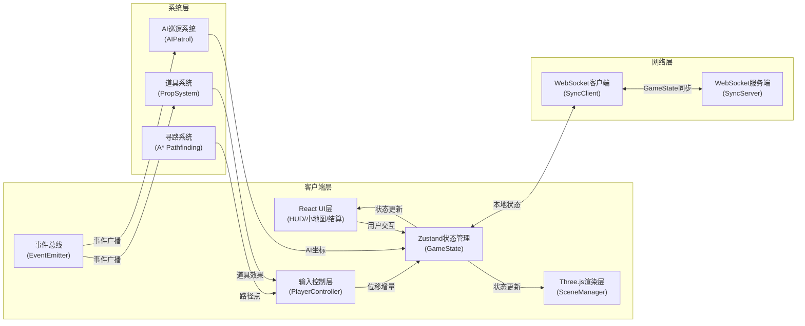

## 1. 架构设计



**模块调用关系与数据流向：**
1. `PlayerController` → 输出位移增量 → `SceneManager` 更新相机/物体变换
2. `GameState` (Zustand) → 驱动 `SceneManager` 渲染更新
3. `AIPatrol` → 每秒输出坐标列表 → `SceneManager`
4. `SyncClient` ↔ WebSocket ↔ `SyncServer` 全量 `GameState` 同步
5. `PropSystem` → 接收玩家坐标 → 输出道具效果 → `PlayerController`
6. `EventBus` → 跨模块事件通信（道具拾取、AI警报、标记成功等）

## 2. 技术栈说明

- **前端框架**：React@18 + TypeScript@5
- **构建工具**：Vite@5 + @vitejs/plugin-react + vite-plugin-gltf
- **3D引擎**：three@0.160 + @types/three
- **状态管理**：zustand@4
- **网络通信**：ws@8 (WebSocket)
- **工具库**：uuid@9
- **服务端运行**：ts-node (开发期运行SyncServer)

## 3. 文件结构

```
src/
├── game/
│   ├── SceneManager.ts      # 3D场景渲染与光照管理
│   ├── PlayerController.ts  # 玩家控制器（猎手/潜行者）
│   ├── AIPatrol.ts          # AI巡逻兵路径与状态机
│   └── Pathfinding.ts       # A*寻路算法
├── network/
│   ├── SyncClient.ts        # WebSocket客户端
│   └── SyncServer.ts        # WebSocket服务端
├── ui/
│   ├── HUD.tsx              # 主HUD组件
│   ├── HunterHUD.tsx        # 猎手专属UI
│   ├── StalkerHUD.tsx       # 潜行者专属UI
│   ├── MiniMap.tsx          # 小地图组件
│   ├── PropBar.tsx          # 道具栏组件
│   └── ResultScreen.tsx     # 结算界面
├── systems/
│   ├── PropSystem.ts        # 道具系统
│   └── EventBus.ts          # 事件总线
├── store/
│   └── useGameStore.ts      # Zustand状态管理
├── types/
│   └── game.ts              # 全局类型定义
├── utils/
│   └── helpers.ts           # 工具函数
├── App.tsx                  # 根组件
├── main.tsx                 # 入口文件
└── index.css                # 全局样式
```

## 4. 核心数据模型

### 4.1 类型定义

```typescript
// 角色类型
type PlayerRole = 'hunter' | 'stalker' | 'ai';

// 玩家状态
interface PlayerState {
  id: string;
  role: PlayerRole;
  position: [number, number, number];
  rotation: [number, number, number];
  health: number;
  isMarked: boolean;
  isInvisible: boolean;
  speedMultiplier: number;
  inventory: PropInstance[];
}

// 道具类型
type PropType = 'cloak' | 'voiceChanger' | 'smoke' | 'speedBoost';

interface PropInstance {
  id: string;
  type: PropType;
  position?: [number, number, number];
  cooldownEnd: number;
  isActive: boolean;
}

// AI状态
type AIState = 'patrol' | 'alert' | 'chase';

interface AIPatrolState {
  id: string;
  state: AIState;
  position: [number, number, number];
  rotation: [number, number, number];
  pathIndex: number;
  detectedTargetId?: string;
  alertEndTime: number;
  chaseEndTime: number;
}

// 游戏全局状态
interface GameState {
  phase: 'waiting' | 'playing' | 'ended';
  timeRemaining: number;
  players: Record<string, PlayerState>;
  aiUnits: Record<string, AIPatrolState>;
  props: Record<string, PropInstance>;
  markedCount: number;
  totalStalkers: number;
  keyFragments: number;
  alertLevel: number;
  winner?: 'hunter' | 'stalker';
  stats: GameStats;
}

interface GameStats {
  hunter: {
    marks: number;
    alertsReceived: number;
    playTime: number;
  };
  stalker: {
    survivedTime: number;
    propsUsed: number;
    fragmentsCollected: number;
  };
}
```

### 4.2 事件总线事件类型

```typescript
type GameEventType =
  | 'prop_picked'          // 道具拾取
  | 'prop_used'            // 道具使用
  | 'ai_detected'          // AI发现目标
  | 'ai_alert'             // AI发送警报
  | 'player_marked'        // 潜行者被标记
  | 'key_synthesized'      // 钥匙合成
  | 'game_end'             // 游戏结束
  | 'player_move'          // 玩家移动
  | 'smoke_created';       // 烟雾弹生成
```

## 5. 关键技术实现

### 5.1 场景渲染 (SceneManager)
- Three.js WebGLRenderer，启用抗锯齿和阴影
- 程序化生成：树木（ConeGeometry + CylinderGeometry）、草丛（Mesh with vertex animation）
- 光照：AmbientLight + DirectionalLight（月光）+ PointLight（道具发光）
- 后处理：EffectComposer + UnrealBloomPass（霓虹光效）+ VignetteShader

### 5.2 玩家控制 (PlayerController)
- **猎手模式**：PointerLock API + WASD移动，鼠标灵敏度0.5-2.0可调
- **潜行者模式**：Raycaster拾取地面目标点 → A*寻路 → 沿路径移动
- 碰撞检测：基于AABB包围盒，与树木/地形碰撞

### 5.3 AI巡逻 (AIPatrol)
- 状态机：PATROL → ALERT → CHASE
- 锥形视野检测：每帧计算目标与AI朝向夹角和距离
- 路径系统：预设3条循环路径，每条5-8个路径点
- 发现动画：红色感叹号（Sprite + 缩放/闪烁动画）

### 5.4 寻路系统 (A* Pathfinding)
- 网格尺寸：1x1单位，地图大小100x100
- 障碍物：树木、岩石标记为不可通行
- 启发函数：曼哈顿距离

### 5.5 道具系统 (PropSystem)
- 每30秒随机生成3个道具，位置随机（避开障碍物）
- 拾取检测：玩家与道具距离 < 2单位
- 使用效果：
  - 隐身斗篷：设置isInvisible=true，持续10秒，冷却30秒
  - 变声器：向猎手发送假脚步声事件
  - 烟雾弹：生成半径4单位烟雾粒子，持续5秒
  - 加速药剂：speedMultiplier=1.5，持续8秒

### 5.6 网络同步 (WebSocket)
- 服务端：Node.js + ws，收集客户端状态并广播全量GameState
- 消息频率：≤ 20次/秒，使用requestAnimationFrame节流
- 客户端预测：本地输入立即应用，服务端状态修正时平滑插值

## 6. 性能优化

- **渲染**：
  - 几何体InstancedMesh批量渲染树木/草丛
  - 视锥体剔除（Frustum Culling）
  - LOD（层次细节）：远处树木简化
- **网络**：
  - 状态差异压缩（仅发送变化字段）
  - 消息节流（最大20Hz）
- **计算**：
  - AI视野检测使用空间划分（Grid）
  - A*寻路缓存已计算路径
- **计时**：
  - 道具冷却使用performance.now()，误差<50ms
  - 游戏倒计时使用服务端时间同步

## 7. 性能约束验证

| 指标 | 目标 | 验证方式 |
|------|------|----------|
| 渲染帧率 | 60fps (RTX 2060) | Chrome DevTools Performance面板 |
| WebSocket频率 | ≤ 20次/秒 | 服务端日志统计 |
| 道具冷却误差 | < 50ms | 单元测试对比setTimeout与performance.now |
| 内存占用 | < 500MB | Chrome Task Manager |

## 8. 启动脚本

```json
{
  "scripts": {
    "dev": "concurrently \"npm run server\" \"npm run client\"",
    "client": "vite",
    "server": "ts-node src/network/SyncServer.ts",
    "build": "tsc && vite build",
    "lint": "eslint src --ext .ts,.tsx",
    "typecheck": "tsc --noEmit"
  }
}
```
