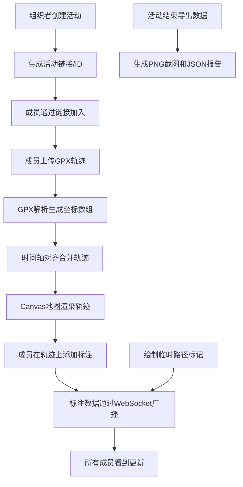

## 1. 产品概述

本产品是为小型户外徒步团体设计的活动轨迹记录与即时标注分享工具，解决传统手台报位置难以实时共享和回看的痛点。组织者可创建活动，成员通过链接加入后上传GPX轨迹，系统自动对齐时间轴并在地图上合并显示所有成员轨迹。成员可在自己轨迹段添加文字或语音标注，支持实时广播临时路径标记，活动结束后可一键导出高清截图和JSON报告。

- 目标用户：户外徒步团体组织者、徒步爱好者
- 核心价值：实现徒步过程中的轨迹共享、路况标注、路线规划和活动复盘

## 2. 核心功能

### 2.1 用户角色

| 角色 | 加入方式 | 核心权限 |
|------|----------|----------|
| 活动组织者 | 创建活动 | 创建活动、管理成员、导出活动数据、删除活动 |
| 活动成员 | 通过分享链接加入 | 上传GPX轨迹、添加/查看标注、绘制临时路径标记 |

### 2.2 功能模块

1. **活动创建与加入**：组织者创建活动生成唯一链接，成员通过链接加入
2. **GPX轨迹上传与解析**：成员粘贴GPX文本，系统解析并自动对齐时间轴
3. **地图轨迹可视化**：Canvas地图上合并显示所有成员轨迹，支持渐进绘制动画
4. **标注管理**：文字/语音标注（Web Audio API录音转base64），气泡图标展示
5. **实时路径标记**：绘制带颜色和箭头的临时路径，WebSocket广播
6. **活动导出**：高清PNG地图截图 + JSON总结报告

### 2.3 页面详情

| 页面名称 | 模块名称 | 功能描述 |
|----------|----------|----------|
| 首页 | 活动入口 | 创建活动表单、输入活动ID加入活动 |
| 活动主页面 | 活动信息栏 | 显示活动名称、成员列表、开始时间、操作按钮（导出） |
| 活动主页面 | 地图画布区域 | Canvas渲染地图、轨迹、标注、临时路径 |
| 活动主页面 | GPX上传面板 | 文本框粘贴GPX、成员昵称输入、上传按钮 |
| 活动主页面 | 标注操作面板 | 选择轨迹段、添加文字/语音标注、录音控制 |
| 活动主页面 | 路径绘制工具栏 | 颜色选择、箭头开关、清除按钮 |
| 活动主页面 | 通知Toast区域 | 右下角实时通知新标注、新成员加入 |

## 3. 核心流程

## 4. 用户界面设计

### 4.1 设计风格

- 主背景色：#1a1a2e（深空蓝黑）
- 卡片背景色：#282240（深紫灰），圆角12px
- 文字颜色：#e0e0e0（灰白）
- 强调色：#00bcd4（青绿）
- 设计理念：深色主题，科技感户外风格，强调地图的视觉中心地位
- 按钮风格：圆角8px，悬停时强调色渐变边框，按下有微缩放效果
- 字体：系统无衬线字体，标题18px半粗体，正文14px常规

### 4.2 页面设计概述

| 页面名称 | 模块名称 | UI元素 |
|----------|----------|---------|
| 首页 | 活动入口 | 大标题"徒步轨迹共享平台"，创建活动卡片，加入活动卡片，背景渐变色叠加噪点纹理 |
| 活动主页面 | 活动信息栏 | 顶部固定栏，活动名称，成员头像列表，导出按钮（强调色） |
| 活动主页面 | 地图画布 | 全屏Canvas，居中布局，轨迹加载时从左到右渐进绘制动画（1.5s缓出） |
| 活动主页面 | 侧边控制面板 | 左侧固定卡片，GPX上传区、标注控制、路径绘制工具，滚动区域 |
| 活动主页面 | 标注气泡 | 圆形图标（青绿色描边，白色填充），点击弹性缩放动画（scale 1->1.15->1，0.3s） |
| 活动主页面 | 通知Toast | 右下角半透明卡片，从下方滑入，停留3s后淡出 |
| 活动主页面 | 加载指示器 | 旋转图标（直径40px，青绿渐变色环） |

### 4.3 响应性

- 桌面端：左侧控制面板（320px固定宽度）+ 右侧地图区域（自适应）
- 平板端：控制面板折叠为可展开抽屉
- 移动端：上下布局，控制面板在底部可滑动展开
- 触控优化：标注图标最小点击区域48x48px，按钮高度44px

### 4.4 动画效果

- 轨迹加载：从起点到终点渐进绘制，1.5s ease-out
- 标注点击：scale 1 -> 1.15 -> 1，0.3s cubic-bezier(0.34, 1.56, 0.64, 1)
- Toast通知：translateY 20px -> 0（滑入），opacity 1 -> 0（淡出），总时长3s
- 路径标记绘制：实时跟随鼠标，虚线预览，确认后实线
- 页面加载：骨架屏脉冲动画，内容渐入
