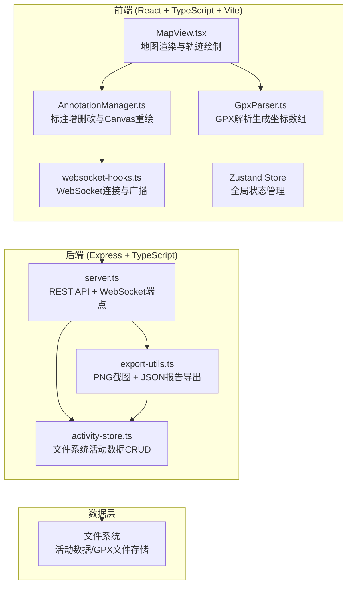
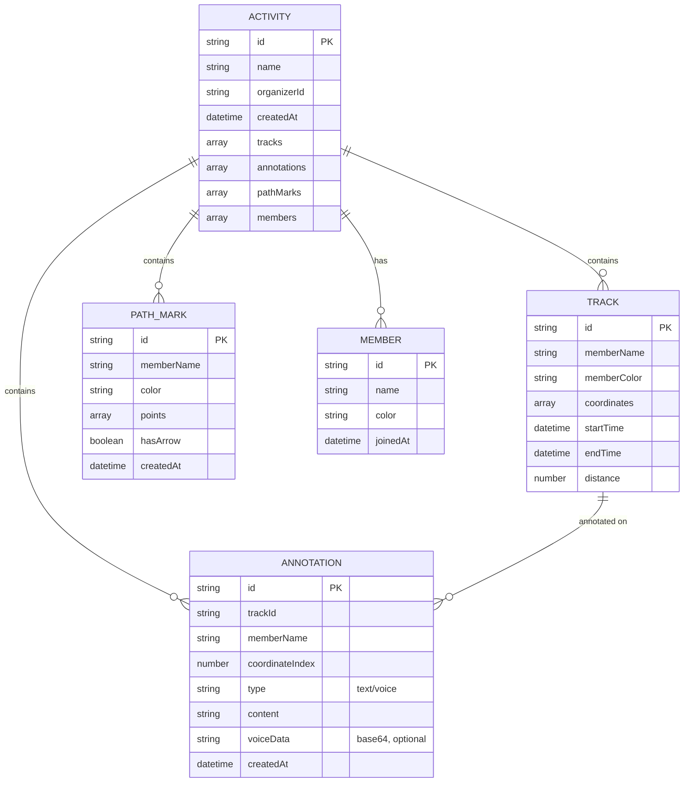

## 1. 架构设计



## 2. 技术描述

- 前端：React 18 + TypeScript + Vite + Zustand + Canvas API
- 后端：Express 4 + TypeScript + ws（WebSocket）+ 文件系统存储
- 构建工具：Vite（前端）+ ts-node（后端）
- 状态管理：Zustand
- 实时通信：WebSocket（ws库）
- 地图渲染：原生Canvas 2D API（无需第三方地图库）
- 语音录制：Web Audio API + MediaRecorder API

## 3. 目录结构

```
project/
├── src/                          # 前端源码
│   ├── components/
│   │   ├── MapView.tsx          # 地图渲染组件
│   │   ├── HomePage.tsx         # 首页
│   │   ├── ActivityPage.tsx     # 活动主页面
│   │   ├── ControlPanel.tsx     # 左侧控制面板
│   │   ├── AnnotationCard.tsx   # 标注卡片
│   │   └── Toast.tsx            # 通知组件
│   ├── hooks/
│   │   └── websocket-hooks.ts   # WebSocket hooks
│   ├── utils/
│   │   ├── GpxParser.ts         # GPX解析模块
│   │   └── AnnotationManager.ts # 标注管理模块
│   ├── store/
│   │   └── useActivityStore.ts  # Zustand状态管理
│   ├── types/
│   │   └── index.ts             # 类型定义
│   ├── App.tsx
│   ├── main.tsx
│   └── index.css
├── api/                          # 后端源码
│   ├── server.ts                # 服务器入口
│   ├── activity-store.ts        # 活动数据存储
│   └── export-utils.ts          # 导出工具
├── shared/                       # 前后端共享类型
│   └── types.ts
├── data/                         # 活动数据存储目录
├── index.html
├── vite.config.js
├── tsconfig.json
└── package.json
```

## 4. 路由定义

| 路由 | 用途 |
|------|------|
| / | 首页，创建/加入活动 |
| /activity/:id | 活动主页面 |

## 5. API定义

### 5.1 REST API

```typescript
// 创建活动
POST /api/activities
Request: { name: string, organizerName: string }
Response: { id: string, name: string, joinLink: string }

// 获取活动数据
GET /api/activities/:id
Response: Activity

// 上传GPX轨迹
POST /api/activities/:id/tracks
Request: { memberName: string, gpxContent: string }
Response: { trackId: string, memberName: string }

// 添加标注
POST /api/activities/:id/annotations
Request: Annotation
Response: Annotation

// 导出活动
GET /api/activities/:id/export
Response: { screenshot: string (base64 PNG), report: JSON }
```

### 5.2 WebSocket消息

```typescript
// 客户端 -> 服务端
{ type: 'join', activityId: string, memberName: string }
{ type: 'annotation', activityId: string, data: Annotation }
{ type: 'path-mark', activityId: string, data: PathMark }
{ type: 'track-added', activityId: string, data: Track }

// 服务端 -> 客户端
{ type: 'member-joined', data: Member }
{ type: 'annotation-added', data: Annotation }
{ type: 'path-mark-added', data: PathMark }
{ type: 'track-added', data: Track }
{ type: 'activity-update', data: Activity }
```

## 6. 数据模型



## 7. 性能指标

- 轨迹数据同步到地图延迟：≤ 200ms
- 20+标注图标同时渲染FPS：≥ 45
- 轨迹绘制动画：1.5s ease-out
- 响应式布局断点：桌面(≥1200px)、平板(768-1199px)、移动(<768px)

## 8. 核心模块职责

| 模块 | 职责 | 输入 | 输出 |
|------|------|------|------|
| GpxParser.ts | 解析GPX XML字符串，提取坐标点、时间戳、元数据 | GPX文本字符串 | { coordinates: [{lat, lon, time}], metadata: {name, startTime, endTime} } |
| AnnotationManager.ts | 管理标注增删改，触发Canvas重绘，监听WebSocket广播事件 | 标注对象、坐标索引、成员信息 | 标注列表、Canvas重绘指令 |
| MapView.tsx | Canvas地图渲染：背景网格、轨迹线、标注气泡、临时路径、动画效果 | 轨迹数组、标注列表、路径标记、视图参数 | 渲染后的Canvas |
| websocket-hooks.ts | 建立WebSocket连接、订阅活动频道、发送/接收广播消息 | 活动ID、消息回调 | 连接状态、消息发送函数 |
| activity-store.ts | 文件系统活动数据CRUD，GPX文件读写，数据持久化 | 活动ID、更新数据 | 活动对象、操作结果 |
| export-utils.ts | Canvas2D合成高清PNG截图，组装JSON总结报告 | 活动数据、画布尺寸 | { screenshot: base64PNG, report: JSON } |
| server.ts | Express启动、REST路由、WebSocket端点、活动创建/导出处理、CORS配置 | HTTP请求、WebSocket消息 | HTTP响应、WebSocket广播 |
