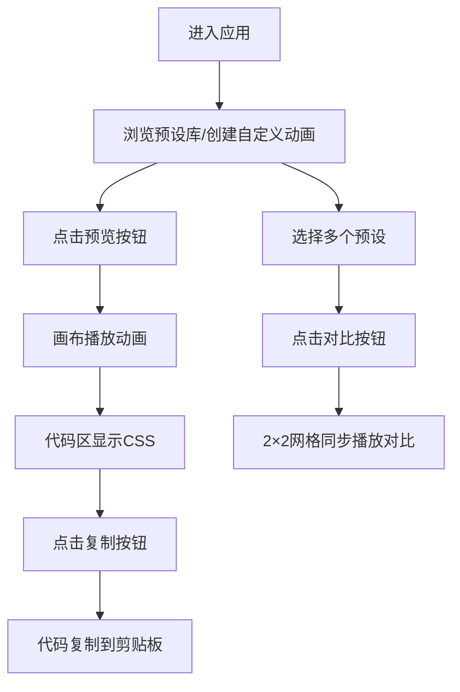

## 1. 产品概述

CSS Keyframes 动画预设管理器是一款面向前端开发者的可视化工具，旨在解决在复杂动画设计中手动编写和维护大量 @keyframes 规则容易出错、效率低下的问题。提供内置预设库、可视化编辑器、代码导出和多动画对比功能，帮助开发者快速生成高质量CSS动画。

- 目标用户：前端开发者、UI设计师、动效设计师
- 核心价值：提升CSS动画开发效率，减少手动编写错误，提供直观的预览和对比体验

## 2. 核心功能

### 2.1 功能模块

1. **动画预设库**：内置20+种分类动画预设（弹跳、脉冲、旋转、淡入、滑入、弹性等），支持预览、搜索、分类筛选
2. **自定义动画编辑器**：支持多属性选择、关键帧节点拖拽、时间轴编辑、属性值精确设置、撤销/重做
3. **代码预览与导出**：实时生成带语法高亮的CSS代码，一键复制到剪贴板
4. **动画对比模式**：最多4个动画同步循环播放对比，直观展示差异

### 2.2 页面详情

| 页面名称 | 模块名称 | 功能描述 |
|-----------|-------------|---------------------|
| 主应用 | 预览画布区 | 播放动画的圆形目标元素（60px直径，#ff6b6b→#ee5a24渐变，微光晕） |
| 主应用 | 代码预览区 | 显示CSS keyframes代码，语法高亮，复制按钮 |
| 主应用 | 预设库标签页 | 动画预设列表，显示名称、时长、缓动、预览按钮，支持分类筛选和搜索 |
| 主应用 | 自定义编辑器标签页 | 时间轴轨道、关键帧节点、属性选择器、数值/颜色输入框、运行按钮 |
| 主应用 | 对比模式 | 2×2网格展示，同步播放，标注动画名称和参数 |

## 3. 核心流程

用户浏览预设库或创建自定义动画 → 预览动画效果 → 查看并复制生成的CSS代码 → 或选择多个动画进入对比模式进行直观比较

## 4. 用户界面设计

### 4.1 设计风格

- **主题**：深色主题
  - 主背景色：#2c3e50
  - 卡片背景：#34495e
  - 文字主色：#ecf0f1
  - 强调色：#e74c3c
- **按钮样式**：
  - 复制按钮：圆角8px，背景#2ecc71，白色文字
  - 运行按钮：圆角8px，背景#9b59b6，白色文字，点击缩放0.95（0.1s动画）
  - 对比按钮：圆角20px，背景#34495e，白色文字，悬停背景变亮10%
- **字体**：代码使用Consolas 14px，界面文字使用现代无衬线字体
- **布局结构**：上下结构
  - 上半部分：预览画布（左50%）+ 代码区域（右50%），中间8px可拖拽分隔条
  - 下半部分：预设库/自定义编辑器（标签页切换，上下布局）
- **交互效果**：所有列表项和按钮悬停时0.25s ease-out过渡（颜色、缩放、背景变化）

### 4.2 界面元素细节

| 模块 | 元素 | UI规格 |
|-----------|-------------|-------------|
| 预览画布 | 圆形目标元素 | 直径60px，#ff6b6b→#ee5a24渐变填充，微光晕效果 |
| 代码区域 | 代码块 | 背景#1e1e1e，Consolas 14px，语法高亮，带行号，内边距10px，圆角8px |
| 时间轴 | 总宽600px，分10段灰色刻度线 | 红色播放指示线（2px宽，上下箭头） |
| 关键帧节点 | 菱形，边长16px | 拖拽时变色#3498db并放大1.2倍，松开吸附到时间轴 |
| 对比模式 | 2×2网格 | 每个网格显示动画名称和参数，同步循环播放 |

### 4.3 响应式适配

- **桌面端**（≥900px）：上半部分左右并排布局，下半部分标签页切换
- **移动端**（<900px）：
  - 上半部分改为上下排列
  - 代码区域折叠为可展开片段
  - 下半部分标签页变为滑动卡片式

### 4.4 性能要求

- 动画播放帧率≥50fps（使用requestAnimationFrame实现）
- 所有动画播放和切换操作响应时间<100ms
